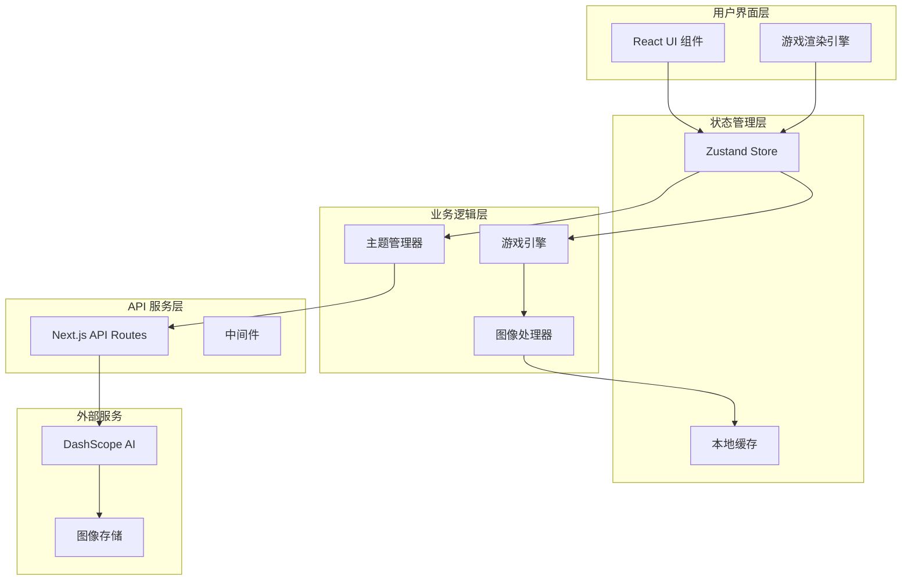

# 架构设计

本文档详细介绍了 Pixel Seed 项目的系统架构、技术选型、设计理念和实现细节。

## 🏗️ 系统架构概览

### 整体架构图



### 核心设计原则

1. **分层架构**：清晰的职责分离，便于维护和扩展
2. **响应式设计**：基于状态驱动的 UI 更新机制
3. **模块化开发**：高内聚、低耦合的组件设计
4. **性能优先**：优化渲染性能和用户体验
5. **可扩展性**：支持新功能和主题的快速集成

## 🎨 前端架构

### 技术栈选择

#### 核心框架

```typescript
// 技术栈配置
const TECH_STACK = {
  framework: 'Next.js 15.5.2',     // React 全栈框架
  styling: 'Tailwind CSS 4.0',     // 原子化 CSS 框架
  stateManagement: 'Zustand 5.0.8', // 轻量级状态管理
  uiComponents: 'Ant Design 5.27.1', // UI 组件库
  animation: 'Framer Motion 12.23.12', // 动画库
  typeScript: '5.x',                // 类型安全
} as const;
```

#### 选择理由

- **Next.js**：提供 SSR/SSG、API Routes、优化的构建系统
- **Tailwind CSS**：快速开发、一致的设计系统、优秀的性能
- **Zustand**：简单易用、TypeScript 友好、无样板代码
- **Ant Design**：成熟的组件生态、一致的用户体验
- **Framer Motion**：强大的动画能力、声明式 API

### 组件架构

#### 组件层次结构

```
src/
├── components/           # 可复用组件
│   ├── ui/              # 基础 UI 组件
│   │   ├── Button/
│   │   ├── Modal/
│   │   └── Loading/
│   ├── game/            # 游戏相关组件
│   │   ├── GameCanvas/
│   │   ├── Player/
│   │   └── Controls/
│   └── theme/           # 主题相关组件
│       ├── ThemeSelector/
│       ├── ThemePreview/
│       └── CustomThemeForm/
├── pages/               # 页面组件
│   ├── index.tsx        # 主页
│   ├── game/            # 游戏页面
│   └── api/             # API 路由
├── hooks/               # 自定义 Hooks
├── stores/              # 状态管理
├── utils/               # 工具函数
└── types/               # 类型定义
```

#### 组件设计模式

```typescript
// 1. 容器组件模式
interface GameContainerProps {
  themeId: string;
}

const GameContainer: React.FC<GameContainerProps> = ({ themeId }) => {
  const { gameState, actions } = useGameStore();
  
  return (
    <div className="game-container">
      <GameCanvas gameState={gameState} />
      <GameControls onAction={actions.handleInput} />
    </div>
  );
};

// 2. 展示组件模式
interface GameCanvasProps {
  gameState: GameState;
}

const GameCanvas: React.FC<GameCanvasProps> = ({ gameState }) => {
  return (
    <canvas
      ref={canvasRef}
      width={gameState.viewport.width}
      height={gameState.viewport.height}
    />
  );
};

// 3. Hook 组件模式
const useGameLoop = (gameState: GameState) => {
  useEffect(() => {
    const gameLoop = setInterval(() => {
      // 游戏循环逻辑
    }, 16); // 60fps
    
    return () => clearInterval(gameLoop);
  }, [gameState]);
};
```

### 状态管理架构

#### Zustand Store 设计

```typescript
// 主状态 Store
interface AppState {
  // UI 状态
  ui: {
    currentPage: 'home' | 'game' | 'settings';
    isLoading: boolean;
    modals: Record<string, boolean>;
  };
  
  // 主题状态
  theme: {
    selectedTheme: Theme | null;
    customThemes: Theme[];
    presetThemes: Theme[];
  };
  
  // 游戏状态
  game: {
    isPlaying: boolean;
    gameData: GameData | null;
    player: PlayerState;
    viewport: ViewportState;
  };
  
  // 生成状态
  generation: {
    isGenerating: boolean;
    progress: number;
    currentStep: string;
    generatedImages: Record<ImageType, string>;
  };
}

// Store 创建
const useAppStore = create<AppState & AppActions>((set, get) => ({
  // 初始状态
  ui: {
    currentPage: 'home',
    isLoading: false,
    modals: {},
  },
  
  // Actions
  setCurrentPage: (page) => set((state) => ({
    ui: { ...state.ui, currentPage: page }
  })),
  
  generateImages: async (theme) => {
    set((state) => ({
      generation: { ...state.generation, isGenerating: true }
    }));
    
    try {
      const images = await generateGameImages(theme);
      set((state) => ({
        generation: {
          ...state.generation,
          isGenerating: false,
          generatedImages: images
        }
      }));
    } catch (error) {
      // 错误处理
    }
  },
}));
```

#### 状态持久化

```typescript
// 本地存储中间件
const persistMiddleware = <T>(
  config: StateCreator<T>,
  options: PersistOptions<T>
) => {
  return persist(config, {
    name: 'pixel-seed-store',
    storage: createJSONStorage(() => localStorage),
    partialize: (state) => ({
      theme: state.theme,
      game: {
        ...state.game,
        // 排除运行时状态
        isPlaying: false,
      },
    }),
  });
};
```

## 🎮 游戏引擎架构

### 渲染系统设计

#### 混合渲染方案

```typescript
// 渲染层次结构
interface RenderLayers {
  background: HTMLElement;    // CSS 背景层
  ground: HTMLElement;        // 地面纹理层
  obstacles: HTMLElement[];   // 障碍物层
  player: HTMLElement;        // 玩家角色层
  ui: HTMLElement;           // UI 覆盖层
}

// 渲染管理器
class RenderManager {
  private layers: RenderLayers;
  private viewport: Viewport;
  
  constructor(container: HTMLElement) {
    this.initializeLayers(container);
    this.setupViewport();
  }
  
  // 更新玩家位置
  updatePlayer(position: Position, direction: Direction) {
    const playerElement = this.layers.player;
    
    // 应用变换
    playerElement.style.transform = `
      translate3d(${position.x}px, ${position.y}px, 0)
      scaleX(${direction === 'left' ? -1 : 1})
    `;
    
    // 更新动画状态
    this.updatePlayerAnimation(position.isMoving);
  }
  
  // 视口跟随
  updateViewport(playerPosition: Position) {
    const offsetX = Math.max(0, playerPosition.x - this.viewport.width / 2);
    const offsetY = Math.max(0, playerPosition.y - this.viewport.height / 2);
    
    this.layers.background.style.transform = `
      translate3d(-${offsetX * 0.5}px, -${offsetY * 0.5}px, 0)
    `;
  }
}
```

#### 游戏循环系统

```typescript
// 游戏循环管理
class GameLoop {
  private isRunning = false;
  private lastTime = 0;
  private targetFPS = 60;
  private frameTime = 1000 / this.targetFPS;
  
  start() {
    this.isRunning = true;
    this.lastTime = performance.now();
    this.loop();
  }
  
  private loop = (currentTime: number) => {
    if (!this.isRunning) return;
    
    const deltaTime = currentTime - this.lastTime;
    
    if (deltaTime >= this.frameTime) {
      // 更新游戏状态
      this.update(deltaTime);
      
      // 渲染画面
      this.render();
      
      this.lastTime = currentTime - (deltaTime % this.frameTime);
    }
    
    requestAnimationFrame(this.loop);
  };
  
  private update(deltaTime: number) {
    // 物理更新
    this.updatePhysics(deltaTime);
    
    // 输入处理
    this.processInput();
    
    // 碰撞检测
    this.checkCollisions();
    
    // 状态同步
    this.syncState();
  }
}
```

### 物理系统

#### 重力和碰撞

```typescript
// 物理引擎
class PhysicsEngine {
  private gravity = 980; // 像素/秒²
  private friction = 0.8;
  
  updatePlayer(player: PlayerState, deltaTime: number): PlayerState {
    const dt = deltaTime / 1000; // 转换为秒
    
    // 应用重力
    if (!player.isGrounded) {
      player.velocity.y += this.gravity * dt;
    }
    
    // 应用摩擦力
    if (player.isGrounded) {
      player.velocity.x *= this.friction;
    }
    
    // 更新位置
    player.position.x += player.velocity.x * dt;
    player.position.y += player.velocity.y * dt;
    
    // 边界检查
    this.checkBoundaries(player);
    
    return player;
  }
  
  checkCollision(rect1: Rectangle, rect2: Rectangle): boolean {
    return (
      rect1.x < rect2.x + rect2.width &&
      rect1.x + rect1.width > rect2.x &&
      rect1.y < rect2.y + rect2.height &&
      rect1.y + rect1.height > rect2.y
    );
  }
}
```

### 输入系统

#### 输入管理器

```typescript
// 输入处理
class InputManager {
  private keys: Set<string> = new Set();
  private gamepadState: GamepadState | null = null;
  
  constructor() {
    this.setupEventListeners();
  }
  
  private setupEventListeners() {
    // 键盘事件
    window.addEventListener('keydown', (e) => {
      this.keys.add(e.code);
      e.preventDefault();
    });
    
    window.addEventListener('keyup', (e) => {
      this.keys.delete(e.code);
      e.preventDefault();
    });
    
    // 手柄支持
    window.addEventListener('gamepadconnected', (e) => {
      console.log('Gamepad connected:', e.gamepad);
    });
  }
  
  getInputState(): InputState {
    const gamepad = navigator.getGamepads()[0];
    
    return {
      left: this.keys.has('KeyA') || this.keys.has('ArrowLeft') || 
            (gamepad?.axes[0] ?? 0) < -0.5,
      right: this.keys.has('KeyD') || this.keys.has('ArrowRight') || 
             (gamepad?.axes[0] ?? 0) > 0.5,
      jump: this.keys.has('KeyW') || this.keys.has('ArrowUp') || 
            this.keys.has('Space') || (gamepad?.buttons[0]?.pressed ?? false),
      crouch: this.keys.has('KeyS') || this.keys.has('ArrowDown') || 
              (gamepad?.buttons[1]?.pressed ?? false),
    };
  }
}
```

## 🤖 AI 集成架构

### 图像生成服务

#### API 抽象层

```typescript
// AI 服务接口
interface AIImageService {
  generateImage(params: GenerateImageParams): Promise<GeneratedImage>;
  batchGenerate(params: BatchGenerateParams): Promise<GeneratedImage[]>;
  getGenerationStatus(taskId: string): Promise<GenerationStatus>;
}

// DashScope 实现
class DashScopeService implements AIImageService {
  private apiKey: string;
  private baseURL = 'https://dashscope.aliyuncs.com';
  
  constructor(apiKey: string) {
    this.apiKey = apiKey;
  }
  
  async generateImage(params: GenerateImageParams): Promise<GeneratedImage> {
    const prompt = this.buildPrompt(params);
    
    const response = await fetch(`${this.baseURL}/api/v1/services/aigc/text2image/image-synthesis`, {
      method: 'POST',
      headers: {
        'Authorization': `Bearer ${this.apiKey}`,
        'Content-Type': 'application/json',
      },
      body: JSON.stringify({
        model: 'wanx-v1',
        input: {
          prompt,
          negative_prompt: 'blurry, low quality, distorted',
        },
        parameters: {
          style: '<pixel>',
          size: this.getSizeForType(params.type),
          n: 1,
        },
      }),
    });
    
    const result = await response.json();
    return this.processResult(result);
  }
  
  private buildPrompt(params: GenerateImageParams): string {
    const basePrompt = params.theme;
    const typeSpecific = this.getTypeSpecificPrompt(params.type);
    const styleGuide = 'pixel art style, inspired by Dead Cells color palette';
    
    return `${basePrompt}, ${typeSpecific}, ${styleGuide}`;
  }
}
```

#### 提示词工程

```typescript
// 提示词构建器
class PromptBuilder {
  private static TYPE_PROMPTS = {
    character: 'character sprite, full body, facing forward, game ready',
    background: 'game background, horizontal landscape, detailed environment',
    ground: 'ground texture, tileable, platform game style',
    obstacle: 'environmental object, game asset, decorative element',
  };
  
  private static STYLE_MODIFIERS = {
    pixel: 'pixel art, 16-bit style, crisp pixels, no anti-aliasing',
    deadCells: 'Dead Cells inspired, dark atmosphere, vibrant colors',
    quality: 'high quality, detailed, professional game art',
  };
  
  static build(theme: string, type: ImageType, options?: PromptOptions): string {
    const parts = [
      theme,
      this.TYPE_PROMPTS[type],
      this.STYLE_MODIFIERS.pixel,
      this.STYLE_MODIFIERS.deadCells,
      this.STYLE_MODIFIERS.quality,
    ];
    
    if (options?.negativePrompt) {
      parts.push(`NOT: ${options.negativePrompt}`);
    }
    
    return parts.join(', ');
  }
}
```

### 图像处理管道

#### 后处理系统

```typescript
// 图像后处理
class ImageProcessor {
  async processGeneratedImage(
    imageUrl: string, 
    type: ImageType
  ): Promise<ProcessedImage> {
    const canvas = document.createElement('canvas');
    const ctx = canvas.getContext('2d')!;
    
    // 加载原始图像
    const img = await this.loadImage(imageUrl);
    
    // 设置目标尺寸
    const targetSize = this.getTargetSize(type);
    canvas.width = targetSize.width;
    canvas.height = targetSize.height;
    
    // 应用处理
    ctx.imageSmoothingEnabled = false; // 保持像素风格
    ctx.drawImage(img, 0, 0, targetSize.width, targetSize.height);
    
    // 颜色校正
    if (type === 'character') {
      this.applyCharacterOptimizations(ctx, canvas);
    }
    
    // 导出处理后的图像
    return {
      dataUrl: canvas.toDataURL('image/png'),
      blob: await this.canvasToBlob(canvas),
      dimensions: targetSize,
    };
  }
  
  private applyCharacterOptimizations(ctx: CanvasRenderingContext2D, canvas: HTMLCanvasElement) {
    const imageData = ctx.getImageData(0, 0, canvas.width, canvas.height);
    const data = imageData.data;
    
    // 背景透明化
    for (let i = 0; i < data.length; i += 4) {
      const r = data[i];
      const g = data[i + 1];
      const b = data[i + 2];
      
      // 检测背景色（通常是白色或特定颜色）
      if (this.isBackgroundColor(r, g, b)) {
        data[i + 3] = 0; // 设置为透明
      }
    }
    
    ctx.putImageData(imageData, 0, 0);
  }
}
```

## 🗄️ 数据架构

### 数据模型设计

#### 核心数据类型

```typescript
// 主题数据模型
interface Theme {
  id: string;
  name: string;
  description: string;
  prompt: string;
  tags: string[];
  category: 'preset' | 'custom';
  createdAt: Date;
  updatedAt: Date;
  metadata: {
    author?: string;
    version: string;
    popularity: number;
  };
}

// 游戏数据模型
interface GameData {
  id: string;
  themeId: string;
  assets: {
    character: GameAsset;
    background: GameAsset;
    ground: GameAsset;
    obstacles: GameAsset[];
  };
  gameState: {
    player: PlayerState;
    world: WorldState;
    progress: GameProgress;
  };
  metadata: {
    createdAt: Date;
    lastPlayed: Date;
    playTime: number;
    version: string;
  };
}

// 资源数据模型
interface GameAsset {
  id: string;
  type: ImageType;
  url: string;
  localPath?: string;
  dimensions: { width: number; height: number };
  generationParams: {
    prompt: string;
    model: string;
    timestamp: Date;
  };
  processing: {
    original: string;
    processed: string;
    optimizations: string[];
  };
}
```

### 缓存策略

#### 多层缓存架构

```typescript
// 缓存管理器
class CacheManager {
  private memoryCache = new Map<string, any>();
  private localStorageCache = new LocalStorageCache();
  private indexedDBCache = new IndexedDBCache();
  
  async get<T>(key: string, type: CacheType): Promise<T | null> {
    // 1. 内存缓存（最快）
    if (this.memoryCache.has(key)) {
      return this.memoryCache.get(key);
    }
    
    // 2. LocalStorage（中等）
    if (type === 'config' || type === 'theme') {
      const value = await this.localStorageCache.get(key);
      if (value) {
        this.memoryCache.set(key, value);
        return value;
      }
    }
    
    // 3. IndexedDB（较慢，但容量大）
    if (type === 'image' || type === 'gameData') {
      const value = await this.indexedDBCache.get(key);
      if (value) {
        this.memoryCache.set(key, value);
        return value;
      }
    }
    
    return null;
  }
  
  async set<T>(key: string, value: T, type: CacheType, ttl?: number): Promise<void> {
    // 内存缓存
    this.memoryCache.set(key, value);
    
    // 持久化缓存
    if (type === 'config' || type === 'theme') {
      await this.localStorageCache.set(key, value, ttl);
    } else {
      await this.indexedDBCache.set(key, value, ttl);
    }
  }
}
```

## 🚀 性能优化

### 渲染优化

#### 虚拟化和批处理

```typescript
// 渲染优化器
class RenderOptimizer {
  private renderQueue: RenderTask[] = [];
  private isRendering = false;
  
  // 批量渲染任务
  queueRender(task: RenderTask) {
    this.renderQueue.push(task);
    
    if (!this.isRendering) {
      this.scheduleRender();
    }
  }
  
  private scheduleRender() {
    requestAnimationFrame(() => {
      this.isRendering = true;
      
      // 批量处理渲染任务
      const tasks = this.renderQueue.splice(0);
      
      // 按类型分组优化
      const groupedTasks = this.groupTasksByType(tasks);
      
      // 执行渲染
      for (const [type, typeTasks] of groupedTasks) {
        this.executeBatchRender(type, typeTasks);
      }
      
      this.isRendering = false;
    });
  }
  
  // 视口裁剪
  private cullOutsideViewport(objects: GameObject[], viewport: Viewport): GameObject[] {
    return objects.filter(obj => {
      return this.isInViewport(obj.bounds, viewport);
    });
  }
}
```

### 资源加载优化

#### 预加载和懒加载

```typescript
// 资源加载管理器
class AssetLoader {
  private loadedAssets = new Map<string, HTMLImageElement>();
  private loadingPromises = new Map<string, Promise<HTMLImageElement>>();
  
  // 预加载关键资源
  async preloadCriticalAssets(theme: Theme): Promise<void> {
    const criticalAssets = [
      theme.preview,
      ...this.getPredictedAssets(theme)
    ];
    
    await Promise.all(
      criticalAssets.map(url => this.loadImage(url))
    );
  }
  
  // 懒加载非关键资源
  async loadImage(url: string): Promise<HTMLImageElement> {
    if (this.loadedAssets.has(url)) {
      return this.loadedAssets.get(url)!;
    }
    
    if (this.loadingPromises.has(url)) {
      return this.loadingPromises.get(url)!;
    }
    
    const promise = new Promise<HTMLImageElement>((resolve, reject) => {
      const img = new Image();
      img.crossOrigin = 'anonymous';
      
      img.onload = () => {
        this.loadedAssets.set(url, img);
        this.loadingPromises.delete(url);
        resolve(img);
      };
      
      img.onerror = () => {
        this.loadingPromises.delete(url);
        reject(new Error(`Failed to load image: ${url}`));
      };
      
      img.src = url;
    });
    
    this.loadingPromises.set(url, promise);
    return promise;
  }
}
```

## 🔧 开发工具链

### 构建配置

#### Next.js 配置优化

```typescript
// next.config.js
const nextConfig = {
  // 性能优化
  compiler: {
    removeConsole: process.env.NODE_ENV === 'production',
  },
  
  // 图像优化
  images: {
    domains: ['dashscope.oss-cn-beijing.aliyuncs.com'],
    formats: ['image/webp', 'image/avif'],
  },
  
  // 实验性功能
  experimental: {
    optimizeCss: true,
    optimizePackageImports: ['antd', 'framer-motion'],
  },
  
  // Webpack 配置
  webpack: (config, { dev, isServer }) => {
    // 生产环境优化
    if (!dev && !isServer) {
      config.optimization.splitChunks = {
        chunks: 'all',
        cacheGroups: {
          vendor: {
            test: /[\\/]node_modules[\\/]/,
            name: 'vendors',
            chunks: 'all',
          },
        },
      };
    }
    
    return config;
  },
};
```

### 代码质量保证

#### ESLint 和 Prettier 配置

```json
// .eslintrc.json
{
  "extends": [
    "next/core-web-vitals",
    "@typescript-eslint/recommended",
    "prettier"
  ],
  "rules": {
    "@typescript-eslint/no-unused-vars": "error",
    "@typescript-eslint/explicit-function-return-type": "warn",
    "react-hooks/exhaustive-deps": "error",
    "prefer-const": "error"
  }
}
```

```json
// .prettierrc
{
  "semi": true,
  "trailingComma": "es5",
  "singleQuote": true,
  "printWidth": 80,
  "tabWidth": 2
}
```

## 🧪 测试架构

### 测试策略

#### 单元测试

```typescript
// 游戏逻辑测试
describe('PhysicsEngine', () => {
  let physics: PhysicsEngine;
  
  beforeEach(() => {
    physics = new PhysicsEngine();
  });
  
  test('should apply gravity to falling player', () => {
    const player = {
      position: { x: 0, y: 0 },
      velocity: { x: 0, y: 0 },
      isGrounded: false,
    };
    
    const updatedPlayer = physics.updatePlayer(player, 16);
    
    expect(updatedPlayer.velocity.y).toBeGreaterThan(0);
    expect(updatedPlayer.position.y).toBeGreaterThan(0);
  });
  
  test('should detect collision between rectangles', () => {
    const rect1 = { x: 0, y: 0, width: 10, height: 10 };
    const rect2 = { x: 5, y: 5, width: 10, height: 10 };
    
    expect(physics.checkCollision(rect1, rect2)).toBe(true);
  });
});
```

#### 集成测试

```typescript
// API 集成测试
describe('Image Generation API', () => {
  test('should generate character image', async () => {
    const response = await fetch('/api/generate-image', {
      method: 'POST',
      headers: { 'Content-Type': 'application/json' },
      body: JSON.stringify({
        theme: 'test theme',
        type: 'character'
      })
    });
    
    expect(response.status).toBe(200);
    
    const data = await response.json();
    expect(data.success).toBe(true);
    expect(data.data.imageUrl).toBeDefined();
  });
});
```

## 📊 监控和分析

### 性能监控

#### 关键指标追踪

```typescript
// 性能监控器
class PerformanceMonitor {
  private metrics = new Map<string, number[]>();
  
  // 记录渲染性能
  recordRenderTime(duration: number) {
    this.addMetric('render_time', duration);
    
    if (duration > 16) { // 超过 60fps 阈值
      console.warn(`Slow render detected: ${duration}ms`);
    }
  }
  
  // 记录 API 响应时间
  recordAPICall(endpoint: string, duration: number, success: boolean) {
    this.addMetric(`api_${endpoint}`, duration);
    
    if (!success) {
      this.addMetric(`api_${endpoint}_errors`, 1);
    }
  }
  
  // 生成性能报告
  generateReport(): PerformanceReport {
    return {
      averageRenderTime: this.getAverage('render_time'),
      frameDrops: this.getCount('frame_drops'),
      apiResponseTimes: this.getAPIMetrics(),
      memoryUsage: this.getMemoryUsage(),
    };
  }
}
```

## 🔮 未来架构规划

### 可扩展性设计

#### 插件系统

```typescript
// 插件接口
interface GamePlugin {
  name: string;
  version: string;
  
  onInit?(game: GameEngine): void;
  onUpdate?(deltaTime: number): void;
  onRender?(renderer: RenderManager): void;
  onDestroy?(): void;
}

// 插件管理器
class PluginManager {
  private plugins = new Map<string, GamePlugin>();
  
  register(plugin: GamePlugin) {
    this.plugins.set(plugin.name, plugin);
    plugin.onInit?.(this.gameEngine);
  }
  
  update(deltaTime: number) {
    for (const plugin of this.plugins.values()) {
      plugin.onUpdate?.(deltaTime);
    }
  }
}
```

#### 微服务架构迁移

```typescript
// 服务抽象层
interface GameService {
  name: string;
  endpoint: string;
  version: string;
}

// 服务发现
class ServiceDiscovery {
  private services = new Map<string, GameService>();
  
  async discoverServices(): Promise<void> {
    // 从服务注册中心获取可用服务
    const services = await this.fetchAvailableServices();
    
    for (const service of services) {
      this.services.set(service.name, service);
    }
  }
  
  getService(name: string): GameService | null {
    return this.services.get(name) || null;
  }
}
```

---

**架构文档将随着项目发展持续更新，欢迎贡献改进建议！** 🏗️