# 2. Background 背景

## 2.1 Pixel Art Games —— 像素艺术游戏

### 2.1.1 Historical Development —— 历史发展

#### Origins and Early Era (1970s-1980s)

Pixel art emerged from the technical constraints of early computing systems, where limited memory and processing power necessitated efficient visual representation methods. The aesthetic that began as a technical limitation evolved into a deliberate artistic choice.

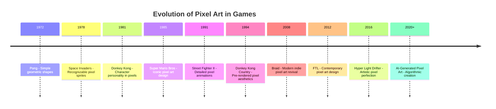

#### Technical Foundations

Early pixel art was constrained by:
- **Color Palettes**: Limited to 2-256 colors
- **Resolution**: Typically 160x144 to 320x240 pixels
- **Memory**: Sprites stored in kilobytes, not megabytes
- **Processing**: Real-time manipulation required optimization

#### Artistic Evolution

The transition from technical necessity to artistic choice involved:
1. **Constraint-Driven Creativity**: Limited resources fostered innovative design solutions
2. **Stylistic Conventions**: Established visual languages and design patterns
3. **Cultural Impact**: Pixel art became synonymous with gaming culture
4. **Modern Revival**: Contemporary games embrace pixel aesthetics deliberately

### 2.1.2 Core Features —— 核心特征

#### Visual Characteristics

**Grid-Based Structure**
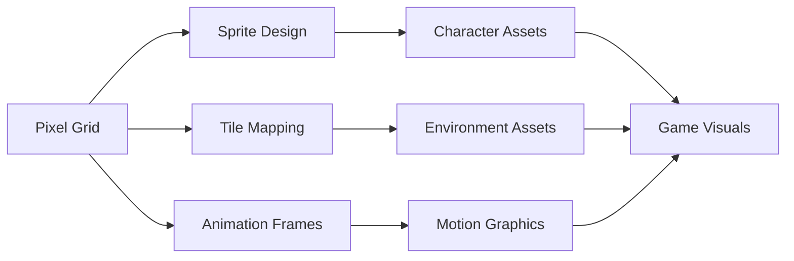

**Color Theory in Pixel Art**
- **Palette Limitations**: Strategic color selection for maximum impact
- **Dithering Techniques**: Creating gradients and textures with limited colors
- **Contrast Management**: Ensuring readability at low resolutions
- **Hue Shifting**: Advanced color techniques for depth and atmosphere

#### Technical Constraints and Advantages

**Constraints as Creative Drivers**
1. **Resolution Limits**: Force focus on essential visual elements
2. **Color Restrictions**: Encourage creative palette solutions
3. **Animation Frames**: Promote efficient motion design
4. **File Size**: Enable fast loading and minimal storage

**Modern Advantages**
- **Scalability**: Clean scaling at integer multiples
- **Performance**: Minimal rendering overhead
- **Nostalgia**: Strong emotional connection with players
- **Accessibility**: Clear, readable visual design

#### Design Principles

**Readability and Clarity**
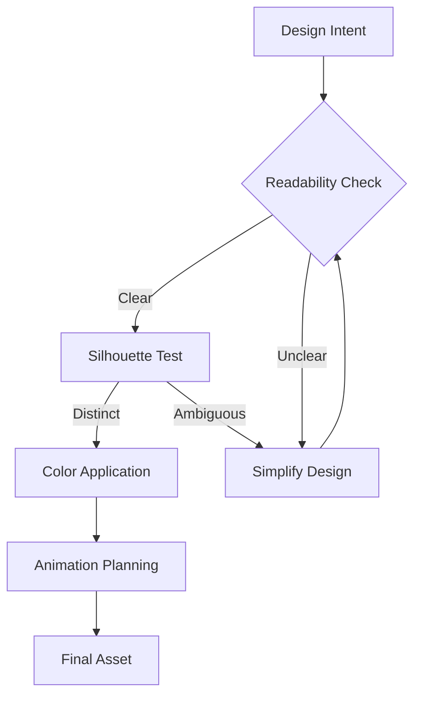

**Consistency and Style**
- **Unified Palette**: Consistent color schemes across all assets
- **Proportional Harmony**: Maintaining scale relationships
- **Stylistic Coherence**: Unified artistic vision throughout
- **Technical Standards**: Consistent pixel density and alignment

## 2.2 Procedural & AI Generation —— 程序化与AI生成

### 2.2.1 Traditional Approaches —— 传统方法

#### Constructive Methods

**Rule-Based Generation**
Constructive approaches build content through predefined rules and algorithms:

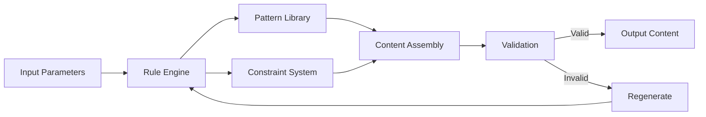

**Applications in Game Development**
- **Level Generation**: Dungeon layouts, maze structures
- **Terrain Creation**: Heightmaps, biome distribution
- **Asset Variation**: Texture patterns, architectural elements
- **Narrative Elements**: Quest structures, dialogue trees

#### Search and Evolutionary Approaches

**Genetic Algorithms in Content Generation**
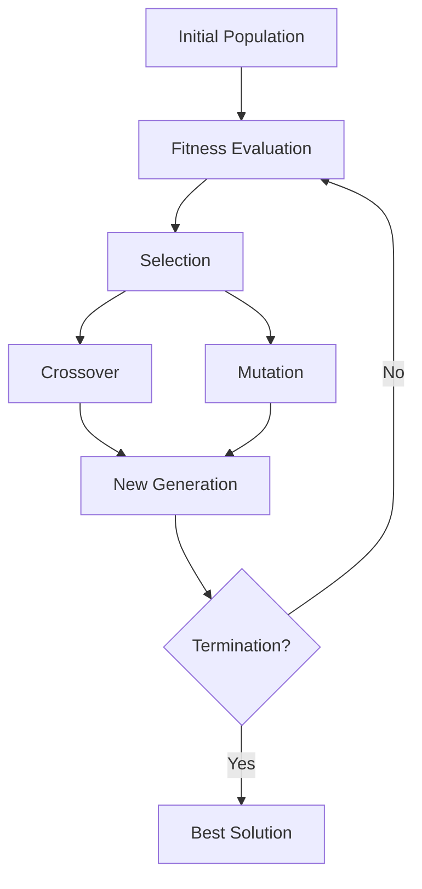

**Evolutionary Techniques**
1. **Population-Based Search**: Multiple candidate solutions evolve simultaneously
2. **Fitness Functions**: Objective measures of content quality
3. **Genetic Operators**: Crossover and mutation for variation
4. **Multi-Objective Optimization**: Balancing multiple design criteria

#### Constraint-Based Systems

**Constraint Satisfaction Problems (CSP)**
- **Variable Definition**: Game elements as variables
- **Domain Specification**: Possible values for each variable
- **Constraint Rules**: Relationships between variables
- **Solution Finding**: Algorithms to satisfy all constraints

**Wave Function Collapse (WFC)**
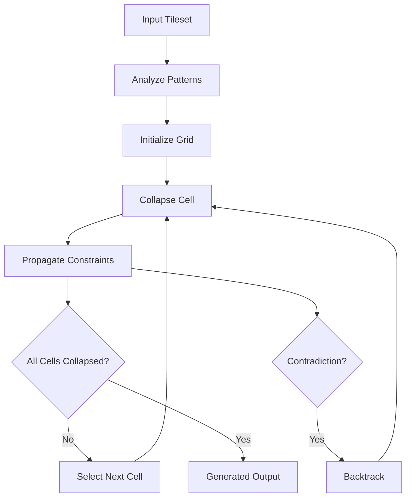

### 2.2.2 AI Image Models —— AI图像模型

#### Autoregressive Models

**Sequential Generation Approach**
Autoregressive models generate images pixel by pixel or patch by patch:

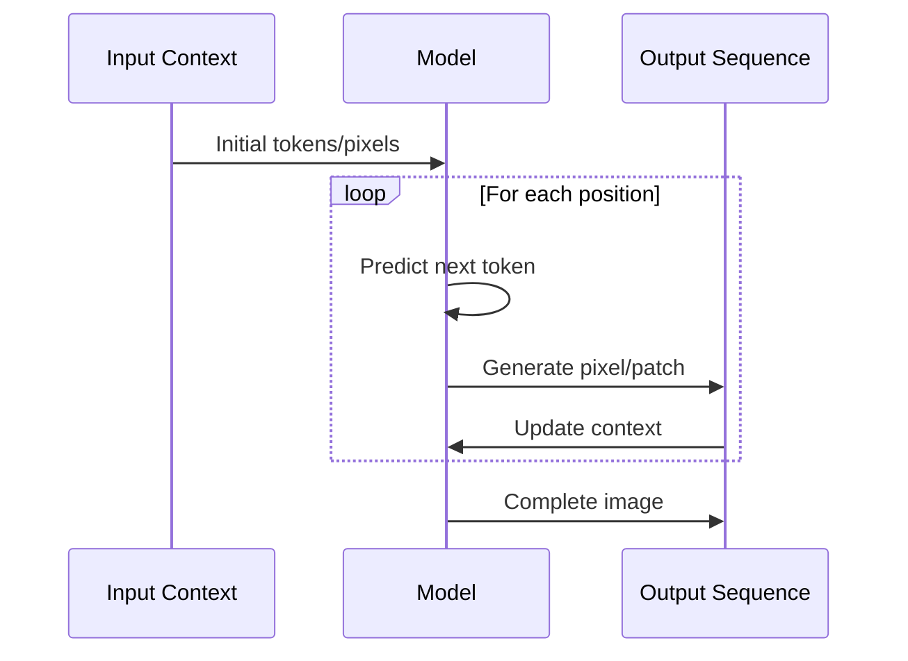

**Key Characteristics**
- **Sequential Nature**: Each pixel depends on previously generated pixels
- **Context Dependency**: Long-range dependencies through attention mechanisms
- **High Quality**: Detailed and coherent image generation
- **Computational Cost**: Slower generation due to sequential nature

#### Diffusion Models

**Denoising Process**
Diffusion models learn to reverse a noise corruption process:

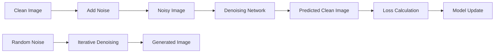

**Training and Inference**
1. **Forward Process**: Gradually add noise to training images
2. **Reverse Process**: Learn to predict and remove noise
3. **Sampling**: Start from noise and iteratively denoise
4. **Conditioning**: Guide generation with text or other inputs

#### Latent Space Diffusion

**Stable Diffusion Architecture**
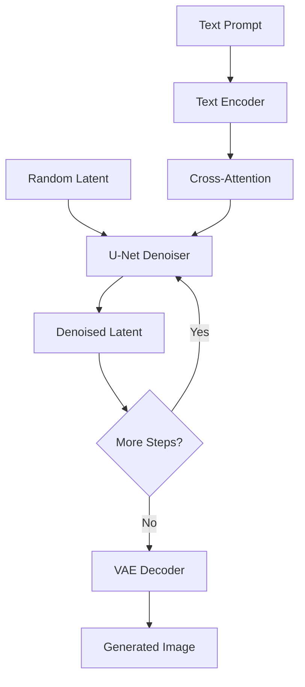

**Advantages of Latent Space**
- **Efficiency**: Lower dimensional space reduces computation
- **Quality**: Maintains high-quality generation capabilities
- **Control**: Better conditioning and fine-tuning possibilities
- **Speed**: Faster inference compared to pixel-space models

### 2.2.3 Hybrid PCG × ML —— 程序化与机器学习的结合

#### Level Generation with Machine Learning

**Neural Network-Assisted Level Design**
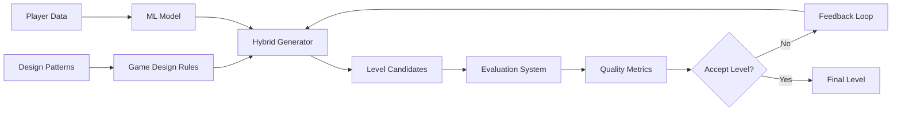

**Learning-Based Approaches**
1. **Imitation Learning**: Learn from human-designed levels
2. **Reinforcement Learning**: Optimize for player engagement metrics
3. **Generative Adversarial Networks**: Adversarial training for realistic content
4. **Variational Autoencoders**: Latent space manipulation for content variation

#### Terrain and Environment Generation

**Multi-Scale Generation Pipeline**
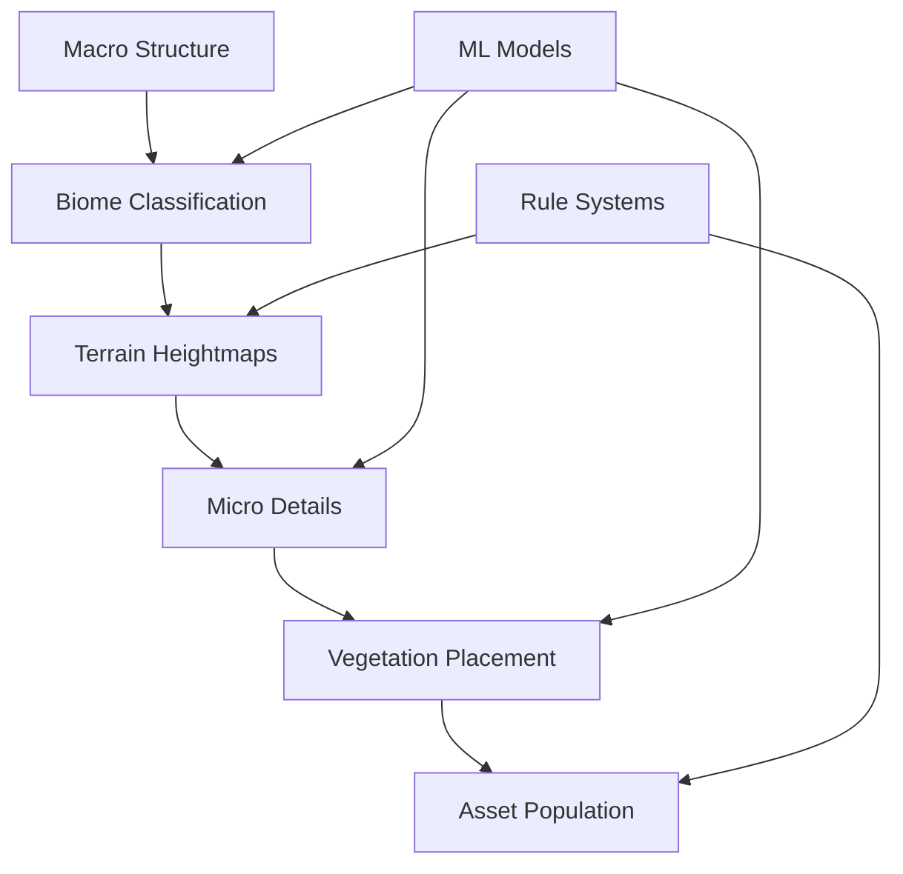

#### Narrative Generation

**AI-Assisted Storytelling**
- **Plot Structure Generation**: ML models for narrative arcs
- **Character Development**: Procedural personality and dialogue
- **Quest Generation**: Dynamic mission creation based on player behavior
- **Dialogue Systems**: Natural language generation for NPCs

### 2.2.4 Controllability & Conditioning —— 可控生成与条件建模

#### Text Conditioning

**Prompt Engineering for Game Assets**
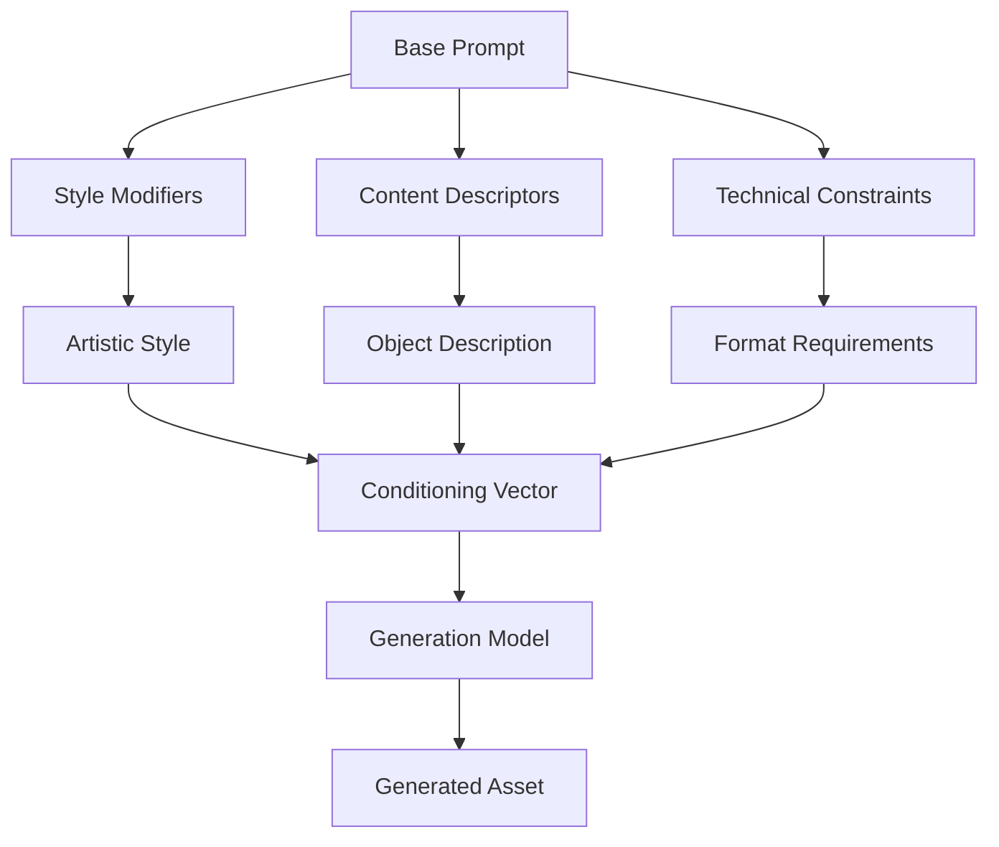

**Prompt Design Strategies**
1. **Hierarchical Prompts**: Structured descriptions from general to specific
2. **Style Transfer**: Consistent artistic direction across assets
3. **Negative Prompts**: Explicit exclusion of unwanted elements
4. **Weighted Terms**: Emphasis control for important features

#### Cross-Attention Mechanisms

**Attention-Based Conditioning**
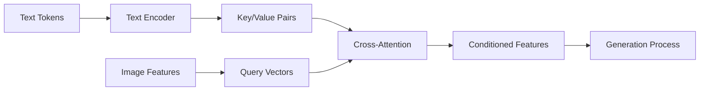

#### Structure and Layout Constraints

**Spatial Control Methods**
1. **ControlNet**: Additional neural networks for spatial guidance
2. **Inpainting**: Selective region modification and completion
3. **Depth Maps**: 3D structure guidance for 2D generation
4. **Edge Maps**: Contour-based generation control

**Layout-Aware Generation**
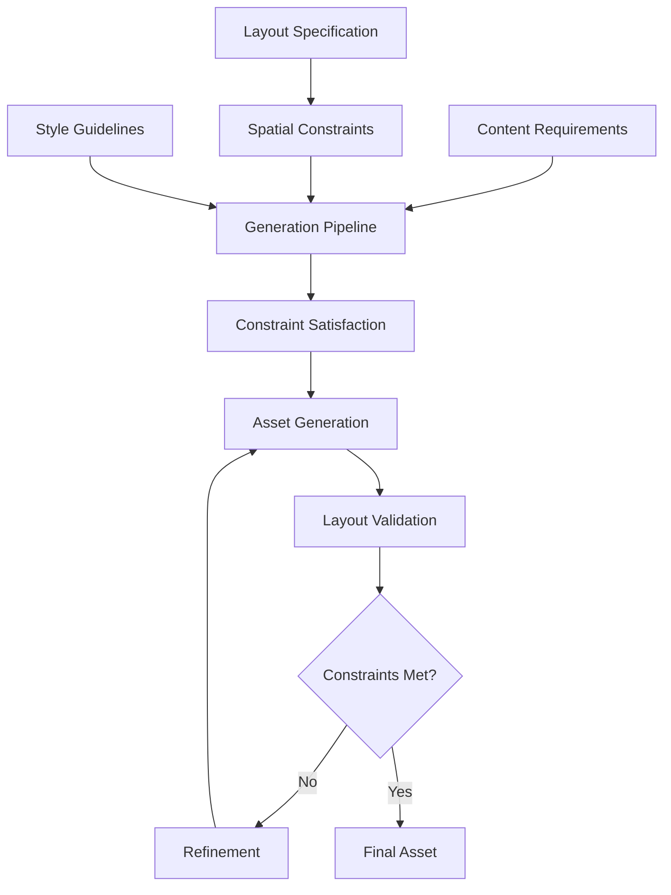

## 2.3 AI in Games & Platformers —— AI在游戏与平台跳跃中的应用与艺术实践

### 2.3.1 Production Pipeline Uses —— 生产管线中的应用

#### Level Generation Applications

**Automated Level Design**
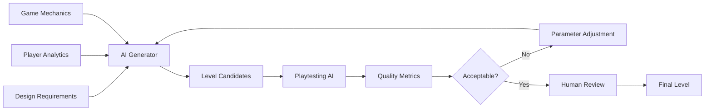

**Industry Applications**
1. **Procedural Dungeons**: Automated dungeon layout generation
2. **Terrain Generation**: Large-scale world creation
3. **Puzzle Design**: AI-assisted puzzle creation and validation
4. **Difficulty Balancing**: Dynamic difficulty adjustment systems

#### Asset Assistance and Augmentation

**AI-Assisted Art Pipeline**
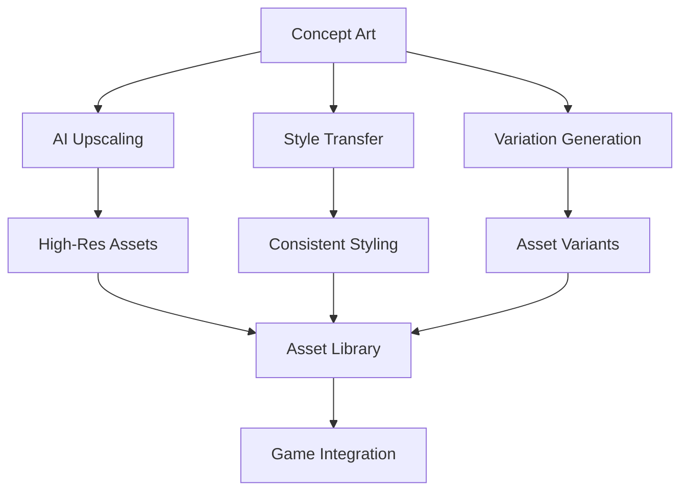

**Workflow Integration**
- **Concept Exploration**: Rapid ideation and visualization
- **Asset Iteration**: Quick variations and refinements
- **Quality Enhancement**: Upscaling and detail addition
- **Style Consistency**: Maintaining visual coherence across assets

#### Hybrid Creation Workflows

**Human-AI Collaboration Model**
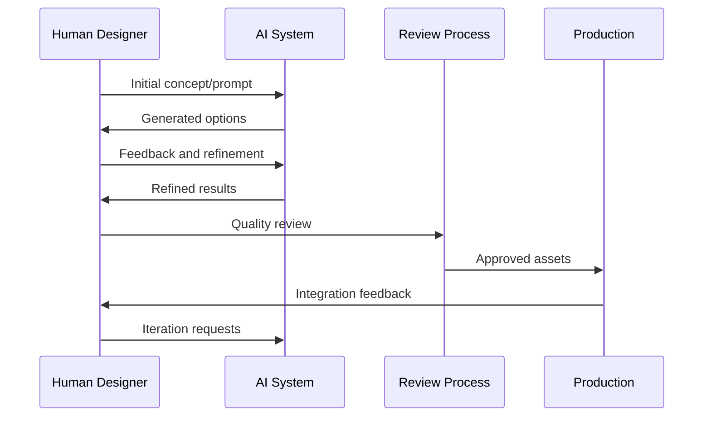

### 2.3.2 Platformer Cases —— 平台跳跃相关研究与数据集

#### Level Serialization and Representation

**Mario Level Encoding**
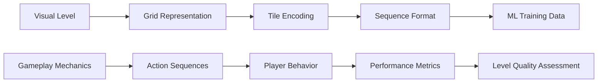

**Data Representation Methods**
1. **Grid-Based Encoding**: 2D arrays representing tile types
2. **Sequence Modeling**: Linear sequences for RNN/Transformer training
3. **Graph Representations**: Connectivity and flow analysis
4. **Multi-Modal Data**: Combining visual and gameplay information

#### Research Datasets and Benchmarks

**Notable Datasets**
- **Mario AI Framework**: Standardized Mario level generation benchmark
- **VGLC (Video Game Level Corpus)**: Large-scale level collection
- **Platformer Level Dataset**: Annotated platformer levels with difficulty ratings
- **Procedural Content Generation Benchmarks**: Standardized evaluation metrics

**Evaluation Metrics**
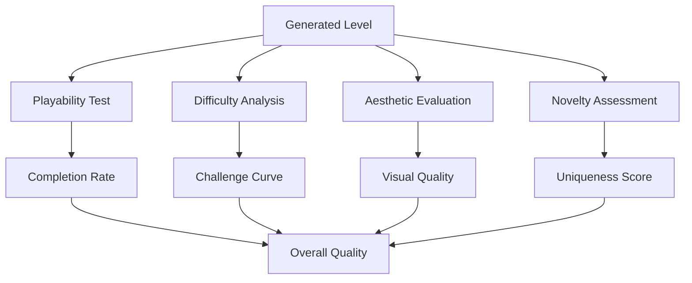

### 2.3.3 Artistic Considerations —— 艺术层面的像素风约束

#### Pixel Grid Constraints

**Grid Alignment Requirements**
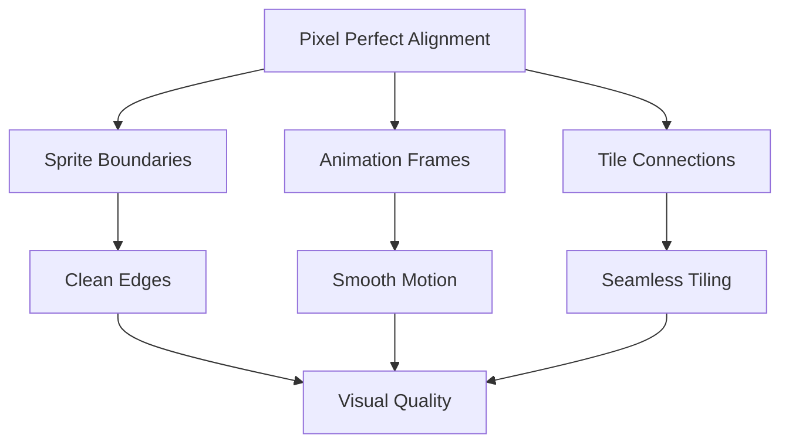

**Technical Constraints**
1. **Pixel Boundaries**: All elements must align to pixel grid
2. **Scaling Factors**: Integer scaling to maintain crispness
3. **Sub-pixel Positioning**: Avoiding blur from fractional positions
4. **Consistent Resolution**: Uniform pixel density across assets

#### Seamless Tiling and Connectivity

**Tileable Asset Design**
```mermaid
flowchart LR
    A[Base Tile] --> B[Edge Analysis]
    B --> C[Seamless Edges]
    C --> D[Pattern Matching]
    D --> E[Tile Variants]
    E --> F[Connectivity Rules]
    F --> G[Tilemap Generation]
```

**Connectivity Patterns**
- **Edge Matching**: Ensuring tiles connect properly
- **Corner Resolution**: Handling tile intersections
- **Transition Tiles**: Smooth boundaries between different tile types
- **Variation Systems**: Multiple tiles for visual diversity

#### Resolution and Fidelity Balance

**Quality vs. Performance Trade-offs**
```mermaid
graph TD
    A[Art Direction] --> B{Resolution Choice}
    B -->|Low Res| C[Authentic Retro]
    B -->|High Res| D[Modern Quality]
    
    C --> E[Performance Benefits]
    C --> F[Style Limitations]
    
    D --> G[Visual Fidelity]
    D --> H[Resource Overhead]
    
    E --> I[Platform Compatibility]
    F --> J[Creative Constraints]
    G --> K[Market Appeal]
    H --> L[Technical Requirements]
```

**Resolution Considerations**
1. **Target Platform**: Mobile vs. desktop capabilities
2. **Art Style**: Authentic retro vs. modern interpretation
3. **Performance**: Frame rate and memory constraints
4. **Scalability**: Multiple resolution support

---

*This background section establishes the theoretical and practical foundations necessary for understanding the innovations presented in Pixel Seed. The next section will identify specific problems and limitations in current approaches.*