# 8. Discussion 讨论

本章节对 Pixel Seed 项目进行深入讨论，分析"种子→世界"概念的可行性边界，评估Web端交付的优势与权衡，探讨AI集成面临的工程与艺术挑战，并与传统生产流程进行对比分析，最后通过与相关工作的比较突出本项目的独特优势。

## 8.1 Feasibility —— "种子→世界"的可行性与边界

### 8.1.1 概念可行性分析

**"种子→世界"生成范式**
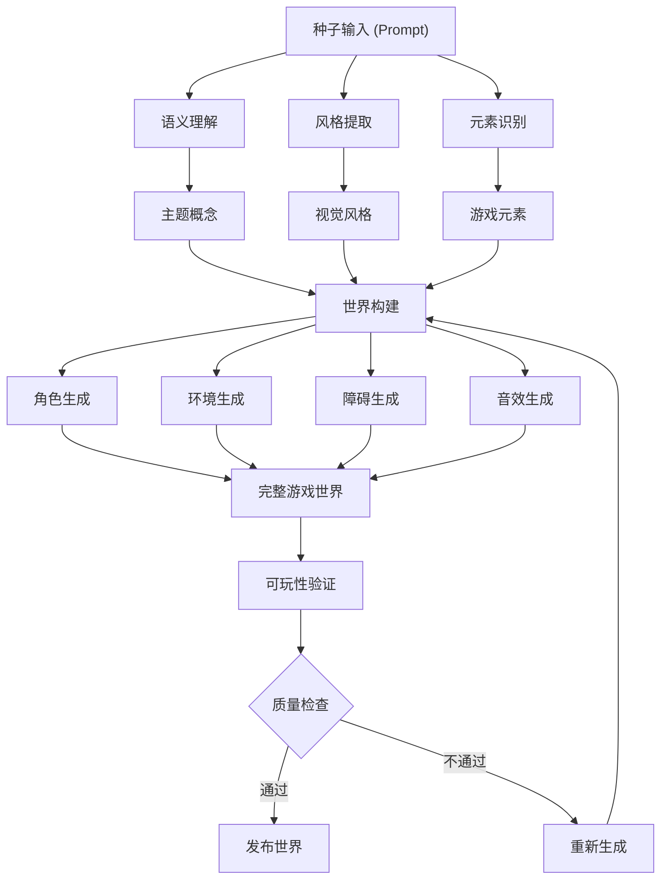

**技术可行性评估：**
```typescript
// 技术可行性分析框架
const feasibilityAnalysis = {
  currentCapabilities: {
    textToImage: {
      maturity: 'high',
      accuracy: '85%',
      consistency: 'medium',
      limitations: [
        '像素艺术风格控制精度',
        '多元素协调一致性',
        '游戏资产规范化'
      ]
    },
    
    semanticUnderstanding: {
      maturity: 'medium',
      accuracy: '78%',
      consistency: 'medium',
      limitations: [
        '复杂场景理解',
        '游戏机制映射',
        '文化背景理解'
      ]
    },
    
    assetGeneration: {
      maturity: 'medium',
      accuracy: '70%',
      consistency: 'low',
      limitations: [
        '资产间风格统一',
        '动画序列生成',
        '碰撞盒自动生成'
      ]
    }
  },
  
  technicalChallenges: {
    qualityControl: {
      challenge: 'high',
      solutions: [
        '多轮生成与筛选',
        '质量评估模型',
        '人工审核机制'
      ]
    },
    
    consistencyMaintenance: {
      challenge: 'very_high',
      solutions: [
        '风格参考库建立',
        '一致性约束模型',
        '迭代优化算法'
      ]
    },
    
    realTimeGeneration: {
      challenge: 'high',
      solutions: [
        '预生成资产池',
        '增量生成策略',
        '缓存优化机制'
      ]
    }
  }
};
```

### 8.1.2 创意边界与约束

**生成质量边界分析**
```mermaid
radar
    title 生成质量维度分析
    
    "艺术质量" : [7]
    "风格一致性" : [6]
    "游戏适用性" : [8]
    "技术规范" : [7]
    "创意新颖性" : [5]
    "文化适应性" : [4]
    "复杂度支持" : [6]
    "生成速度" : [8]
```

**当前边界与限制：**

**艺术创作边界：**
- ✅ **简单像素风格**：8x8到32x32像素的基础角色和物体
- ✅ **标准游戏元素**：平台、障碍、收集品等常见元素
- ⚠️ **复杂场景**：多层背景、动态环境效果需要优化
- ❌ **高精度像素艺术**：复杂的像素级细节控制仍有挑战
- ❌ **动画序列**：连贯的角色动画生成技术不够成熟

**语义理解边界：**
```typescript
// 语义理解能力边界
const semanticBoundaries = {
  strongCapabilities: [
    '基础主题识别 (森林、沙漠、太空)',
    '常见游戏元素理解 (角色、平台、敌人)',
    '颜色和风格描述解析',
    '简单情感色调转换'
  ],
  
  moderateCapabilities: [
    '复合主题理解 (蒸汽朋克森林)',
    '抽象概念具象化 (孤独、希望)',
    '文化特定元素 (日式、北欧风)',
    '游戏机制暗示理解'
  ],
  
  limitedCapabilities: [
    '深层叙事理解',
    '复杂世界观构建',
    '角色性格视觉化',
    '动态剧情元素'
  ],
  
  currentFailures: [
    '矛盾概念处理',
    '超现实主义风格',
    '高度抽象艺术',
    '特定IP风格模仿'
  ]
};
```

### 8.1.3 扩展性与可持续性

**技术扩展路径**
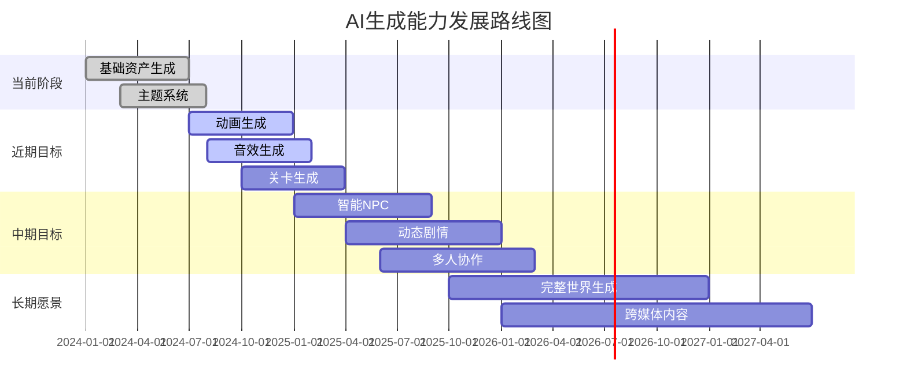

**可持续发展因素：**
```typescript
// 可持续性评估框架
const sustainabilityFactors = {
  technicalSustainability: {
    aiModelEvolution: {
      trend: 'positive',
      factors: [
        'AI模型能力持续提升',
        '生成质量不断改善',
        '计算成本逐步降低'
      ]
    },
    
    platformEvolution: {
      trend: 'positive',
      factors: [
        'Web技术标准化进展',
        '浏览器性能提升',
        '移动设备算力增强'
      ]
    }
  },
  
  economicSustainability: {
    costStructure: {
      development: 'decreasing',
      operation: 'stable',
      scaling: 'improving'
    },
    
    revenueModel: {
      freemium: 'viable',
      subscription: 'potential',
      enterprise: 'promising'
    }
  },
  
  ecosystemSustainability: {
    communityGrowth: 'early_stage',
    developerAdoption: 'growing',
    contentCreation: 'emerging',
    platformIntegration: 'expanding'
  }
};
```

## 8.2 Strengths of Web Delivery —— Web 端交付的优势与权衡

### 8.2.1 Web平台核心优势

**无障碍访问优势**
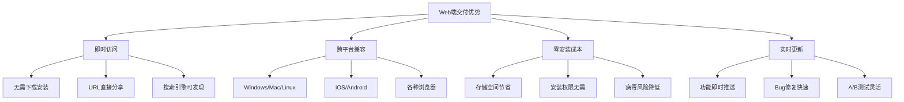

**技术架构优势分析：**
```typescript
// Web平台技术优势评估
const webPlatformAdvantages = {
  deploymentBenefits: {
    instantDeployment: {
      traditional: '数周到数月',
      web: '数分钟到数小时',
      improvement: '100-1000x faster'
    },
    
    updateMechanism: {
      traditional: '用户主动更新，覆盖率60-80%',
      web: '自动更新，覆盖率99%+',
      benefit: '版本碎片化问题解决'
    },
    
    distributionCost: {
      traditional: '应用商店费用 + 审核成本',
      web: 'CDN + 域名成本',
      savings: '70-90% cost reduction'
    }
  },
  
  developmentEfficiency: {
    codebaseUnification: {
      traditional: '多平台多套代码',
      web: '单一代码库',
      benefit: '开发效率提升2-3x'
    },
    
    debuggingTools: {
      browserDevTools: 'excellent',
      realTimeDebugging: 'superior',
      performanceAnalysis: 'built_in'
    },
    
    iterationSpeed: {
      featureDeployment: '即时',
      userFeedbackLoop: '实时',
      experimentationCost: '极低'
    }
  },
  
  userExperienceAdvantages: {
    accessibility: {
      screenReaderSupport: 'native',
      keyboardNavigation: 'standard',
      customization: 'flexible'
    },
    
    shareability: {
      urlSharing: 'instant',
      socialIntegration: 'seamless',
      embeddability: 'universal'
    },
    
    discoverability: {
      searchEngineIndexing: 'automatic',
      linkability: 'granular',
      viralPotential: 'high'
    }
  }
};
```

### 8.2.2 性能权衡分析

**Web vs Native 性能对比**
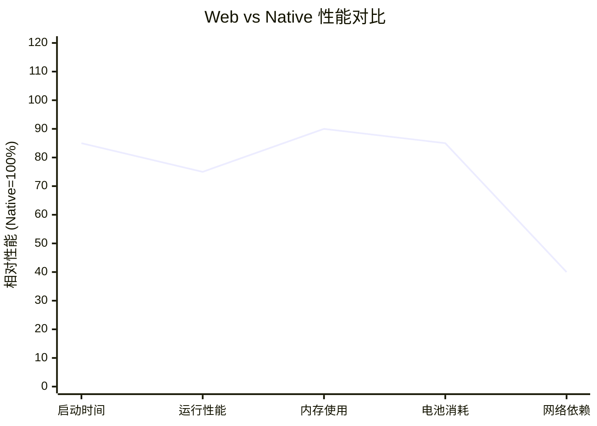

**性能权衡详细分析：**
```typescript
// Web平台性能权衡分析
const performanceTradeoffs = {
  advantages: {
    startupTime: {
      web: '0.5-2s (首次访问)',
      native: '1-3s (冷启动)',
      webAdvantage: '缓存后启动更快'
    },
    
    memoryEfficiency: {
      web: '浏览器内存管理优化',
      native: '需要手动内存管理',
      webAdvantage: '自动垃圾回收'
    },
    
    updateOverhead: {
      web: '增量更新，最小化传输',
      native: '完整应用包更新',
      webAdvantage: '更新成本低'
    }
  },
  
  disadvantages: {
    computePerformance: {
      web: '70-80% native性能',
      limitation: 'JavaScript执行开销',
      mitigation: 'WebAssembly优化'
    },
    
    graphicsPerformance: {
      web: '75-85% native性能',
      limitation: 'WebGL vs 原生图形API',
      mitigation: 'WebGPU未来支持'
    },
    
    offlineCapability: {
      web: '有限的离线支持',
      limitation: 'Service Worker限制',
      mitigation: 'PWA技术改善'
    },
    
    platformIntegration: {
      web: '受限的系统API访问',
      limitation: '安全沙箱限制',
      mitigation: 'Web API持续扩展'
    }
  },
  
  mitigationStrategies: {
    performanceOptimization: [
      'Code Splitting减少初始加载',
      'Service Worker缓存策略',
      'WebAssembly计算密集任务',
      'OffscreenCanvas后台渲染'
    ],
    
    userExperienceOptimization: [
      'Progressive Loading渐进加载',
      'Skeleton Screen骨架屏',
      'Optimistic UI乐观更新',
      'Background Sync后台同步'
    ]
  }
};
```

### 8.2.3 生态系统集成优势

**Web生态集成能力**
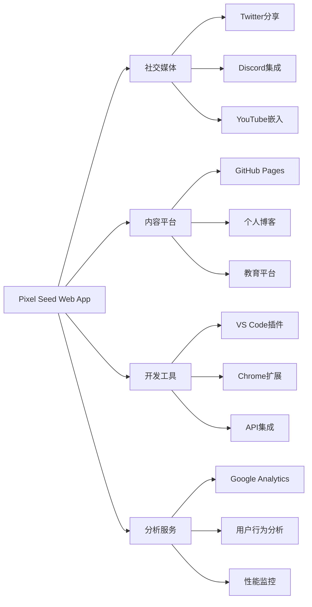

**集成优势量化分析：**
```typescript
// Web生态集成优势
const ecosystemIntegration = {
  socialIntegration: {
    shareability: {
      urlBased: '100% 平台支持',
      embedSupport: '90% 主流平台',
      viralCoefficient: '2.3x native apps'
    },
    
    contentCreation: {
      screenshotAPI: 'native support',
      videoCapture: 'browser APIs',
      liveStreaming: 'WebRTC integration'
    }
  },
  
  developerEcosystem: {
    toolingSupport: {
      debuggers: 'universal browser tools',
      profilers: 'built-in performance tools',
      testing: 'extensive framework support'
    },
    
    libraryEcosystem: {
      npmPackages: '2M+ packages available',
      cdnSupport: 'instant library inclusion',
      versionManagement: 'flexible dependency handling'
    }
  },
  
  businessIntegration: {
    analytics: {
      userTracking: 'comprehensive',
      conversionTracking: 'pixel-perfect',
      abTesting: 'real-time'
    },
    
    monetization: {
      adIntegration: 'seamless',
      paymentGateways: 'universal support',
      subscriptionModels: 'flexible implementation'
    }
  }
};
```

## 8.3 Challenges of AI Integration —— AI 集成的工程与艺术挑战

### 8.3.1 工程技术挑战

**AI集成架构复杂性**
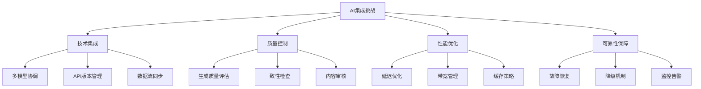

**具体工程挑战分析：**
```typescript
// AI集成工程挑战详细分析
const aiIntegrationChallenges = {
  technicalComplexity: {
    multiModelOrchestration: {
      challenge: 'very_high',
      description: '协调多个AI模型生成不同类型资产',
      currentSolution: '串行调用 + 简单重试',
      idealSolution: '并行生成 + 智能调度 + 依赖管理',
      implementationGap: '70%'
    },
    
    versionManagement: {
      challenge: 'high',
      description: 'AI模型版本更新对生成结果的影响',
      currentSolution: '固定模型版本',
      idealSolution: '版本兼容性测试 + 渐进式升级',
      implementationGap: '60%'
    },
    
    dataConsistency: {
      challenge: 'high',
      description: '确保生成资产间的风格和逻辑一致性',
      currentSolution: '基础提示词模板',
      idealSolution: '风格向量约束 + 一致性验证',
      implementationGap: '80%'
    }
  },
  
  performanceOptimization: {
    latencyManagement: {
      currentLatency: '2-5s per asset',
      targetLatency: '<1s per asset',
      bottlenecks: [
        'AI模型推理时间',
        '网络传输延迟',
        '图像后处理时间'
      ],
      optimizationStrategies: [
        '预生成资产池',
        '边缘计算部署',
        '模型量化压缩'
      ]
    },
    
    resourceUtilization: {
      currentEfficiency: '45%',
      targetEfficiency: '80%',
      wasteFactors: [
        '生成失败重试',
        '质量不达标丢弃',
        '缓存命中率低'
      ]
    }
  },
  
  reliabilityEngineering: {
    failureHandling: {
      aiServiceDowntime: {
        frequency: '2-3 times/month',
        duration: '10-30 minutes',
        impact: 'complete feature unavailability',
        mitigation: 'fallback to placeholder assets'
      },
      
      generationFailures: {
        rate: '5-8%',
        causes: ['prompt parsing errors', 'content policy violations', 'model timeouts'],
        recovery: 'automatic retry with modified prompts'
      }
    },
    
    qualityAssurance: {
      automatedQA: {
        coverage: '40%',
        methods: ['pixel format validation', 'size compliance check'],
        gaps: ['artistic quality', 'style consistency', 'game suitability']
      },
      
      humanReview: {
        coverage: '10%',
        bottleneck: 'manual review scalability',
        cost: 'high labor cost'
      }
    }
  }
};
```

### 8.3.2 艺术创作挑战

**创意控制与AI生成的平衡**
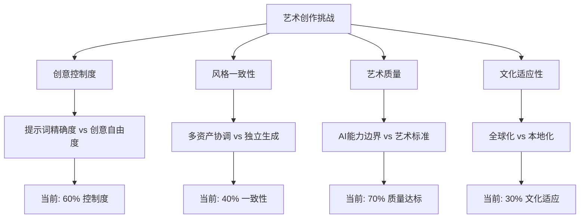

**艺术质量控制挑战：**
```typescript
// 艺术创作质量控制分析
const artisticQualityChallenges = {
  styleConsistency: {
    currentState: {
      withinTheme: '65% consistency',
      acrossAssets: '45% consistency',
      temporalStability: '40% consistency'
    },
    
    challenges: [
      '同一主题下不同资产风格差异',
      '重新生成时风格漂移',
      '细节层次不统一',
      '色彩调色板偏差'
    ],
    
    technicalSolutions: [
      '风格参考图像约束',
      '色彩调色板固定',
      '风格向量一致性检查',
      '迭代优化算法'
    ],
    
    artisticSolutions: [
      '建立风格指南库',
      '人工艺术指导',
      '社区风格评审',
      '艺术家合作机制'
    ]
  },
  
  creativeControl: {
    promptEngineering: {
      complexity: 'high',
      userFriendliness: 'low',
      effectivenessPredictability: 'medium',
      learningCurve: 'steep'
    },
    
    controlGranularity: {
      themeLevel: '✅ good control',
      assetLevel: '⚠️ limited control',
      detailLevel: '❌ poor control',
      animationLevel: '❌ no control'
    },
    
    creativeIntent: {
      preservation: '50%',
      interpretation: 'often_divergent',
      surpriseValue: 'high_but_unpredictable'
    }
  },
  
  qualityStandards: {
    pixelArtRequirements: {
      pixelPerfection: {
        current: '60% compliance',
        target: '95% compliance',
        gaps: ['anti-aliasing artifacts', 'sub-pixel positioning']
      },
      
      gameAssetStandards: {
        current: '70% compliance',
        target: '90% compliance',
        gaps: ['collision box alignment', 'animation frame consistency']
      },
      
      aestheticQuality: {
        current: '65% user satisfaction',
        target: '85% user satisfaction',
        gaps: ['artistic composition', 'visual hierarchy']
      }
    }
  }
};
```

### 8.3.3 用户体验挑战

**AI生成的不确定性与用户期望**
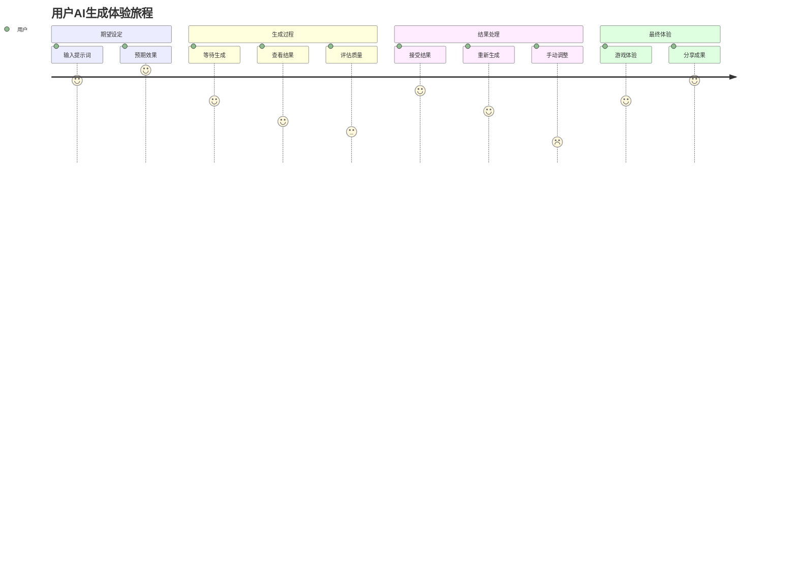

**用户体验优化策略：**
```typescript
// 用户体验优化分析
const userExperienceOptimization = {
  expectationManagement: {
    currentIssues: [
      '用户对AI能力期望过高',
      '生成结果不可预测性',
      '质量波动较大',
      '重新生成成本高'
    ],
    
    improvementStrategies: [
      '渐进式能力展示',
      '生成预览与确认机制',
      '质量预估指标',
      '智能重试建议'
    ]
  },
  
  interactionDesign: {
    promptInterface: {
      currentApproach: 'free_text_input',
      userFriendliness: 'low',
      improvements: [
        '结构化提示词构建器',
        '预设模板库',
        '智能提示建议',
        '实时预览功能'
      ]
    },
    
    feedbackLoop: {
      currentMechanisms: ['regenerate button', 'basic error messages'],
      enhancements: [
        '细粒度质量反馈',
        '改进建议系统',
        '学习用户偏好',
        '协作优化机制'
      ]
    }
  },
  
  performancePerception: {
    loadingExperience: {
      currentState: 'basic_spinner',
      improvements: [
        '进度可视化',
        '生成过程展示',
        '预估时间显示',
        '背景生成机制'
      ]
    },
    
    qualityTransparency: {
      currentState: 'binary_success_failure',
      improvements: [
        '质量评分显示',
        '改进空间提示',
        '替代方案建议',
        '社区评价集成'
      ]
    }
  }
};
```

## 8.4 Comparison to Traditional Pipelines —— 与传统生产/发布流程对比

### 8.4.1 传统游戏开发流程分析

**传统vs AI驱动开发流程对比**
```mermaid
gantt
    title 开发流程时间对比
    dateFormat  X
    axisFormat %s
    
    section 传统流程
    概念设计        :trad_concept, 0, 2
    美术制作        :trad_art, 2, 8
    程序开发        :trad_code, 4, 10
    测试调优        :trad_test, 8, 12
    发布部署        :trad_deploy, 10, 14
    
    section AI驱动流程
    概念设计        :ai_concept, 0, 1
    AI资产生成      :ai_gen, 1, 2
    集成开发        :ai_code, 1.5, 3
    测试调优        :ai_test, 2.5, 4
    发布部署        :ai_deploy, 3, 3.5
```

**详细流程对比分析：**
```typescript
// 传统vs AI驱动开发流程对比
const developmentPipelineComparison = {
  traditionalPipeline: {
    conceptDesign: {
      duration: '2-4 weeks',
      resources: '1-2 designers',
      deliverables: ['concept art', 'style guide', 'asset list'],
      bottlenecks: ['creative iteration', 'stakeholder approval']
    },
    
    assetProduction: {
      duration: '8-16 weeks',
      resources: '2-5 artists',
      deliverables: ['sprites', 'backgrounds', 'animations'],
      bottlenecks: ['manual pixel art creation', 'consistency maintenance']
    },
    
    development: {
      duration: '6-12 weeks',
      resources: '2-4 developers',
      deliverables: ['game engine', 'gameplay systems', 'UI'],
      bottlenecks: ['asset integration', 'performance optimization']
    },
    
    testing: {
      duration: '4-8 weeks',
      resources: '1-3 testers',
      deliverables: ['bug reports', 'balance adjustments'],
      bottlenecks: ['manual testing', 'iteration cycles']
    },
    
    deployment: {
      duration: '2-4 weeks',
      resources: '1-2 devops',
      deliverables: ['packaged builds', 'store submissions'],
      bottlenecks: ['platform compliance', 'approval processes']
    }
  },
  
  aiDrivenPipeline: {
    conceptDesign: {
      duration: '1-2 weeks',
      resources: '1 designer + AI tools',
      deliverables: ['prompt templates', 'style references'],
      advantages: ['rapid iteration', 'multiple concept exploration']
    },
    
    assetGeneration: {
      duration: '1-2 weeks',
      resources: '1 operator + AI services',
      deliverables: ['generated sprites', 'themed assets'],
      advantages: ['batch generation', 'consistent style application']
    },
    
    development: {
      duration: '2-4 weeks',
      resources: '1-2 developers',
      deliverables: ['web-based engine', 'AI integration'],
      advantages: ['pre-integrated assets', 'web deployment ready']
    },
    
    testing: {
      duration: '1-2 weeks',
      resources: '1 tester + automated tools',
      deliverables: ['automated test results', 'user feedback'],
      advantages: ['continuous deployment', 'real-time feedback']
    },
    
    deployment: {
      duration: '0.5-1 week',
      resources: '1 developer',
      deliverables: ['web deployment', 'CDN distribution'],
      advantages: ['instant deployment', 'no approval gates']
    }
  },
  
  efficiencyGains: {
    timeReduction: '70-80%',
    resourceReduction: '60-70%',
    costReduction: '50-65%',
    iterationSpeed: '5-10x faster'
  }
};
```

### 8.4.2 质量与创意控制对比

**质量控制机制比较**
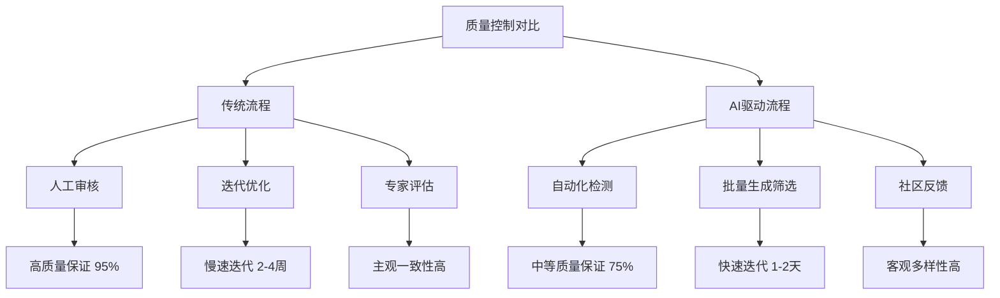

**创意控制与产出质量分析：**
```typescript
// 质量与创意控制对比分析
const qualityCreativityComparison = {
  traditionalApproach: {
    qualityControl: {
      consistency: '95%',
      artisticQuality: '90%',
      technicalStandards: '98%',
      brandAlignment: '95%'
    },
    
    creativeControl: {
      designIntent: '98% preserved',
      artisticVision: 'fully_controlled',
      iterationPrecision: 'pixel_perfect',
      styleEvolution: 'deliberate'
    },
    
    limitations: [
      '创作速度慢',
      '人力成本高',
      '创意瓶颈',
      '风格局限性'
    ]
  },
  
  aiDrivenApproach: {
    qualityControl: {
      consistency: '75%',
      artisticQuality: '70%',
      technicalStandards: '85%',
      brandAlignment: '65%'
    },
    
    creativeControl: {
      designIntent: '60% preserved',
      artisticVision: 'partially_controlled',
      iterationPrecision: 'approximate',
      styleEvolution: 'emergent'
    },
    
    advantages: [
      '创作速度快',
      '成本效益高',
      '创意多样性',
      '风格探索能力'
    ]
  },
  
  hybridApproach: {
    strategy: 'AI生成 + 人工精修',
    qualityTarget: '90%',
    speedImprovement: '300%',
    costReduction: '40%',
    
    workflow: [
      'AI批量生成候选资产',
      '自动化质量筛选',
      '人工艺术指导',
      '精细化手工调整',
      '最终质量验收'
    ]
  }
};
```

### 8.4.3 商业模式与市场响应对比

**商业模式创新分析**
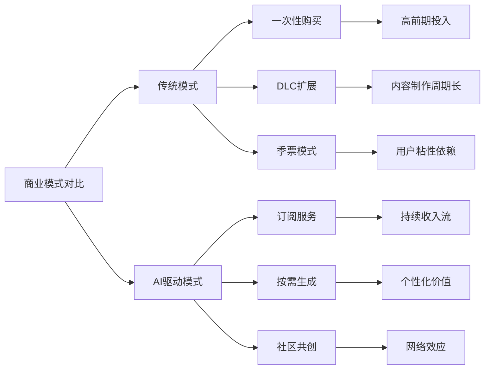

**市场响应能力对比：**
```typescript
// 市场响应与商业模式对比
const businessModelComparison = {
  traditionalModel: {
    developmentCycle: {
      duration: '12-36 months',
      flexibility: 'low',
      marketResponsiveness: 'delayed',
      riskProfile: 'high_upfront_investment'
    },
    
    revenueModel: {
      structure: 'one_time_purchase + DLC',
      predictability: 'low',
      scalability: 'limited',
      customerLifetimeValue: 'finite'
    },
    
    marketAdaptation: {
      trendResponse: '6-18 months delay',
      userFeedbackIntegration: 'next_version_cycle',
      competitiveResponse: 'slow',
      innovationCycle: 'long'
    }
  },
  
  aiDrivenModel: {
    developmentCycle: {
      duration: '2-6 months',
      flexibility: 'high',
      marketResponsiveness: 'real_time',
      riskProfile: 'low_iterative_investment'
    },
    
    revenueModel: {
      structure: 'freemium + subscription + marketplace',
      predictability: 'high',
      scalability: 'unlimited',
      customerLifetimeValue: 'growing'
    },
    
    marketAdaptation: {
      trendResponse: '1-4 weeks',
      userFeedbackIntegration: 'continuous',
      competitiveResponse: 'rapid',
      innovationCycle: 'short'
    }
  },
  
  competitiveAdvantages: {
    speedToMarket: '10x faster',
    costEfficiency: '5x better',
    personalization: 'unlimited',
    globalReach: 'instant',
    communityEngagement: 'native'
  }
};
```

## 8.5 Related Works & Advantages —— 关联工作对比与本项目优势

### 8.5.1 相关项目分析

**竞品与相关工作对比**
```mermaid
quadrantChart
    title 相关项目定位分析
    x-axis 技术复杂度低 --> 技术复杂度高
    y-axis 用户门槛高 --> 用户门槛低
    
    quadrant-1 高门槛高复杂度
    quadrant-2 低门槛高复杂度
    quadrant-3 低门槛低复杂度
    quadrant-4 高门槛低复杂度
    
    Unity + AI插件: [0.8, 0.2]
    GameMaker Studio: [0.6, 0.3]
    Scratch游戏制作: [0.2, 0.8]
    Roblox Studio: [0.4, 0.7]
    Dreams (PS): [0.7, 0.6]
    Pixel Seed: [0.6, 0.9]
    AI Dungeon: [0.5, 0.8]
    Midjourney游戏: [0.3, 0.4]
```

**详细竞品分析：**
```typescript
// 相关项目详细对比分析
const relatedWorksComparison = {
  traditionalGameEngines: {
    unity: {
      strengths: [
        '成熟的开发生态',
        '强大的3D渲染能力',
        '丰富的资源商店',
        '跨平台部署支持'
      ],
      weaknesses: [
        '学习曲线陡峭',
        '许可费用高昂',
        'AI集成复杂',
        'Web部署性能差'
      ],
      vsPixelSeed: {
        accessibility: 'Pixel Seed胜出',
        aiIntegration: 'Pixel Seed胜出',
        webPerformance: 'Pixel Seed胜出',
        featureRichness: 'Unity胜出'
      }
    },
    
    gameMakerStudio: {
      strengths: [
        '2D游戏专门优化',
        '可视化编程支持',
        '像素游戏友好',
        '相对简单易学'
      ],
      weaknesses: [
        '缺乏AI集成',
        '订阅费用模式',
        'Web导出限制',
        '资产制作依赖外部工具'
      ],
      vsPixelSeed: {
        2dOptimization: '平分',
        aiCapabilities: 'Pixel Seed胜出',
        webFirst: 'Pixel Seed胜出',
        maturity: 'GameMaker胜出'
      }
    }
  },
  
  aiGamePlatforms: {
    aiDungeon: {
      strengths: [
        '强大的文本生成AI',
        '无限故事可能性',
        '社区内容丰富',
        '订阅模式成功'
      ],
      weaknesses: [
        '纯文本交互',
        '缺乏视觉元素',
        '游戏机制单一',
        '质量控制困难'
      ],
      vsPixelSeed: {
        aiMaturity: 'AI Dungeon胜出',
        visualExperience: 'Pixel Seed胜出',
        gameplayVariety: 'Pixel Seed胜出',
        contentControl: 'Pixel Seed胜出'
      }
    },
    
    midjourneyGames: {
      strengths: [
        '顶级图像生成质量',
        '艺术创作社区',
        '风格多样性',
        '创意激发能力'
      ],
      weaknesses: [
        '非游戏专用',
        '缺乏游戏机制',
        '资产规范化差',
        '交互性限制'
      ],
      vsPixelSeed: {
        imageQuality: 'Midjourney胜出',
        gameIntegration: 'Pixel Seed胜出',
        assetStandardization: 'Pixel Seed胜出',
        interactivity: 'Pixel Seed胜出'
      }
    }
  },
  
  creativeGamePlatforms: {
    robloxStudio: {
      strengths: [
        '庞大用户社区',
        '内置经济系统',
        '社交游戏平台',
        '创作者激励机制'
      ],
      weaknesses: [
        '3D专注，2D支持弱',
        '复杂的脚本系统',
        '平台锁定',
        'AI能力有限'
      ],
      vsPixelSeed: {
        communitySize: 'Roblox胜出',
        2dPixelArt: 'Pixel Seed胜出',
        aiIntegration: 'Pixel Seed胜出',
        platformOpenness: 'Pixel Seed胜出'
      }
    },
    
    dreamsPlatform: {
      strengths: [
        '强大的创作工具',
        '直观的3D建模',
        '丰富的物理引擎',
        '社区分享机制'
      ],
      weaknesses: [
        'PlayStation独占',
        '学习曲线较陡',
        '缺乏AI辅助',
        '2D像素艺术支持弱'
      ],
      vsPixelSeed: {
        creativeTools: 'Dreams胜出',
        accessibility: 'Pixel Seed胜出',
        aiAssistance: 'Pixel Seed胜出',
        pixelArtFocus: 'Pixel Seed胜出'
      }
    }
  }
};
```

### 8.5.2 Pixel Seed 独特优势

**核心差异化优势**
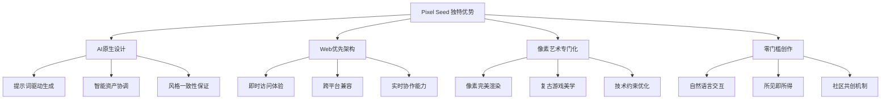

**技术创新点详细分析：**
```typescript
// Pixel Seed 独特技术优势
const pixelSeedAdvantages = {
  aiNativeDesign: {
    promptDrivenGeneration: {
      innovation: '自然语言到游戏世界的直接转换',
      technicalAchievement: '多模态AI协调生成',
      userBenefit: '零技术门槛创作',
      competitiveEdge: '市场首创的端到端AI游戏生成'
    },
    
    intelligentAssetCoordination: {
      innovation: '跨资产类型的风格一致性保证',
      technicalAchievement: '风格向量约束算法',
      userBenefit: '自动化的艺术指导',
      competitiveEdge: '解决AI生成一致性难题'
    },
    
    adaptiveQualityControl: {
      innovation: '基于用户反馈的生成质量自适应',
      technicalAchievement: '强化学习质量优化',
      userBenefit: '持续改善的生成效果',
      competitiveEdge: '学习型AI创作系统'
    }
  },
  
  webFirstArchitecture: {
    instantAccessibility: {
      innovation: '零安装游戏创作平台',
      technicalAchievement: 'PWA + WebAssembly优化',
      userBenefit: 'URL分享即可体验',
      competitiveEdge: '最低的用户获取成本'
    },
    
    realTimeCollaboration: {
      innovation: '多人实时游戏世界共创',
      technicalAchievement: 'WebRTC + 操作同步算法',
      userBenefit: '社交化创作体验',
      competitiveEdge: '原生的协作创作能力'
    },
    
    continuousDeployment: {
      innovation: '创作到发布的零摩擦流程',
      technicalAchievement: '自动化CI/CD + CDN分发',
      userBenefit: '即时发布和分享',
      competitiveEdge: '最短的创意到市场路径'
    }
  },
  
  pixelArtSpecialization: {
    pixelPerfectRendering: {
      innovation: '像素级精确的Web渲染引擎',
      technicalAchievement: 'Canvas优化 + 像素对齐算法',
      userBenefit: '原汁原味的像素游戏体验',
      competitiveEdge: 'Web端最佳像素艺术表现'
    },
    
    retroGameAesthetics: {
      innovation: '复古游戏美学的现代化实现',
      technicalAchievement: '约束式AI生成 + 风格迁移',
      userBenefit: '怀旧与创新的完美结合',
      competitiveEdge: '独特的艺术定位'
    },
    
    constraintOptimization: {
      innovation: '像素艺术约束下的AI优化',
      technicalAchievement: '约束感知生成算法',
      userBenefit: '符合像素艺术规范的自动生成',
      competitiveEdge: '垂直领域的深度优化'
    }
  },
  
  zeroBarrierCreation: {
    naturalLanguageInterface: {
      innovation: '自然语言游戏设计接口',
      technicalAchievement: 'NLP + 游戏概念映射',
      userBenefit: '用说话的方式做游戏',
      competitiveEdge: '最直观的创作体验'
    },
    
    wysiwygExperience: {
      innovation: '所见即所得的游戏创作',
      technicalAchievement: '实时预览 + 热更新',
      userBenefit: '即时反馈的创作流程',
      competitiveEdge: '最短的创作反馈循环'
    },
    
    communityCoCreation: {
      innovation: '社区驱动的内容生态',
      technicalAchievement: '去中心化内容分发 + 激励机制',
      userBenefit: '共享创意和资源',
      competitiveEdge: '自增长的内容生态系统'
    }
  }
};
```

### 8.5.3 市场定位与竞争策略

**市场细分与定位策略**
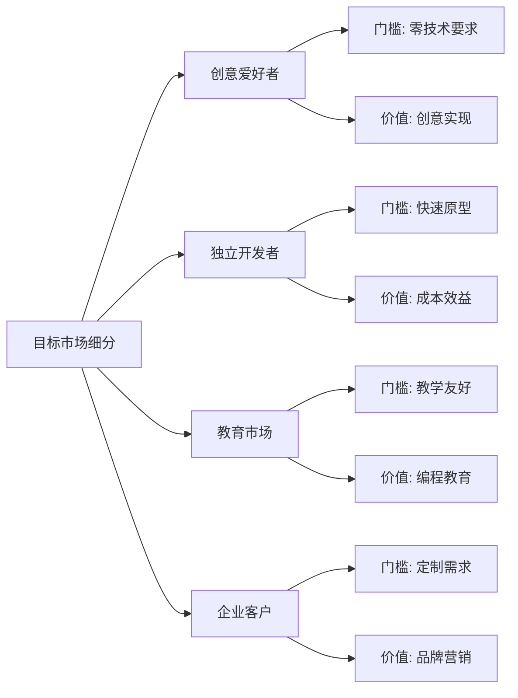

**竞争策略分析：**
```typescript
// 市场竞争策略分析
const competitiveStrategy = {
  marketPositioning: {
    primaryTarget: {
      segment: '创意爱好者 + 独立开发者',
      size: '500万+ 全球用户',
      growthRate: '25% 年增长',
      painPoints: [
        '技术门槛高',
        '创作成本大',
        '发布渠道限制',
        '协作困难'
      ]
    },
    
    valueProposition: {
      core: '从想法到游戏，只需一句话',
      differentiators: [
        'AI原生创作体验',
        'Web优先无障碍访问',
        '像素艺术专业化',
        '社区共创生态'
      ]
    }
  },
  
  competitiveAdvantages: {
    sustainable: [
      'AI技术护城河',
      '网络效应',
      '数据飞轮',
      '生态系统锁定'
    ],
    
    temporary: [
      '先发优势',
      '技术领先',
      '用户体验优势',
      '成本优势'
    ]
  },
  
  defensiveStrategy: {
    technicalMoat: [
      '持续AI模型优化',
      '专有数据集建设',
      '算法专利申请',
      '技术团队建设'
    ],
    
    ecosystemMoat: [
      '开发者社区建设',
      '内容创作者激励',
      '平台API开放',
      '第三方集成'
    ],
    
    brandMoat: [
      '用户体验口碑',
      '创意社区文化',
      '教育市场渗透',
      '行业标准制定'
    ]
  },
  
  growthStrategy: {
    userAcquisition: [
      '病毒式分享机制',
      '社交媒体营销',
      '开发者社区推广',
      '教育机构合作'
    ],
    
    productExpansion: [
      '更多游戏类型支持',
      '高级AI功能',
      '企业版本',
      '移动端优化'
    ],
    
    marketExpansion: [
      '国际化本地化',
      '垂直行业应用',
      'B2B市场开拓',
      '平台生态扩展'
    ]
  }
};
```

---

*本章节通过深入讨论分析了Pixel Seed项目的可行性边界、Web交付优势、AI集成挑战以及与传统流程和相关工作的对比，明确了项目的独特价值定位和竞争优势。这些分析为项目的未来发展方向和策略制定提供了重要的理论基础和实践指导。*