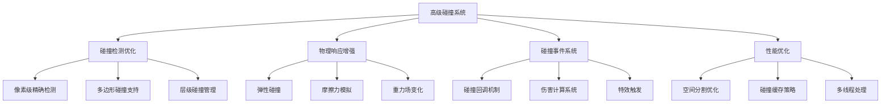
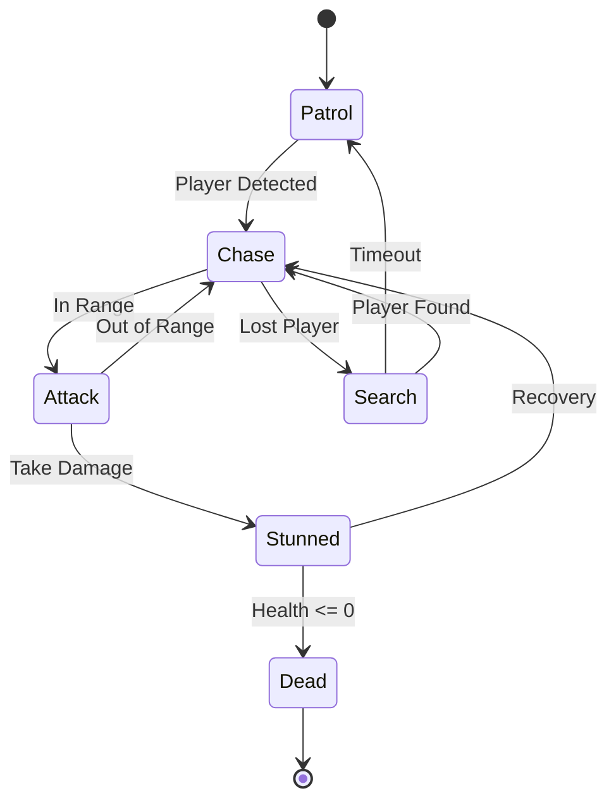
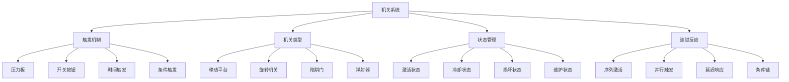
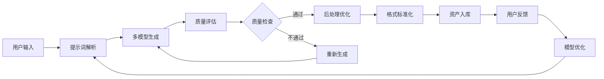
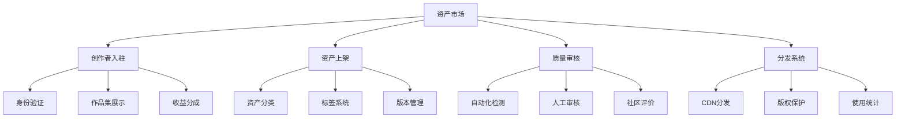
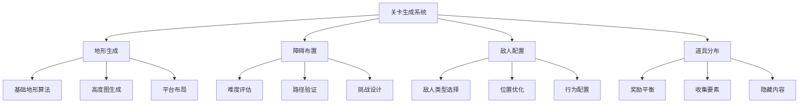
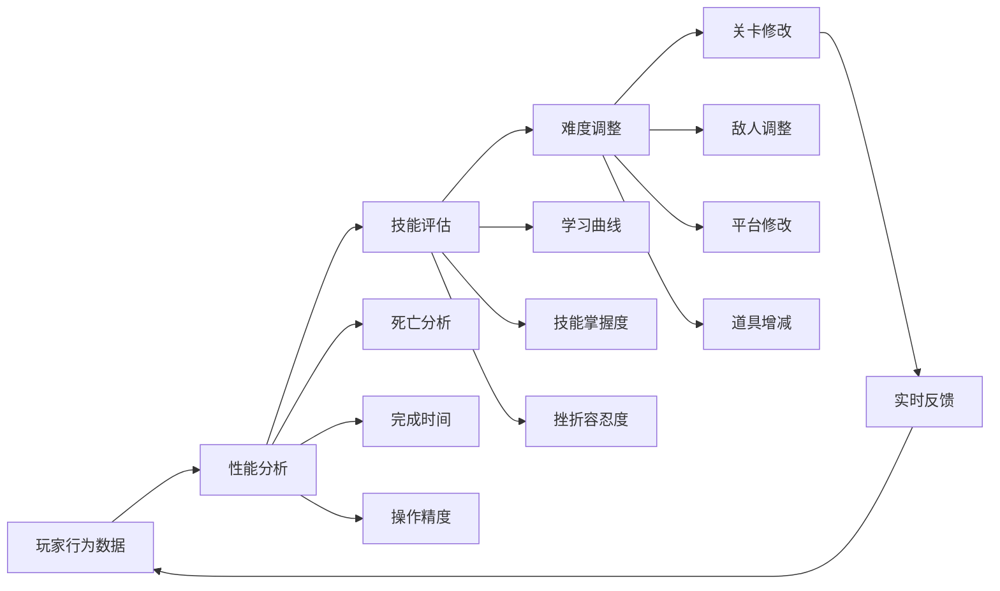
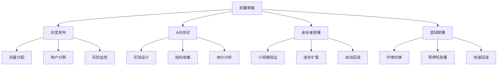
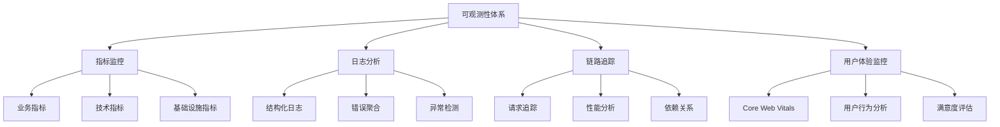

# 10. Future Work 未来工作

本章节详细规划 Pixel Seed 项目的未来发展方向，从游戏机制完善、AI能力增强、技术架构升级、工具链建设到部署运维优化等多个维度，制定了系统性的发展路线图。

## 10.1 Gameplay Extension —— 完整碰撞、敌人与机关

### 10.1.1 高级碰撞系统

**精确碰撞检测与响应**


**碰撞系统技术实现：**
```typescript
// 高级碰撞系统设计
interface AdvancedCollisionSystem {
  // 精确碰撞检测
  pixelPerfectCollision: {
    implementation: 'Canvas ImageData像素级检测',
    performance: '优化算法，支持60FPS下100+对象',
    features: [
      '透明像素忽略',
      '碰撞点精确定位',
      '碰撞法向量计算',
      '穿透深度测量'
    ]
  };
  
  // 物理响应系统
  physicsResponse: {
    elasticCollision: {
      formula: 'v1_new = ((m1-m2)*v1 + 2*m2*v2)/(m1+m2)',
      applications: ['球体弹跳', '角色反弹', '道具碰撞'],
      parameters: ['质量', '弹性系数', '摩擦系数']
    },
    
    frictionSimulation: {
      staticFriction: 'μs * N (静摩擦力)',
      kineticFriction: 'μk * N (动摩擦力)',
      applications: ['地面行走', '斜坡滑动', '墙面摩擦'],
      effects: ['速度衰减', '方向改变', '停止判定']
    },
    
    gravityFields: {
      variableGravity: '支持区域性重力变化',
      gravityWells: '重力井效应模拟',
      antiGravity: '反重力区域支持',
      implementation: '基于距离的重力场计算'
    }
  };
  
  // 碰撞事件系统
  eventSystem: {
    collisionCallbacks: {
      onCollisionEnter: '碰撞开始事件',
      onCollisionStay: '持续碰撞事件',
      onCollisionExit: '碰撞结束事件',
      customEvents: '自定义碰撞事件'
    },
    
    damageCalculation: {
      baseDamage: '基础伤害值',
      velocityModifier: '速度影响系数',
      materialModifier: '材质影响系数',
      criticalHit: '暴击判定机制'
    },
    
    effectTriggers: {
      particleEffects: '粒子特效触发',
      soundEffects: '音效播放',
      screenShake: '屏幕震动效果',
      slowMotion: '慢动作效果'
    }
  };
  
  // 性能优化策略
  performanceOptimization: {
    spatialPartitioning: {
      quadTree: '四叉树空间分割',
      gridBased: '网格化碰撞检测',
      dynamicPartitioning: '动态分区调整',
      culling: '视锥体剔除优化'
    },
    
    collisionCaching: {
      resultCaching: '碰撞结果缓存',
      proximityCache: '邻近对象缓存',
      frameSkipping: '帧跳跃优化',
      levelOfDetail: '细节层次管理'
    },
    
    multithreading: {
      workerThreads: 'Web Worker并行计算',
      asyncCollision: '异步碰撞检测',
      batchProcessing: '批量处理优化',
      loadBalancing: '负载均衡策略'
    }
  };
}

// 碰撞系统实现示例
class EnhancedCollisionEngine {
  private spatialGrid: SpatialGrid;
  private collisionCache: Map<string, CollisionResult>;
  private eventEmitter: EventEmitter;
  
  constructor() {
    this.spatialGrid = new SpatialGrid(64); // 64x64网格
    this.collisionCache = new Map();
    this.eventEmitter = new EventEmitter();
  }
  
  // 像素级精确碰撞检测
  pixelPerfectCollision(
    obj1: GameObject, 
    obj2: GameObject
  ): CollisionResult {
    const cacheKey = `${obj1.id}-${obj2.id}`;
    
    // 缓存检查
    if (this.collisionCache.has(cacheKey)) {
      return this.collisionCache.get(cacheKey)!;
    }
    
    // AABB预检测
    if (!this.aabbIntersection(obj1.bounds, obj2.bounds)) {
      return { colliding: false };
    }
    
    // 像素级检测
    const result = this.pixelLevelCheck(obj1, obj2);
    
    // 缓存结果
    this.collisionCache.set(cacheKey, result);
    
    return result;
  }
  
  // 物理响应计算
  calculatePhysicsResponse(
    collision: CollisionResult
  ): PhysicsResponse {
    const { obj1, obj2, contactPoint, normal } = collision;
    
    // 弹性碰撞计算
    const elasticResponse = this.calculateElasticCollision(
      obj1.velocity, obj2.velocity,
      obj1.mass, obj2.mass,
      normal
    );
    
    // 摩擦力计算
    const frictionForce = this.calculateFriction(
      elasticResponse.velocity1,
      obj1.material.friction,
      normal
    );
    
    return {
      velocity1: elasticResponse.velocity1.subtract(frictionForce),
      velocity2: elasticResponse.velocity2.subtract(frictionForce),
      impulse: elasticResponse.impulse,
      contactPoint,
      normal
    };
  }
  
  // 碰撞事件处理
  handleCollisionEvents(collision: CollisionResult): void {
    const { obj1, obj2, type } = collision;
    
    // 触发碰撞事件
    this.eventEmitter.emit('collision', {
      objects: [obj1, obj2],
      type,
      timestamp: Date.now()
    });
    
    // 伤害计算
    if (obj1.canTakeDamage && obj2.canDealDamage) {
      const damage = this.calculateDamage(obj1, obj2, collision);
      obj1.takeDamage(damage);
    }
    
    // 特效触发
    this.triggerEffects(collision);
  }
}
```

### 10.1.2 敌人AI系统

**智能敌人行为设计**


**AI系统技术架构：**
```typescript
// 敌人AI系统设计
interface EnemyAISystem {
  // 行为状态机
  behaviorStateMachine: {
    states: {
      patrol: {
        behavior: '沿预定路径巡逻',
        transitions: ['chase', 'investigate'],
        parameters: ['patrolSpeed', 'patrolPath', 'alertRadius']
      },
      
      chase: {
        behavior: '追击玩家',
        transitions: ['attack', 'search', 'patrol'],
        parameters: ['chaseSpeed', 'maxChaseDistance', 'loseTargetTime']
      },
      
      attack: {
        behavior: '攻击玩家',
        transitions: ['chase', 'stunned'],
        parameters: ['attackDamage', 'attackRange', 'attackCooldown']
      },
      
      search: {
        behavior: '搜索丢失的目标',
        transitions: ['chase', 'patrol'],
        parameters: ['searchRadius', 'searchDuration', 'searchPattern']
      },
      
      stunned: {
        behavior: '受击硬直状态',
        transitions: ['chase', 'dead'],
        parameters: ['stunDuration', 'recoveryTime']
      }
    }
  };
  
  // 感知系统
  perceptionSystem: {
    vision: {
      fieldOfView: '视野角度 (默认120度)',
      viewDistance: '视野距离',
      obstacleBlocking: '障碍物遮挡检测',
      peripheralVision: '周边视觉敏感度'
    },
    
    hearing: {
      hearingRadius: '听觉范围',
      soundTypes: ['footsteps', 'jumping', 'collision'],
      soundDecay: '声音衰减模型',
      noiseThreshold: '噪音阈值'
    },
    
    memory: {
      lastKnownPosition: '最后已知位置记忆',
      memoryDuration: '记忆持续时间',
      suspicionLevel: '怀疑等级',
      alertState: '警戒状态'
    }
  };
  
  // 路径寻找
  pathfinding: {
    algorithm: 'A*算法优化版本',
    gridResolution: '路径网格精度',
    dynamicObstacles: '动态障碍物处理',
    pathSmoothing: '路径平滑优化',
    jumpPoints: '跳跃点识别',
    fallbackBehavior: '路径失败时的备选行为'
  };
  
  // 群体行为
  flockingBehavior: {
    separation: '个体间分离行为',
    alignment: '群体方向对齐',
    cohesion: '群体聚合倾向',
    leadership: '领导者跟随机制',
    communication: '敌人间信息传递'
  };
}

// AI系统实现示例
class EnemyAI {
  private stateMachine: StateMachine;
  private perception: PerceptionSystem;
  private pathfinder: Pathfinder;
  private memory: AIMemory;
  
  constructor(enemyType: EnemyType, config: AIConfig) {
    this.stateMachine = new StateMachine(enemyType.states);
    this.perception = new PerceptionSystem(config.perception);
    this.pathfinder = new Pathfinder(config.pathfinding);
    this.memory = new AIMemory(config.memory);
  }
  
  // AI主更新循环
  update(deltaTime: number, gameState: GameState): void {
    // 感知更新
    const perceptionData = this.perception.update(gameState);
    
    // 记忆更新
    this.memory.update(perceptionData, deltaTime);
    
    // 状态机更新
    const currentState = this.stateMachine.getCurrentState();
    const stateOutput = currentState.execute({
      perception: perceptionData,
      memory: this.memory.getData(),
      deltaTime
    });
    
    // 状态转换检查
    const nextState = this.checkStateTransitions(stateOutput);
    if (nextState !== currentState.name) {
      this.stateMachine.transitionTo(nextState);
    }
    
    // 行为执行
    this.executeBehavior(stateOutput);
  }
  
  // 巡逻行为实现
  private executePatrolBehavior(params: PatrolParams): void {
    const { patrolPath, currentIndex, patrolSpeed } = params;
    const targetPoint = patrolPath[currentIndex];
    
    // 路径寻找
    const path = this.pathfinder.findPath(
      this.position, 
      targetPoint
    );
    
    if (path.length > 0) {
      // 沿路径移动
      const direction = path[0].subtract(this.position).normalize();
      this.velocity = direction.multiply(patrolSpeed);
      
      // 到达检查
      if (this.position.distanceTo(targetPoint) < 10) {
        params.currentIndex = (currentIndex + 1) % patrolPath.length;
      }
    }
  }
  
  // 追击行为实现
  private executeChaseBehavior(params: ChaseParams): void {
    const { target, chaseSpeed, maxChaseDistance } = params;
    
    // 距离检查
    const distance = this.position.distanceTo(target.position);
    if (distance > maxChaseDistance) {
      // 超出追击范围，转换到搜索状态
      this.stateMachine.transitionTo('search');
      return;
    }
    
    // 路径寻找到目标
    const path = this.pathfinder.findPath(
      this.position,
      target.position
    );
    
    if (path.length > 0) {
      const direction = path[0].subtract(this.position).normalize();
      this.velocity = direction.multiply(chaseSpeed);
      
      // 预测目标位置
      const predictedPosition = this.predictTargetPosition(target);
      if (predictedPosition) {
        const predictedPath = this.pathfinder.findPath(
          this.position,
          predictedPosition
        );
        
        if (predictedPath.length > 0) {
          const predictedDirection = predictedPath[0]
            .subtract(this.position)
            .normalize();
          
          // 混合当前追击和预测追击
          this.velocity = direction
            .multiply(0.7)
            .add(predictedDirection.multiply(0.3))
            .multiply(chaseSpeed);
        }
      }
    }
  }
  
  // 攻击行为实现
  private executeAttackBehavior(params: AttackParams): void {
    const { target, attackDamage, attackRange, attackCooldown } = params;
    
    // 攻击范围检查
    const distance = this.position.distanceTo(target.position);
    if (distance > attackRange) {
      this.stateMachine.transitionTo('chase');
      return;
    }
    
    // 冷却时间检查
    if (this.attackTimer > 0) {
      this.attackTimer -= deltaTime;
      return;
    }
    
    // 执行攻击
    this.performAttack(target, attackDamage);
    this.attackTimer = attackCooldown;
    
    // 攻击动画和特效
    this.playAttackAnimation();
    this.spawnAttackEffects();
  }
}
```

### 10.1.3 机关与陷阱系统

**交互式机关设计**


## 10.2 AI-Assisted Assets —— 规范化的可控生成与批量化上架

### 10.2.1 AI生成质量标准化

**生成质量控制流程**


**AI生成标准化系统：**
```typescript
// AI资产生成标准化系统
interface AIAssetStandardization {
  // 质量评估标准
  qualityStandards: {
    pixelArt: {
      resolution: {
        minimum: '16x16 pixels',
        maximum: '256x256 pixels',
        recommended: '32x32, 64x64 pixels',
        aspectRatio: '1:1, 2:1, 1:2 supported'
      },
      
      colorPalette: {
        maxColors: '16 colors per sprite',
        paletteConsistency: '同主题资产色彩一致性 >85%',
        contrastRatio: '相邻颜色对比度 >3:1',
        transparencySupport: 'Alpha通道完整性检查'
      },
      
      pixelPerfection: {
        aliasing: '无抗锯齿要求',
        pixelAlignment: '像素网格对齐检查',
        sharpness: '边缘清晰度评分 >8/10',
        consistency: '风格一致性评分 >7/10'
      },
      
      gameplayIntegration: {
        collisionBounds: '碰撞边界自动生成',
        animationFrames: '动画帧数标准化',
        tileability: '可拼接性检测',
        scalability: '缩放兼容性测试'
      }
    }
  };
  
  // 自动化质量检测
  qualityAssessment: {
    technicalMetrics: {
      pixelPerfectness: {
        algorithm: '像素网格对齐检测算法',
        threshold: '对齐度 >95%',
        autoFix: '自动像素对齐修正'
      },
      
      colorConsistency: {
        algorithm: '色彩空间聚类分析',
        paletteExtraction: '主色调提取与验证',
        consistencyScore: '一致性评分算法'
      },
      
      styleCoherence: {
        featureExtraction: 'CNN特征提取',
        styleVector: '风格向量相似度计算',
        coherenceThreshold: '风格一致性阈值 >0.8'
      }
    },
    
    aestheticMetrics: {
      visualAppeal: {
        symmetryAnalysis: '对称性分析',
        compositionBalance: '构图平衡评估',
        detailRichness: '细节丰富度评分'
      },
      
      gameplayFit: {
        recognizability: '可识别性评估',
        functionalClarity: '功能清晰度检查',
        playerExpectation: '玩家期望匹配度'
      }
    }
  };
  
  // 批量生成优化
  batchGeneration: {
    parallelProcessing: {
      workerThreads: 'Web Worker并行生成',
      queueManagement: '生成队列智能调度',
      resourceAllocation: '计算资源动态分配',
      failureRecovery: '失败任务自动重试'
    },
    
    templateSystem: {
      baseTemplates: '基础模板库',
      variationGeneration: '变体自动生成',
      parameterSpace: '参数空间采样',
      diversityControl: '多样性控制算法'
    },
    
    cacheStrategy: {
      generationCache: '生成结果缓存',
      similarityDeduplication: '相似度去重',
      versionControl: '资产版本管理',
      incrementalUpdate: '增量更新机制'
    }
  };
}

// 质量标准化实现
class AIAssetQualityController {
  private qualityMetrics: QualityMetrics;
  private postProcessor: AssetPostProcessor;
  private validator: AssetValidator;
  
  constructor() {
    this.qualityMetrics = new QualityMetrics();
    this.postProcessor = new AssetPostProcessor();
    this.validator = new AssetValidator();
  }
  
  // 生成质量评估
  async assessQuality(asset: GeneratedAsset): Promise<QualityReport> {
    const technicalScore = await this.assessTechnicalQuality(asset);
    const aestheticScore = await this.assessAestheticQuality(asset);
    const gameplayScore = await this.assessGameplayFit(asset);
    
    const overallScore = (
      technicalScore * 0.4 +
      aestheticScore * 0.3 +
      gameplayScore * 0.3
    );
    
    return {
      overallScore,
      technicalScore,
      aestheticScore,
      gameplayScore,
      issues: this.identifyIssues(asset),
      recommendations: this.generateRecommendations(asset)
    };
  }
  
  // 技术质量评估
  private async assessTechnicalQuality(
    asset: GeneratedAsset
  ): Promise<number> {
    const pixelAlignment = this.checkPixelAlignment(asset);
    const colorConsistency = this.checkColorConsistency(asset);
    const formatCompliance = this.checkFormatCompliance(asset);
    
    return (pixelAlignment + colorConsistency + formatCompliance) / 3;
  }
  
  // 像素对齐检查
  private checkPixelAlignment(asset: GeneratedAsset): number {
    const imageData = asset.getImageData();
    let alignedPixels = 0;
    let totalPixels = 0;
    
    for (let y = 0; y < imageData.height; y++) {
      for (let x = 0; x < imageData.width; x++) {
        const pixelIndex = (y * imageData.width + x) * 4;
        const alpha = imageData.data[pixelIndex + 3];
        
        if (alpha > 0) {
          totalPixels++;
          
          // 检查像素是否在网格上对齐
          if (this.isPixelAligned(x, y)) {
            alignedPixels++;
          }
        }
      }
    }
    
    return totalPixels > 0 ? alignedPixels / totalPixels : 0;
  }
  
  // 批量生成管理
  async batchGenerate(
    requests: GenerationRequest[]
  ): Promise<GenerationResult[]> {
    const batchSize = 10;
    const results: GenerationResult[] = [];
    
    for (let i = 0; i < requests.length; i += batchSize) {
      const batch = requests.slice(i, i + batchSize);
      
      // 并行处理批次
      const batchPromises = batch.map(request => 
        this.generateWithQualityControl(request)
      );
      
      const batchResults = await Promise.allSettled(batchPromises);
      
      // 处理结果
      batchResults.forEach((result, index) => {
        if (result.status === 'fulfilled') {
          results.push(result.value);
        } else {
          // 失败重试
          const retryRequest = batch[index];
          this.scheduleRetry(retryRequest);
        }
      });
      
      // 批次间延迟，避免API限制
      await this.delay(1000);
    }
    
    return results;
  }
  
  // 带质量控制的生成
  private async generateWithQualityControl(
    request: GenerationRequest
  ): Promise<GenerationResult> {
    let attempts = 0;
    const maxAttempts = 3;
    
    while (attempts < maxAttempts) {
      const asset = await this.generateAsset(request);
      const qualityReport = await this.assessQuality(asset);
      
      if (qualityReport.overallScore >= 0.7) {
        // 质量合格，进行后处理
        const optimizedAsset = await this.postProcessor.optimize(asset);
        
        return {
          asset: optimizedAsset,
          qualityReport,
          attempts: attempts + 1,
          success: true
        };
      }
      
      attempts++;
      
      // 根据质量报告调整生成参数
      request = this.adjustGenerationParameters(
        request, 
        qualityReport
      );
    }
    
    throw new Error(`Failed to generate quality asset after ${maxAttempts} attempts`);
  }
}
```

### 10.2.2 资产市场与分发系统

**创作者生态建设**


## 10.3 Procedural Levels —— 关卡程序生成与难度曲线

### 10.3.1 智能关卡生成

**程序化关卡设计系统**


**关卡生成技术实现：**
```typescript
// 程序化关卡生成系统
interface ProceduralLevelGeneration {
  // 地形生成算法
  terrainGeneration: {
    heightmapGeneration: {
      algorithm: 'Perlin噪声 + 分形叠加',
      parameters: {
        octaves: '4-8层噪声叠加',
        frequency: '基础频率控制',
        amplitude: '高度变化幅度',
        persistence: '细节保持度'
      },
      postProcessing: [
        '高度平滑处理',
        '平台区域识别',
        '可达性验证',
        '视觉优化'
      ]
    },
    
    platformLayout: {
      algorithm: '约束满足问题求解',
      constraints: [
        '最小跳跃距离',
        '最大跳跃距离',
        '垂直可达性',
        '路径连通性'
      ],
      optimization: [
        '路径长度最优化',
        '难度梯度控制',
        '视觉平衡调整'
      ]
    },
    
    biomeSystem: {
      biomeTypes: ['森林', '沙漠', '雪山', '洞穴', '城市'],
      transitionZones: '生物群系过渡区域',
      environmentalEffects: '环境特效与物理影响',
      thematicConsistency: '主题一致性保证'
    }
  };
  
  // 难度曲线设计
  difficultyCurve: {
    difficultyMetrics: {
      jumpComplexity: {
        measurement: '跳跃序列复杂度评分',
        factors: ['距离', '高度', '时机', '精确度'],
        scaling: '线性 + 指数混合增长'
      },
      
      enemyDensity: {
        measurement: '敌人密度与强度',
        factors: ['数量', '类型', '位置', 'AI难度'],
        balancing: '玩家技能曲线匹配'
      },
      
      resourceScarcity: {
        measurement: '资源稀缺度',
        factors: ['生命值', '道具', '检查点'],
        progression: '逐步减少安全网'
      }
    },
    
    adaptiveDifficulty: {
      playerPerformance: {
        metrics: ['死亡次数', '完成时间', '收集率'],
        analysis: '实时性能分析',
        adjustment: '动态难度调整'
      },
      
      learningCurve: {
        skillIntroduction: '新技能循序渐进引入',
        masteryReinforcement: '技能熟练度强化',
        challengeEscalation: '挑战逐步升级'
      }
    }
  };
  
  // 内容多样性保证
  contentVariety: {
    mechanicRotation: {
      coreMechanics: ['跳跃', '攀爬', '滑行', '战斗'],
      combinationPatterns: '机制组合模式',
      noveltyInjection: '新颖元素注入',
      repetitionAvoidance: '重复内容避免'
    },
    
    narrativeIntegration: {
      storyBeats: '故事节点嵌入',
      environmentalStorytelling: '环境叙事',
      characterProgression: '角色成长体现',
      worldBuilding: '世界观构建'
    },
    
    replayability: {
      randomization: '随机化要素',
      alternativePaths: '多路径设计',
      hiddenSecrets: '隐藏内容',
      speedrunOptimization: '速通路线优化'
    }
  };
}

// 关卡生成器实现
class ProceduralLevelGenerator {
  private terrainGenerator: TerrainGenerator;
  private difficultyAnalyzer: DifficultyAnalyzer;
  private contentBalancer: ContentBalancer;
  private validator: LevelValidator;
  
  constructor(config: LevelGenerationConfig) {
    this.terrainGenerator = new TerrainGenerator(config.terrain);
    this.difficultyAnalyzer = new DifficultyAnalyzer(config.difficulty);
    this.contentBalancer = new ContentBalancer(config.content);
    this.validator = new LevelValidator(config.validation);
  }
  
  // 生成完整关卡
  async generateLevel(
    requirements: LevelRequirements
  ): Promise<GeneratedLevel> {
    let attempts = 0;
    const maxAttempts = 10;
    
    while (attempts < maxAttempts) {
      try {
        // 1. 生成基础地形
        const terrain = await this.generateTerrain(requirements);
        
        // 2. 布置游戏元素
        const gameElements = await this.placeGameElements(
          terrain, 
          requirements
        );
        
        // 3. 难度评估与调整
        const difficultyScore = this.difficultyAnalyzer.analyze(
          terrain, 
          gameElements
        );
        
        if (!this.isDifficultyAppropriate(difficultyScore, requirements)) {
          attempts++;
          continue;
        }
        
        // 4. 内容平衡检查
        const balanceReport = this.contentBalancer.analyze(
          terrain, 
          gameElements
        );
        
        if (!balanceReport.isBalanced) {
          // 调整内容平衡
          gameElements = this.contentBalancer.rebalance(
            gameElements, 
            balanceReport
          );
        }
        
        // 5. 关卡验证
        const validationResult = await this.validator.validate({
          terrain,
          gameElements,
          requirements
        });
        
        if (validationResult.isValid) {
          return {
            terrain,
            gameElements,
            metadata: {
              difficultyScore,
              balanceReport,
              validationResult,
              generationTime: Date.now(),
              seed: requirements.seed
            }
          };
        }
        
        attempts++;
      } catch (error) {
        console.warn(`Level generation attempt ${attempts + 1} failed:`, error);
        attempts++;
      }
    }
    
    throw new Error(`Failed to generate valid level after ${maxAttempts} attempts`);
  }
  
  // 地形生成
  private async generateTerrain(
    requirements: LevelRequirements
  ): Promise<TerrainData> {
    const { width, height, biome, complexity } = requirements;
    
    // 生成高度图
    const heightmap = this.terrainGenerator.generateHeightmap({
      width,
      height,
      octaves: complexity * 2 + 2,
      frequency: 0.01,
      amplitude: height * 0.3,
      seed: requirements.seed
    });
    
    // 识别平台区域
    const platforms = this.terrainGenerator.identifyPlatforms(
      heightmap,
      {
        minPlatformWidth: 64,
        maxSlope: 0.1,
        minGap: 32
      }
    );
    
    // 生成连接路径
    const connections = this.terrainGenerator.generateConnections(
      platforms,
      {
        maxJumpDistance: 128,
        maxJumpHeight: 96,
        preferredPath: 'shortest'
      }
    );
    
    return {
      heightmap,
      platforms,
      connections,
      biome,
      bounds: { width, height }
    };
  }
  
  // 游戏元素布置
  private async placeGameElements(
    terrain: TerrainData,
    requirements: LevelRequirements
  ): Promise<GameElement[]> {
    const elements: GameElement[] = [];
    
    // 布置起点和终点
    const startPoint = this.findOptimalStartPoint(terrain);
    const endPoint = this.findOptimalEndPoint(terrain, startPoint);
    
    elements.push(
      { type: 'start', position: startPoint },
      { type: 'end', position: endPoint }
    );
    
    // 布置检查点
    const checkpoints = this.placeCheckpoints(
      terrain, 
      startPoint, 
      endPoint,
      requirements.checkpointDensity
    );
    elements.push(...checkpoints);
    
    // 布置敌人
    const enemies = this.placeEnemies(
      terrain,
      requirements.enemyDensity,
      requirements.difficultyTarget
    );
    elements.push(...enemies);
    
    // 布置道具和收集品
    const collectibles = this.placeCollectibles(
      terrain,
      requirements.collectibleDensity
    );
    elements.push(...collectibles);
    
    // 布置障碍和陷阱
    const obstacles = this.placeObstacles(
      terrain,
      requirements.obstacleDensity
    );
    elements.push(...obstacles);
    
    return elements;
  }
  
  // 难度适宜性检查
  private isDifficultyAppropriate(
    difficultyScore: DifficultyScore,
    requirements: LevelRequirements
  ): boolean {
    const target = requirements.difficultyTarget;
    const tolerance = 0.2;
    
    return Math.abs(difficultyScore.overall - target) <= tolerance &&
           difficultyScore.jumpComplexity <= target + tolerance &&
           difficultyScore.enemyChallenge <= target + tolerance &&
           difficultyScore.navigationComplexity <= target + tolerance;
  }
}
```

### 10.3.2 自适应难度系统

**玩家行为分析与难度调整**


## 10.4 Tooling —— 自动切片/Atlas、规范检查与一键打包

### 10.4.1 资产处理自动化

**智能资产处理流水线**
```typescript
// 自动化工具链系统
interface AutomatedToolchain {
  // 图像处理自动化
  imageProcessing: {
    spriteSheetGeneration: {
      algorithm: '最优矩形装箱算法',
      optimization: [
        '空间利用率最大化',
        '纹理大小标准化',
        '透明区域压缩',
        '相似图像聚类'
      ],
      formats: ['PNG', 'WebP', 'AVIF'],
      atlasMetadata: 'JSON格式坐标映射'
    },
    
    automaticSlicing: {
      edgeDetection: '边缘检测算法',
      boundingBoxOptimization: '包围盒优化',
      transparencyHandling: '透明像素处理',
      batchProcessing: '批量切片处理'
    },
    
    qualityOptimization: {
      losslessCompression: '无损压缩优化',
      colorPaletteReduction: '色彩调色板优化',
      formatConversion: '格式自动转换',
      sizeOptimization: '文件大小优化'
    }
  };
  
  // 规范检查自动化
  complianceChecking: {
    pixelArtStandards: {
      pixelPerfectness: '像素完美度检查',
      colorLimitations: '颜色数量限制验证',
      resolutionCompliance: '分辨率规范检查',
      transparencyValidation: '透明度规范验证'
    },
    
    gameplayCompatibility: {
      collisionBounds: '碰撞边界验证',
      animationFrames: '动画帧数检查',
      tileability: '可拼接性验证',
      performanceImpact: '性能影响评估'
    },
    
    accessibilityCompliance: {
      colorContrast: '颜色对比度检查',
      visualClarity: '视觉清晰度评估',
      cognitiveLoad: '认知负荷评估',
      universalDesign: '通用设计原则检查'
    }
  };
  
  // 一键打包部署
  buildAndDeploy: {
    assetBundling: {
      dependencyAnalysis: '依赖关系分析',
      treeShaking: '无用资产剔除',
      compressionStrategy: '压缩策略选择',
      cacheOptimization: '缓存策略优化'
    },
    
    multiPlatformBuild: {
      webOptimization: 'Web平台优化',
      mobileAdaptation: '移动端适配',
      desktopPackaging: '桌面端打包',
      crossPlatformTesting: '跨平台测试'
    },
    
    deploymentAutomation: {
      cicdIntegration: 'CI/CD流水线集成',
      environmentManagement: '环境管理',
      rollbackStrategy: '回滚策略',
      monitoringSetup: '监控配置'
    }
  };
}

// 自动化工具实现
class AutomatedAssetPipeline {
  private imageProcessor: ImageProcessor;
  private complianceChecker: ComplianceChecker;
  private bundler: AssetBundler;
  private deployer: AutoDeployer;
  
  constructor() {
    this.imageProcessor = new ImageProcessor();
    this.complianceChecker = new ComplianceChecker();
    this.bundler = new AssetBundler();
    this.deployer = new AutoDeployer();
  }
  
  // 完整的资产处理流水线
  async processAssets(
    inputAssets: RawAsset[]
  ): Promise<ProcessedAssetBundle> {
    const pipeline = [
      this.validateInput.bind(this),
      this.processImages.bind(this),
      this.checkCompliance.bind(this),
      this.generateAtlas.bind(this),
      this.optimizeBundle.bind(this),
      this.validateOutput.bind(this)
    ];
    
    let currentAssets = inputAssets;
    
    for (const step of pipeline) {
      try {
        currentAssets = await step(currentAssets);
      } catch (error) {
        throw new Error(`Pipeline step failed: ${error.message}`);
      }
    }
    
    return currentAssets as ProcessedAssetBundle;
  }
  
  // 图像处理步骤
  private async processImages(
    assets: RawAsset[]
  ): Promise<ProcessedAsset[]> {
    const processedAssets: ProcessedAsset[] = [];
    
    for (const asset of assets) {
      // 自动切片
      const slicedSprites = await this.imageProcessor.autoSlice(asset);
      
      // 质量优化
      const optimizedSprites = await Promise.all(
        slicedSprites.map(sprite => 
          this.imageProcessor.optimize(sprite)
        )
      );
      
      // 格式转换
      const convertedSprites = await Promise.all(
        optimizedSprites.map(sprite =>
          this.imageProcessor.convertFormat(sprite, 'webp')
        )
      );
      
      processedAssets.push({
        ...asset,
        sprites: convertedSprites,
        metadata: {
          originalSize: asset.size,
          processedSize: convertedSprites.reduce(
            (total, sprite) => total + sprite.size, 0
          ),
          compressionRatio: asset.size / convertedSprites.reduce(
            (total, sprite) => total + sprite.size, 0
          ),
          processingTime: Date.now()
        }
      });
    }
    
    return processedAssets;
  }
  
  // 规范检查步骤
  private async checkCompliance(
    assets: ProcessedAsset[]
  ): Promise<ValidatedAsset[]> {
    const validatedAssets: ValidatedAsset[] = [];
    
    for (const asset of assets) {
      const complianceReport = await this.complianceChecker.check(asset);
      
      if (!complianceReport.isCompliant) {
        // 尝试自动修复
        const fixedAsset = await this.complianceChecker.autoFix(
          asset, 
          complianceReport
        );
        
        if (fixedAsset) {
          validatedAssets.push({
            ...fixedAsset,
            complianceReport: await this.complianceChecker.check(fixedAsset)
          });
        } else {
          throw new Error(
            `Asset ${asset.name} failed compliance check and cannot be auto-fixed`
          );
        }
      } else {
        validatedAssets.push({
          ...asset,
          complianceReport
        });
      }
    }
    
    return validatedAssets;
  }
  
  // 图集生成步骤
  private async generateAtlas(
    assets: ValidatedAsset[]
  ): Promise<AtlasBundle> {
    // 按类型和主题分组
    const groupedAssets = this.groupAssetsByTheme(assets);
    const atlases: Atlas[] = [];
    
    for (const [theme, themeAssets] of groupedAssets) {
      // 使用最优装箱算法生成图集
      const atlas = await this.imageProcessor.generateAtlas(
        themeAssets,
        {
          maxSize: 2048,
          padding: 2,
          algorithm: 'maxrects',
          format: 'webp'
        }
      );
      
      atlases.push({
        ...atlas,
        theme,
        metadata: {
          spriteCount: themeAssets.length,
          utilization: atlas.utilization,
          generationTime: Date.now()
        }
      });
    }
    
    return {
      atlases,
      totalSprites: assets.length,
      totalSize: atlases.reduce((total, atlas) => total + atlas.size, 0),
      metadata: {
        generationTime: Date.now(),
        compressionRatio: this.calculateCompressionRatio(assets, atlases)
      }
    };
  }
}
```

## 10.5 Deployment & Observability —— A/B、灰度与可观测性完善

### 10.5.1 智能部署策略

**渐进式部署与风险控制**


**部署系统技术实现：**
```typescript
// 智能部署系统
interface IntelligentDeployment {
  // 灰度发布策略
  gradualRollout: {
    trafficSplitting: {
      algorithm: '基于用户ID哈希的一致性分流',
      strategies: [
        '按地理位置分流',
        '按用户类型分流',
        '按设备类型分流',
        '按时间段分流'
      ],
      rolloutSchedule: {
        phase1: '1% 流量，持续24小时',
        phase2: '5% 流量，持续48小时',
        phase3: '25% 流量，持续72小时',
        phase4: '100% 流量，全量发布'
      }
    },
    
    riskAssessment: {
      healthMetrics: [
        '错误率 <0.1%',
        '响应时间 <200ms',
        '可用性 >99.9%',
        '用户满意度 >4.5/5'
      ],
      automaticRollback: {
        triggers: [
          '错误率超过阈值',
          '响应时间异常',
          '用户投诉激增',
          '业务指标下降'
        ],
        rollbackTime: '<5分钟自动回滚'
      }
    }
  };
  
  // A/B测试框架
  abTesting: {
    experimentDesign: {
      hypothesisFormulation: '假设制定与验证',
      sampleSizeCalculation: '样本量计算',
      randomization: '随机化分组',
      controlVariables: '控制变量管理'
    },
    
    metricsCollection: {
      primaryMetrics: [
        '用户参与度',
        '转化率',
        '留存率',
        '收入指标'
      ],
      secondaryMetrics: [
        '页面加载时间',
        '错误率',
        '用户反馈',
        '功能使用率'
      ],
      realTimeTracking: '实时指标追踪'
    },
    
    statisticalAnalysis: {
      significanceTest: '统计显著性检验',
      confidenceInterval: '置信区间计算',
      effectSize: '效应量评估',
      powerAnalysis: '统计功效分析'
    }
  };
  
  // 可观测性系统
  observability: {
    metricsCollection: {
      applicationMetrics: [
        '请求量 (RPS)',
        '响应时间分布',
        '错误率统计',
        '业务指标'
      ],
      infrastructureMetrics: [
        'CPU使用率',
        '内存使用率',
        '网络I/O',
        '磁盘I/O'
      ],
      userExperienceMetrics: [
        'Core Web Vitals',
        '用户行为路径',
        '功能使用统计',
        '满意度评分'
      ]
    },
    
    distributedTracing: {
      traceCollection: '分布式链路追踪',
      spanAnalysis: '调用链分析',
      performanceBottlenecks: '性能瓶颈识别',
      errorPropagation: '错误传播分析'
    },
    
    logAggregation: {
      structuredLogging: '结构化日志记录',
      logCorrelation: '日志关联分析',
      anomalyDetection: '异常检测',
      alerting: '智能告警'
    }
  };
}

// 部署管理器实现
class DeploymentManager {
  private trafficSplitter: TrafficSplitter;
  private healthMonitor: HealthMonitor;
  private abTestManager: ABTestManager;
  private observabilityCollector: ObservabilityCollector;
  
  constructor() {
    this.trafficSplitter = new TrafficSplitter();
    this.healthMonitor = new HealthMonitor();
    this.abTestManager = new ABTestManager();
    this.observabilityCollector = new ObservabilityCollector();
  }
  
  // 执行灰度发布
  async executeGradualRollout(
    deployment: DeploymentConfig
  ): Promise<RolloutResult> {
    const rolloutPlan = this.createRolloutPlan(deployment);
    
    for (const phase of rolloutPlan.phases) {
      console.log(`Starting rollout phase: ${phase.name}`);
      
      // 更新流量分配
      await this.trafficSplitter.updateTrafficSplit({
        newVersion: phase.trafficPercentage,
        oldVersion: 100 - phase.trafficPercentage
      });
      
      // 监控健康指标
      const healthCheck = await this.monitorPhaseHealth(
        phase.duration,
        phase.healthThresholds
      );
      
      if (!healthCheck.isHealthy) {
        // 自动回滚
        console.warn('Health check failed, initiating rollback');
        await this.rollback(deployment.previousVersion);
        
        return {
          success: false,
          phase: phase.name,
          reason: healthCheck.failureReason,
          rollbackTime: Date.now()
        };
      }
      
      console.log(`Phase ${phase.name} completed successfully`);
    }
    
    return {
      success: true,
      completedAt: Date.now(),
      totalDuration: rolloutPlan.totalDuration
    };
  }
  
  // 阶段健康监控
  private async monitorPhaseHealth(
    duration: number,
    thresholds: HealthThresholds
  ): Promise<HealthCheckResult> {
    const startTime = Date.now();
    const endTime = startTime + duration;
    
    while (Date.now() < endTime) {
      const metrics = await this.healthMonitor.collectMetrics();
      
      // 检查错误率
      if (metrics.errorRate > thresholds.maxErrorRate) {
        return {
          isHealthy: false,
          failureReason: `Error rate ${metrics.errorRate} exceeds threshold ${thresholds.maxErrorRate}`
        };
      }
      
      // 检查响应时间
      if (metrics.responseTime.p95 > thresholds.maxResponseTime) {
        return {
          isHealthy: false,
          failureReason: `Response time ${metrics.responseTime.p95}ms exceeds threshold ${thresholds.maxResponseTime}ms`
        };
      }
      
      // 检查可用性
      if (metrics.availability < thresholds.minAvailability) {
        return {
          isHealthy: false,
          failureReason: `Availability ${metrics.availability} below threshold ${thresholds.minAvailability}`
        };
      }
      
      // 等待下次检查
      await this.delay(30000); // 30秒检查间隔
    }
    
    return { isHealthy: true };
  }
  
  // A/B测试执行
  async runABTest(
    experiment: ExperimentConfig
  ): Promise<ExperimentResult> {
    // 创建实验
    const experimentId = await this.abTestManager.createExperiment(experiment);
    
    // 配置流量分配
    await this.trafficSplitter.configureExperiment({
      experimentId,
      controlGroup: experiment.controlPercentage,
      treatmentGroup: experiment.treatmentPercentage
    });
    
    // 开始数据收集
    const dataCollector = this.observabilityCollector.startExperimentTracking(
      experimentId
    );
    
    // 等待实验完成
    await this.delay(experiment.duration);
    
    // 收集结果
    const results = await dataCollector.getResults();
    
    // 统计分析
    const analysis = await this.abTestManager.analyzeResults(
      results,
      experiment.successMetrics
    );
    
    return {
      experimentId,
      results,
      analysis,
      recommendation: this.generateRecommendation(analysis),
      completedAt: Date.now()
    };
  }
  
  // 自动回滚
  private async rollback(previousVersion: string): Promise<void> {
    console.log(`Initiating rollback to version ${previousVersion}`);
    
    // 立即切换流量到旧版本
    await this.trafficSplitter.updateTrafficSplit({
      newVersion: 0,
      oldVersion: 100
    });
    
    // 验证回滚成功
    const healthCheck = await this.healthMonitor.quickHealthCheck();
    
    if (healthCheck.isHealthy) {
      console.log('Rollback completed successfully');
    } else {
      console.error('Rollback failed, manual intervention required');
      await this.alerting.sendCriticalAlert({
        type: 'rollback_failed',
        message: 'Automatic rollback failed, immediate attention required',
        severity: 'critical'
      });
    }
  }
}
```

### 10.5.2 全面可观测性体系

**多维度监控与分析**


**可观测性技术实现：**
```typescript
// 全面可观测性系统
interface ComprehensiveObservability {
  // 指标收集与分析
  metricsSystem: {
    businessMetrics: {
      userEngagement: {
        dailyActiveUsers: 'DAU统计',
        sessionDuration: '会话时长分布',
        featureUsage: '功能使用率',
        conversionFunnel: '转化漏斗分析'
      },
      
      contentMetrics: {
        gameCreationRate: '游戏创建频率',
        themePopularity: '主题受欢迎度',
        sharingActivity: '分享活跃度',
        aiGenerationSuccess: 'AI生成成功率'
      },
      
      revenueMetrics: {
        subscriptionConversion: '订阅转化率',
        averageRevenuePerUser: '用户平均收入',
        churnRate: '用户流失率',
        lifetimeValue: '用户生命周期价值'
      }
    },
    
    technicalMetrics: {
      performanceMetrics: {
        responseTime: '响应时间分布',
        throughput: '吞吐量统计',
        errorRate: '错误率监控',
        availability: '可用性监控'
      },
      
      resourceMetrics: {
        cpuUtilization: 'CPU使用率',
        memoryUsage: '内存使用情况',
        diskIO: '磁盘I/O统计',
        networkTraffic: '网络流量监控'
      },
      
      applicationMetrics: {
        cacheHitRate: '缓存命中率',
        databaseConnections: '数据库连接数',
        queueLength: '队列长度监控',
        backgroundJobs: '后台任务状态'
      }
    }
  };
  
  // 智能告警系统
  alertingSystem: {
    anomalyDetection: {
      algorithm: '基于机器学习的异常检测',
      baselineEstablishment: '基线建立与动态调整',
      seasonalityHandling: '季节性模式识别',
      falsePositiveReduction: '误报率降低策略'
    },
    
    alertRouting: {
      severityLevels: ['info', 'warning', 'error', 'critical'],
      escalationPolicy: '告警升级策略',
      notificationChannels: ['email', 'slack', 'sms', 'webhook'],
      onCallSchedule: '值班轮换管理'
    },
    
    alertCorrelation: {
      rootCauseAnalysis: '根因分析',
      impactAssessment: '影响范围评估',
      similarIncidentDetection: '相似事件检测',
      autoRemediation: '自动修复建议'
    }
  };
  
  // 用户体验监控
  userExperienceMonitoring: {
    realUserMonitoring: {
      coreWebVitals: {
        LCP: 'Largest Contentful Paint',
        FID: 'First Input Delay',
        CLS: 'Cumulative Layout Shift',
        TTFB: 'Time to First Byte'
      },
      
      customMetrics: {
        gameLoadTime: '游戏加载时间',
        aiGenerationTime: 'AI生成响应时间',
        themePreviewTime: '主题预览加载时间',
        userInteractionLatency: '用户交互延迟'
      }
    },
    
    syntheticMonitoring: {
      uptimeChecks: '可用性检查',
      functionalTests: '功能测试监控',
      performanceBudgets: '性能预算监控',
      crossBrowserTesting: '跨浏览器兼容性'
    },
    
    userJourneyTracking: {
      conversionFunnels: '转化漏斗追踪',
      dropOffAnalysis: '流失点分析',
      userFlowOptimization: '用户流程优化',
      cohortAnalysis: '用户群组分析'
    }
  };
}

// 可观测性收集器实现
class ObservabilityCollector {
  private metricsStore: MetricsStore;
  private logAggregator: LogAggregator;
  private traceCollector: TraceCollector;
  private alertManager: AlertManager;
  
  constructor() {
    this.metricsStore = new MetricsStore();
    this.logAggregator = new LogAggregator();
    this.traceCollector = new TraceCollector();
    this.alertManager = new AlertManager();
  }
  
  // 启动全面监控
  startComprehensiveMonitoring(): void {
    // 启动指标收集
    this.startMetricsCollection();
    
    // 启动日志聚合
    this.startLogAggregation();
    
    // 启动链路追踪
    this.startDistributedTracing();
    
    // 启动用户体验监控
    this.startUserExperienceMonitoring();
    
    // 启动异常检测
    this.startAnomalyDetection();
  }
  
  // 指标收集
  private startMetricsCollection(): void {
    // 业务指标收集
    setInterval(() => {
      this.collectBusinessMetrics();
    }, 60000); // 每分钟收集一次
    
    // 技术指标收集
    setInterval(() => {
      this.collectTechnicalMetrics();
    }, 30000); // 每30秒收集一次
    
    // 用户体验指标收集
    setInterval(() => {
      this.collectUserExperienceMetrics();
    }, 10000); // 每10秒收集一次
  }
  
  // 业务指标收集
  private async collectBusinessMetrics(): Promise<void> {
    const metrics = {
      timestamp: Date.now(),
      userEngagement: {
        activeUsers: await this.getUserActivityCount(),
        newRegistrations: await this.getNewRegistrationCount(),
        gameCreations: await this.getGameCreationCount(),
        sharingActivity: await this.getSharingActivityCount()
      },
      contentMetrics: {
        aiGenerationRequests: await this.getAIGenerationCount(),
        successfulGenerations: await this.getSuccessfulGenerationCount(),
        themeUsage: await this.getThemeUsageStats(),
        userFeedback: await this.getUserFeedbackStats()
      }
    };
    
    await this.metricsStore.store('business_metrics', metrics);
    
    // 检查业务异常
    await this.checkBusinessAnomalies(metrics);
  }
  
  // 异常检测
  private async checkBusinessAnomalies(
    currentMetrics: BusinessMetrics
  ): Promise<void> {
    const historicalData = await this.metricsStore.getHistoricalData(
      'business_metrics',
      '7d'
    );
    
    const anomalies = this.detectAnomalies(currentMetrics, historicalData);
    
    for (const anomaly of anomalies) {
      if (anomaly.severity >= 0.8) {
        await this.alertManager.sendAlert({
          type: 'business_anomaly',
          severity: 'high',
          message: `Detected anomaly in ${anomaly.metric}: ${anomaly.description}`,
          data: anomaly,
          timestamp: Date.now()
        });
      }
    }
  }
  
  // 生成可观测性报告
  async generateObservabilityReport(
    timeRange: TimeRange
  ): Promise<ObservabilityReport> {
    const [metrics, logs, traces, alerts] = await Promise.all([
      this.metricsStore.getMetrics(timeRange),
      this.logAggregator.getLogSummary(timeRange),
      this.traceCollector.getTraceSummary(timeRange),
      this.alertManager.getAlertSummary(timeRange)
    ]);
    
    return {
      timeRange,
      summary: {
        totalRequests: metrics.totalRequests,
        averageResponseTime: metrics.averageResponseTime,
        errorRate: metrics.errorRate,
        availability: metrics.availability
      },
      businessInsights: {
        userGrowth: this.calculateUserGrowth(metrics),
        featureAdoption: this.analyzeFeatureAdoption(metrics),
        revenueImpact: this.calculateRevenueImpact(metrics)
      },
      technicalInsights: {
        performanceTrends: this.analyzePerformanceTrends(metrics),
        errorPatterns: this.analyzeErrorPatterns(logs),
        bottlenecks: this.identifyBottlenecks(traces)
      },
      recommendations: this.generateRecommendations({
        metrics,
        logs,
        traces,
        alerts
      })
    };
  }
}
```

---

*本章节详细规划了Pixel Seed项目的未来发展方向，从游戏机制完善、AI能力增强、关卡生成系统、工具链自动化到部署运维优化等多个维度，为项目的持续发展和技术演进提供了全面的路线图和实施指导。*