# 5. Implementation 实现

## 5.1 Project Structure —— 项目结构

### 5.1.1 Directory Layout —— 目录布局与职责边界

Pixel Seed采用现代Web应用的标准目录结构，遵循关注点分离和模块化设计原则：

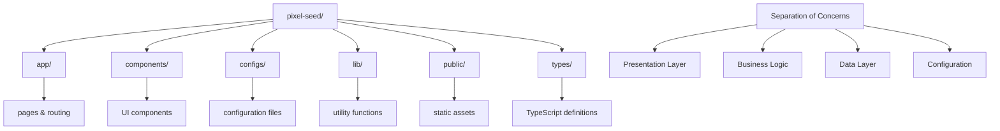

**目录职责分析：**

```typescript
// 项目结构映射
interface ProjectStructure {
  app: {
    purpose: "Next.js App Router pages and layouts";
    contains: ["page.tsx", "layout.tsx", "loading.tsx"];
    responsibility: "路由和页面组织";
  };
  components: {
    purpose: "Reusable UI components";
    contains: ["GameCanvas", "ThemesList", "SideMenu"];
    responsibility: "用户界面组件";
  };
  configs: {
    purpose: "Application configuration";
    contains: ["themes.ts", "constants.ts"];
    responsibility: "应用配置管理";
  };
  lib: {
    purpose: "Utility functions and helpers";
    contains: ["utils.ts", "api.ts", "store.ts"];
    responsibility: "工具函数和业务逻辑";
  };
}
```

### 5.1.2 Naming & Versioning —— 命名规范与版本策略

**命名约定系统**
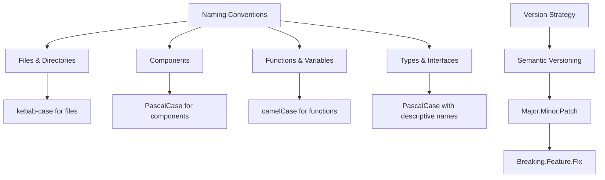

**版本管理策略：**
```json
{
  "versioning": {
    "strategy": "Semantic Versioning (SemVer)",
    "format": "MAJOR.MINOR.PATCH",
    "rules": {
      "MAJOR": "Breaking changes to API or core functionality",
      "MINOR": "New features, backward compatible",
      "PATCH": "Bug fixes, no new features"
    },
    "current": "1.0.0",
    "release_cycle": "Continuous deployment with feature flags"
  }
}
```

## 5.2 Frontend Stack —— 前端技术栈

### 5.2.1 Next.js Framework —— 路由与渲染模型

**App Router架构**
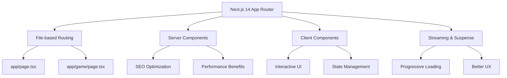

**渲染策略实现：**
```typescript
// app/layout.tsx - Root Layout
export default function RootLayout({
  children,
}: {
  children: React.ReactNode;
}) {
  return (
    <html lang="en">
      <body className={inter.className}>
        <Providers>
          <div className="min-h-screen bg-gradient-to-br from-purple-900 via-blue-900 to-indigo-900">
            {children}
          </div>
        </Providers>
      </body>
    </html>
  );
}

// app/page.tsx - Home Page (Server Component)
export default function HomePage() {
  return (
    <div className="container mx-auto px-4 py-8">
      <ProjectHeader />
      <div className="grid lg:grid-cols-4 gap-6">
        <SideMenu />
        <MainContent />
      </div>
    </div>
  );
}

// components/GameCanvas.tsx - Client Component
'use client';
export default function GameCanvas() {
  const [gameState, setGameState] = useState<GameState>('menu');
  // Interactive game logic here
}
```

### 5.2.2 Zustand State Management —— 轻量状态流与选择器

**状态管理架构**
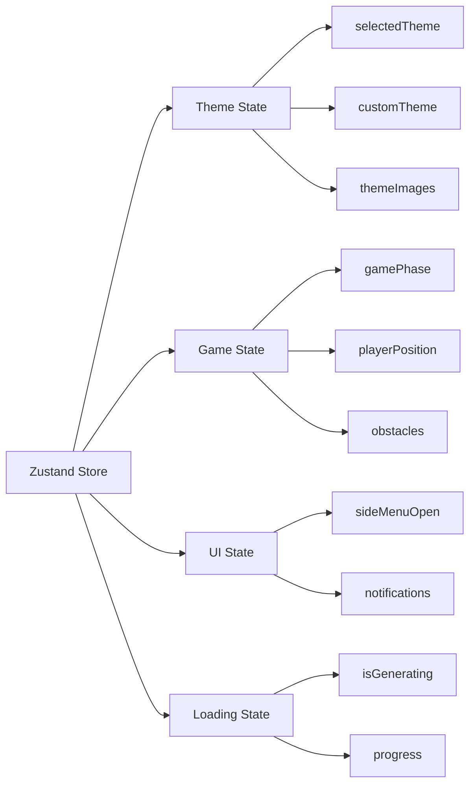

**Store实现细节：**
```typescript
// lib/store.ts
import { create } from 'zustand';
import { devtools } from 'zustand/middleware';

interface AppState {
  // Theme Management
  selectedTheme: string;
  customThemeName: string;
  customThemePrompt: string;
  themeImages: {
    character: string;
    background: string;
    ground: string;
    obstacle: string;
  };
  
  // Game State
  gameState: 'menu' | 'playing' | 'paused' | 'gameOver';
  playerPosition: { x: number; y: number };
  obstacles: Array<{ x: number; y: number; width: number; height: number }>;
  
  // UI State
  isGenerating: boolean;
  progress: number;
  
  // Actions
  setSelectedTheme: (theme: string) => void;
  setCustomTheme: (name: string, prompt: string) => void;
  updateThemeImages: (images: Partial<ThemeImages>) => void;
  setGameState: (state: GameState) => void;
  updatePlayerPosition: (position: { x: number; y: number }) => void;
}

export const useAppStore = create<AppState>()(devtools((set, get) => ({
  // Initial State
  selectedTheme: 'forest',
  customThemeName: '',
  customThemePrompt: '',
  themeImages: {
    character: '/placeholder-character.png',
    background: '/placeholder-background.png',
    ground: '/placeholder-ground.png',
    obstacle: '/placeholder-obstacle.png',
  },
  gameState: 'menu',
  playerPosition: { x: 100, y: 300 },
  obstacles: [],
  isGenerating: false,
  progress: 0,
  
  // Actions
  setSelectedTheme: (theme) => set({ selectedTheme: theme }),
  setCustomTheme: (name, prompt) => set({ 
    customThemeName: name, 
    customThemePrompt: prompt 
  }),
  updateThemeImages: (images) => set((state) => ({
    themeImages: { ...state.themeImages, ...images }
  })),
  setGameState: (gameState) => set({ gameState }),
  updatePlayerPosition: (position) => set({ playerPosition: position }),
})));
```

### 5.2.3 Ant Design & Tailwind CSS —— UI组件与样式体系

**双重样式系统集成**
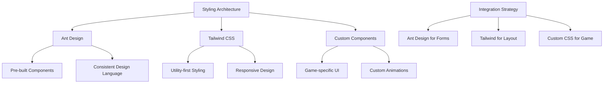

**样式集成实现：**
```typescript
// tailwind.config.js
module.exports = {
  content: [
    './pages/**/*.{js,ts,jsx,tsx,mdx}',
    './components/**/*.{js,ts,jsx,tsx,mdx}',
    './app/**/*.{js,ts,jsx,tsx,mdx}',
  ],
  theme: {
    extend: {
      colors: {
        primary: {
          50: '#f0f9ff',
          500: '#3b82f6',
          900: '#1e3a8a',
        },
        game: {
          bg: '#0f172a',
          ground: '#22c55e',
          obstacle: '#ef4444',
        }
      },
      animation: {
        'bounce-slow': 'bounce 2s infinite',
        'pulse-fast': 'pulse 1s infinite',
      }
    },
  },
  plugins: [],
};

// components/ui/Button.tsx - Custom Button Component
import { Button as AntButton } from 'antd';
import { cn } from '@/lib/utils';

interface ButtonProps {
  variant?: 'primary' | 'secondary' | 'game';
  size?: 'sm' | 'md' | 'lg';
  children: React.ReactNode;
  className?: string;
  onClick?: () => void;
}

export function Button({ 
  variant = 'primary', 
  size = 'md', 
  children, 
  className,
  ...props 
}: ButtonProps) {
  const baseClasses = 'font-semibold rounded-lg transition-all duration-200';
  const variantClasses = {
    primary: 'bg-blue-600 hover:bg-blue-700 text-white',
    secondary: 'bg-gray-200 hover:bg-gray-300 text-gray-900',
    game: 'bg-green-600 hover:bg-green-700 text-white pixel-font'
  };
  const sizeClasses = {
    sm: 'px-3 py-1.5 text-sm',
    md: 'px-4 py-2 text-base',
    lg: 'px-6 py-3 text-lg'
  };
  
  return (
    <button 
      className={cn(
        baseClasses,
        variantClasses[variant],
        sizeClasses[size],
        className
      )}
      {...props}
    >
      {children}
    </button>
  );
}
```

### 5.2.4 Framer Motion —— 动画与过渡

**动画系统架构**
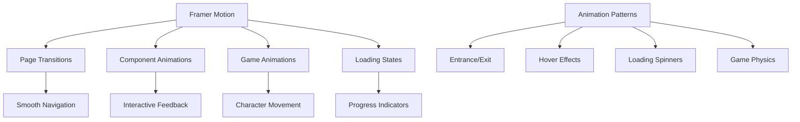

**动画实现示例：**
```typescript
// components/animations/PageTransition.tsx
import { motion, AnimatePresence } from 'framer-motion';

const pageVariants = {
  initial: {
    opacity: 0,
    y: 20,
    scale: 0.95
  },
  in: {
    opacity: 1,
    y: 0,
    scale: 1
  },
  out: {
    opacity: 0,
    y: -20,
    scale: 1.05
  }
};

const pageTransition = {
  type: 'tween',
  ease: 'anticipate',
  duration: 0.4
};

export function PageTransition({ children }: { children: React.ReactNode }) {
  return (
    <motion.div
      initial="initial"
      animate="in"
      exit="out"
      variants={pageVariants}
      transition={pageTransition}
    >
      {children}
    </motion.div>
  );
}

// components/ThemeCard.tsx - Animated Theme Selection
export function ThemeCard({ theme, isSelected, onSelect }: ThemeCardProps) {
  return (
    <motion.div
      className={cn(
        'p-4 rounded-lg border-2 cursor-pointer transition-all',
        isSelected ? 'border-blue-500 bg-blue-50' : 'border-gray-200 hover:border-gray-300'
      )}
      whileHover={{ scale: 1.02, y: -2 }}
      whileTap={{ scale: 0.98 }}
      initial={{ opacity: 0, y: 20 }}
      animate={{ opacity: 1, y: 0 }}
      transition={{ duration: 0.2 }}
      onClick={onSelect}
    >
      <motion.img
        src={theme.preview}
        alt={theme.name}
        className="w-full h-32 object-cover rounded"
        layoutId={`theme-image-${theme.id}`}
      />
      <h3 className="mt-2 font-semibold">{theme.name}</h3>
    </motion.div>
  );
}

// Game character animation
export function AnimatedCharacter({ position, isJumping }: CharacterProps) {
  return (
    <motion.div
      className="absolute w-8 h-8"
      animate={{
        x: position.x,
        y: position.y,
        rotate: isJumping ? [0, 5, -5, 0] : 0
      }}
      transition={{
        x: { type: 'spring', stiffness: 300, damping: 30 },
        y: { type: 'spring', stiffness: 400, damping: 25 },
        rotate: { duration: 0.3 }
      }}
    >
      
    </motion.div>
  );
}
```

## 5.3 Configuration & Types —— 配置与类型系统

### 5.3.1 Configs / PRESET_THEMES —— 主题清单与占位资源

**主题配置系统**
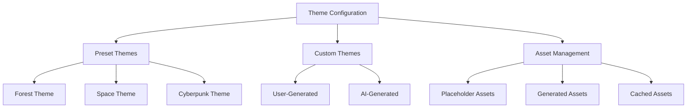

**主题配置实现：**
```typescript
// configs/themes.ts
export interface ThemeAssets {
  character: string;
  background: string;
  ground: string;
  obstacle: string;
  preview?: string;
}

export interface Theme {
  id: string;
  name: string;
  description: string;
  prompt: string;
  assets: ThemeAssets;
  tags: string[];
  difficulty?: 'easy' | 'medium' | 'hard';
  isCustom?: boolean;
}

export const PRESET_THEMES: Theme[] = [
  {
    id: 'forest',
    name: 'Mystical Forest',
    description: 'A magical forest with ancient trees and mystical creatures',
    prompt: 'mystical forest, ancient trees, magical atmosphere, pixel art style',
    assets: {
      character: '/themes/forest/character.png',
      background: '/themes/forest/background.png',
      ground: '/themes/forest/ground.png',
      obstacle: '/themes/forest/obstacle.png',
      preview: '/themes/forest/preview.png'
    },
    tags: ['nature', 'magic', 'fantasy'],
    difficulty: 'easy'
  },
  {
    id: 'space',
    name: 'Cosmic Adventure',
    description: 'Journey through the stars in a retro space setting',
    prompt: 'retro space, cosmic background, futuristic platforms, pixel art',
    assets: {
      character: '/themes/space/character.png',
      background: '/themes/space/background.png',
      ground: '/themes/space/ground.png',
      obstacle: '/themes/space/obstacle.png',
      preview: '/themes/space/preview.png'
    },
    tags: ['space', 'sci-fi', 'retro'],
    difficulty: 'medium'
  },
  {
    id: 'cyberpunk',
    name: 'Neon City',
    description: 'Navigate through a cyberpunk metropolis',
    prompt: 'cyberpunk city, neon lights, futuristic buildings, pixel art style',
    assets: {
      character: '/themes/cyberpunk/character.png',
      background: '/themes/cyberpunk/background.png',
      ground: '/themes/cyberpunk/ground.png',
      obstacle: '/themes/cyberpunk/obstacle.png',
      preview: '/themes/cyberpunk/preview.png'
    },
    tags: ['cyberpunk', 'neon', 'urban'],
    difficulty: 'hard'
  }
];

// Asset fallback system
export const PLACEHOLDER_ASSETS: ThemeAssets = {
  character: '/placeholders/character-placeholder.png',
  background: '/placeholders/background-placeholder.png',
  ground: '/placeholders/ground-placeholder.png',
  obstacle: '/placeholders/obstacle-placeholder.png'
};

// Theme utility functions
export function getThemeById(id: string): Theme | undefined {
  return PRESET_THEMES.find(theme => theme.id === id);
}

export function getThemesByTag(tag: string): Theme[] {
  return PRESET_THEMES.filter(theme => theme.tags.includes(tag));
}

export function createCustomTheme(
  name: string, 
  prompt: string, 
  assets?: Partial<ThemeAssets>
): Theme {
  return {
    id: `custom-${Date.now()}`,
    name,
    description: `Custom theme: ${name}`,
    prompt,
    assets: {
      ...PLACEHOLDER_ASSETS,
      ...assets
    },
    tags: ['custom'],
    isCustom: true
  };
}
```

### 5.3.2 Types —— TypeScript 类型定义与安全

**类型系统架构**
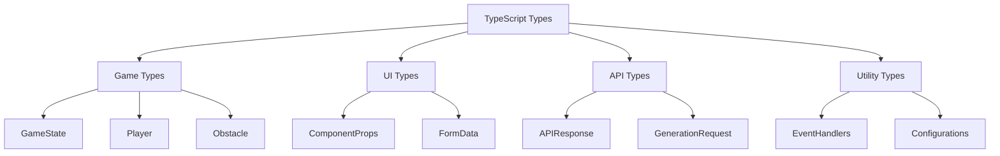

**核心类型定义：**
```typescript
// types/game.ts
export type GameState = 'menu' | 'playing' | 'paused' | 'gameOver';

export interface Player {
  x: number;
  y: number;
  width: number;
  height: number;
  velocityX: number;
  velocityY: number;
  isJumping: boolean;
  isOnGround: boolean;
}

export interface Obstacle {
  id: string;
  x: number;
  y: number;
  width: number;
  height: number;
  type: 'static' | 'moving' | 'destructible';
}

export interface GameConfig {
  gravity: number;
  jumpForce: number;
  moveSpeed: number;
  groundLevel: number;
  canvasWidth: number;
  canvasHeight: number;
}

// types/ui.ts
export interface ButtonProps {
  variant?: 'primary' | 'secondary' | 'danger';
  size?: 'sm' | 'md' | 'lg';
  disabled?: boolean;
  loading?: boolean;
  children: React.ReactNode;
  onClick?: () => void;
}

export interface ModalProps {
  isOpen: boolean;
  onClose: () => void;
  title?: string;
  children: React.ReactNode;
}

export interface NotificationProps {
  type: 'success' | 'error' | 'warning' | 'info';
  message: string;
  duration?: number;
  onClose?: () => void;
}

// types/api.ts
export interface GenerationRequest {
  prompt: string;
  style?: string;
  aspectRatio?: string;
  quality?: 'draft' | 'standard' | 'high';
}

export interface GenerationResponse {
  success: boolean;
  data?: {
    imageUrl: string;
    metadata: {
      prompt: string;
      model: string;
      timestamp: string;
    };
  };
  error?: {
    code: string;
    message: string;
  };
}

export interface APIError {
  code: string;
  message: string;
  details?: Record<string, any>;
}

// types/store.ts
export interface AppState {
  // Theme state
  selectedTheme: string;
  customThemeName: string;
  customThemePrompt: string;
  themeImages: ThemeAssets;
  
  // Game state
  gameState: GameState;
  player: Player;
  obstacles: Obstacle[];
  score: number;
  
  // UI state
  isGenerating: boolean;
  progress: number;
  notifications: NotificationProps[];
  
  // Actions
  setSelectedTheme: (theme: string) => void;
  setCustomTheme: (name: string, prompt: string) => void;
  updateThemeImages: (images: Partial<ThemeAssets>) => void;
  setGameState: (state: GameState) => void;
  updatePlayer: (player: Partial<Player>) => void;
  addObstacle: (obstacle: Obstacle) => void;
  removeObstacle: (id: string) => void;
  addNotification: (notification: NotificationProps) => void;
  removeNotification: (index: number) => void;
}

// Utility types
export type DeepPartial<T> = {
  [P in keyof T]?: T[P] extends object ? DeepPartial<T[P]> : T[P];
};

export type EventHandler<T = Event> = (event: T) => void;

export type AsyncFunction<T = any> = (...args: any[]) => Promise<T>;
```

### 5.3.3 Env & Secrets —— 环境变量与密钥管理

**环境配置管理**
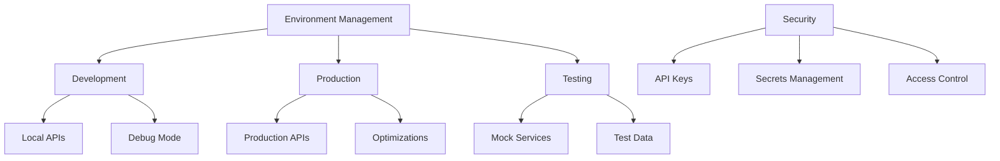

**环境配置实现：**
```typescript
// .env.local (development)
NEXT_PUBLIC_APP_ENV=development
NEXT_PUBLIC_API_BASE_URL=http://localhost:3000/api
NEXT_PUBLIC_ENABLE_DEBUG=true

# AI Service Configuration
OPENAI_API_KEY=sk-...
STABILITY_AI_API_KEY=sk-...
REPLICATE_API_TOKEN=r8_...

# Database
DATABASE_URL=postgresql://...
REDIS_URL=redis://localhost:6379

# Analytics
NEXT_PUBLIC_GA_ID=G-...
NEXT_PUBLIC_POSTHOG_KEY=phc_...

// lib/env.ts - Environment validation
import { z } from 'zod';

const envSchema = z.object({
  NODE_ENV: z.enum(['development', 'production', 'test']),
  NEXT_PUBLIC_APP_ENV: z.string(),
  NEXT_PUBLIC_API_BASE_URL: z.string().url(),
  OPENAI_API_KEY: z.string().min(1),
  STABILITY_AI_API_KEY: z.string().min(1),
  DATABASE_URL: z.string().url().optional(),
  REDIS_URL: z.string().url().optional(),
});

export const env = envSchema.parse(process.env);

// lib/config.ts - Application configuration
export const config = {
  app: {
    name: 'Pixel Seed',
    version: '1.0.0',
    environment: env.NEXT_PUBLIC_APP_ENV,
    baseUrl: env.NEXT_PUBLIC_API_BASE_URL,
  },
  
  ai: {
    providers: {
      openai: {
        apiKey: env.OPENAI_API_KEY,
        model: 'dall-e-3',
        maxTokens: 4000,
      },
      stability: {
        apiKey: env.STABILITY_AI_API_KEY,
        model: 'stable-diffusion-xl-1024-v1-0',
      },
    },
    generation: {
      timeout: 30000,
      retries: 3,
      quality: 'standard' as const,
    },
  },
  
  game: {
    physics: {
      gravity: 0.8,
      jumpForce: -15,
      moveSpeed: 5,
    },
    canvas: {
      width: 800,
      height: 400,
      pixelRatio: window?.devicePixelRatio || 1,
    },
  },
  
  ui: {
    animations: {
      duration: 0.3,
      easing: 'ease-in-out',
    },
    notifications: {
      duration: 5000,
      maxCount: 3,
    },
  },
} as const;

// Security utilities
export function sanitizeApiKey(key: string): string {
  if (key.length <= 8) return key;
  return `${key.slice(0, 4)}...${key.slice(-4)}`;
}

export function validateEnvironment(): boolean {
  try {
    envSchema.parse(process.env);
    return true;
  } catch (error) {
    console.error('Environment validation failed:', error);
    return false;
  }
}
```

## 5.4 UI Components —— 界面组件

### 5.4.1 SideMenu —— 侧栏与全局操作

**侧栏组件架构**
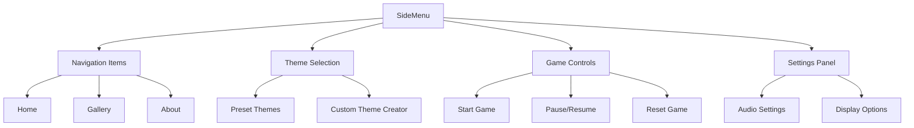

**SideMenu组件实现：**
```typescript
// components/SideMenu.tsx
import { useState } from 'react';
import { motion, AnimatePresence } from 'framer-motion';
import { useAppStore } from '@/lib/store';
import { Button } from '@/components/ui/Button';
import { ThemesList } from './ThemesList';
import { ThemeCustomizer } from './ThemeCustomizer';

interface SideMenuProps {
  className?: string;
}

export function SideMenu({ className }: SideMenuProps) {
  const [activeTab, setActiveTab] = useState<'themes' | 'custom' | 'settings'>('themes');
  const { gameState, setGameState } = useAppStore();
  
  const menuVariants = {
    hidden: { x: -300, opacity: 0 },
    visible: { 
      x: 0, 
      opacity: 1,
      transition: { type: 'spring', stiffness: 300, damping: 30 }
    }
  };
  
  const tabVariants = {
    inactive: { opacity: 0.6, scale: 0.95 },
    active: { opacity: 1, scale: 1 }
  };
  
  return (
    <motion.div
      className={cn(
        'bg-white/10 backdrop-blur-md rounded-xl p-6 h-fit',
        'border border-white/20 shadow-xl',
        className
      )}
      variants={menuVariants}
      initial="hidden"
      animate="visible"
    >
      {/* Header */}
      <div className="mb-6">
        <h2 className="text-2xl font-bold text-white mb-2">Pixel Seed</h2>
        <p className="text-white/70 text-sm">AI-Powered Game Creation</p>
      </div>
      
      {/* Tab Navigation */}
      <div className="flex space-x-2 mb-6">
        {[
          { id: 'themes', label: 'Themes', icon: '🎨' },
          { id: 'custom', label: 'Custom', icon: '✨' },
          { id: 'settings', label: 'Settings', icon: '⚙️' }
        ].map((tab) => (
          <motion.button
            key={tab.id}
            className={cn(
              'flex items-center space-x-2 px-3 py-2 rounded-lg text-sm font-medium',
              'transition-colors duration-200',
              activeTab === tab.id
                ? 'bg-blue-600 text-white'
                : 'text-white/70 hover:text-white hover:bg-white/10'
            )}
            variants={tabVariants}
            animate={activeTab === tab.id ? 'active' : 'inactive'}
            onClick={() => setActiveTab(tab.id as any)}
          >
            <span>{tab.icon}</span>
            <span>{tab.label}</span>
          </motion.button>
        ))}
      </div>
      
      {/* Tab Content */}
      <AnimatePresence mode="wait">
        <motion.div
          key={activeTab}
          initial={{ opacity: 0, y: 20 }}
          animate={{ opacity: 1, y: 0 }}
          exit={{ opacity: 0, y: -20 }}
          transition={{ duration: 0.2 }}
        >
          {activeTab === 'themes' && <ThemesList />}
          {activeTab === 'custom' && <ThemeCustomizer />}
          {activeTab === 'settings' && <SettingsPanel />}
        </motion.div>
      </AnimatePresence>
      
      {/* Game Controls */}
      <div className="mt-6 pt-6 border-t border-white/20">
        <div className="space-y-3">
          <Button
            variant="game"
            size="lg"
            className="w-full"
            onClick={() => setGameState(gameState === 'playing' ? 'menu' : 'playing')}
          >
            {gameState === 'playing' ? '⏸️ Pause Game' : '🎮 Start Game'}
          </Button>
          
          {gameState !== 'menu' && (
            <Button
              variant="secondary"
              size="md"
              className="w-full"
              onClick={() => setGameState('menu')}
            >
              🏠 Back to Menu
            </Button>
          )}
        </div>
      </div>
    </motion.div>
  );
}
```

### 5.4.2 ThemesList —— 主题列表与选中高亮

**主题列表组件设计**
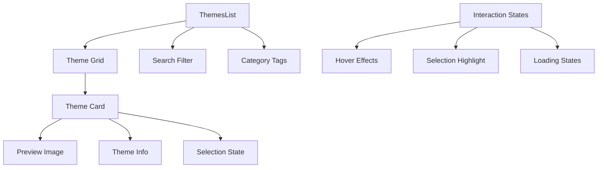

**ThemesList实现：**
```typescript
// components/ThemesList.tsx
import { useState, useMemo } from 'react';
import { motion } from 'framer-motion';
import { useAppStore } from '@/lib/store';
import { PRESET_THEMES, type Theme } from '@/configs/themes';
import { Input } from 'antd';
import { SearchOutlined } from '@ant-design/icons';

export function ThemesList() {
  const [searchTerm, setSearchTerm] = useState('');
  const [selectedTag, setSelectedTag] = useState<string | null>(null);
  const { selectedTheme, setSelectedTheme } = useAppStore();
  
  // Filter themes based on search and tags
  const filteredThemes = useMemo(() => {
    return PRESET_THEMES.filter(theme => {
      const matchesSearch = theme.name.toLowerCase().includes(searchTerm.toLowerCase()) ||
                           theme.description.toLowerCase().includes(searchTerm.toLowerCase());
      const matchesTag = !selectedTag || theme.tags.includes(selectedTag);
      return matchesSearch && matchesTag;
    });
  }, [searchTerm, selectedTag]);
  
  // Get all unique tags
  const allTags = useMemo(() => {
    const tags = new Set<string>();
    PRESET_THEMES.forEach(theme => theme.tags.forEach(tag => tags.add(tag)));
    return Array.from(tags);
  }, []);
  
  return (
    <div className="space-y-4">
      {/* Search */}
      <Input
        placeholder="Search themes..."
        prefix={<SearchOutlined />}
        value={searchTerm}
        onChange={(e) => setSearchTerm(e.target.value)}
        className="bg-white/10 border-white/20 text-white"
      />
      
      {/* Tag Filter */}
      <div className="flex flex-wrap gap-2">
        <motion.button
          className={cn(
            'px-3 py-1 rounded-full text-xs font-medium transition-colors',
            !selectedTag
              ? 'bg-blue-600 text-white'
              : 'bg-white/10 text-white/70 hover:bg-white/20'
          )}
          onClick={() => setSelectedTag(null)}
          whileHover={{ scale: 1.05 }}
          whileTap={{ scale: 0.95 }}
        >
          All
        </motion.button>
        
        {allTags.map(tag => (
          <motion.button
            key={tag}
            className={cn(
              'px-3 py-1 rounded-full text-xs font-medium transition-colors capitalize',
              selectedTag === tag
                ? 'bg-blue-600 text-white'
                : 'bg-white/10 text-white/70 hover:bg-white/20'
            )}
            onClick={() => setSelectedTag(selectedTag === tag ? null : tag)}
            whileHover={{ scale: 1.05 }}
            whileTap={{ scale: 0.95 }}
          >
            {tag}
          </motion.button>
        ))}
      </div>
      
      {/* Themes Grid */}
      <div className="grid grid-cols-1 gap-3 max-h-96 overflow-y-auto">
        {filteredThemes.map((theme, index) => (
          <ThemeCard
            key={theme.id}
            theme={theme}
            isSelected={selectedTheme === theme.id}
            onSelect={() => setSelectedTheme(theme.id)}
            index={index}
          />
        ))}
      </div>
      
      {filteredThemes.length === 0 && (
        <div className="text-center py-8 text-white/50">
          <p>No themes found matching your criteria.</p>
        </div>
      )}
    </div>
  );
}

// ThemeCard component
interface ThemeCardProps {
  theme: Theme;
  isSelected: boolean;
  onSelect: () => void;
  index: number;
}

function ThemeCard({ theme, isSelected, onSelect, index }: ThemeCardProps) {
  return (
    <motion.div
      className={cn(
        'relative p-3 rounded-lg border-2 cursor-pointer transition-all duration-200',
        'hover:shadow-lg',
        isSelected
          ? 'border-blue-500 bg-blue-500/20 shadow-blue-500/25'
          : 'border-white/20 bg-white/5 hover:border-white/40 hover:bg-white/10'
      )}
      initial={{ opacity: 0, y: 20 }}
      animate={{ opacity: 1, y: 0 }}
      transition={{ delay: index * 0.05 }}
      whileHover={{ scale: 1.02, y: -2 }}
      whileTap={{ scale: 0.98 }}
      onClick={onSelect}
    >
      {/* Preview Image */}
      <div className="relative mb-3">
        
        
        {/* Difficulty Badge */}
        {theme.difficulty && (
          <div className={cn(
            'absolute top-2 right-2 px-2 py-1 rounded text-xs font-medium',
            theme.difficulty === 'easy' && 'bg-green-600 text-white',
            theme.difficulty === 'medium' && 'bg-yellow-600 text-white',
            theme.difficulty === 'hard' && 'bg-red-600 text-white'
          )}>
            {theme.difficulty}
          </div>
        )}
        
        {/* Selection Indicator */}
        {isSelected && (
          <motion.div
            className="absolute inset-0 border-2 border-blue-400 rounded bg-blue-400/20"
            initial={{ scale: 0.8, opacity: 0 }}
            animate={{ scale: 1, opacity: 1 }}
            transition={{ type: 'spring', stiffness: 300 }}
          >
            <div className="absolute top-1 right-1 w-6 h-6 bg-blue-500 rounded-full flex items-center justify-center">
              <span className="text-white text-xs">✓</span>
            </div>
          </motion.div>
        )}
      </div>
      
      {/* Theme Info */}
      <div>
        <h3 className="font-semibold text-white mb-1">{theme.name}</h3>
        <p className="text-white/70 text-xs mb-2 line-clamp-2">{theme.description}</p>
        
        {/* Tags */}
        <div className="flex flex-wrap gap-1">
          {theme.tags.slice(0, 3).map(tag => (
            <span
              key={tag}
              className="px-2 py-0.5 bg-white/10 text-white/60 text-xs rounded capitalize"
            >
              {tag}
            </span>
          ))}
        </div>
      </div>
    </motion.div>
  );
}
```

### 5.4.3 ThemePreview —— 角色/背景/地面/障碍预览与骨架屏

**预览组件架构**
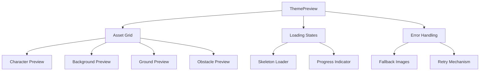

**ThemePreview实现：**
```typescript
// components/ThemePreview.tsx
import { useState, useEffect } from 'react';
import { motion, AnimatePresence } from 'framer-motion';
import { useAppStore } from '@/lib/store';
import { getThemeById, PLACEHOLDER_ASSETS } from '@/configs/themes';
import { Skeleton } from 'antd';

interface AssetPreviewProps {
  label: string;
  src: string;
  alt: string;
  isLoading?: boolean;
  error?: boolean;
  onRetry?: () => void;
}

function AssetPreview({ label, src, alt, isLoading, error, onRetry }: AssetPreviewProps) {
  const [imageLoaded, setImageLoaded] = useState(false);
  const [imageError, setImageError] = useState(false);
  
  useEffect(() => {
    setImageLoaded(false);
    setImageError(false);
  }, [src]);
  
  return (
    <div className="space-y-2">
      <h4 className="text-sm font-medium text-white/80">{label}</h4>
      
      <div className="relative aspect-square bg-white/5 rounded-lg overflow-hidden border border-white/10">
        <AnimatePresence mode="wait">
          {(isLoading || !imageLoaded) && !imageError && (
            <motion.div
              key="skeleton"
              className="absolute inset-0"
              initial={{ opacity: 0 }}
              animate={{ opacity: 1 }}
              exit={{ opacity: 0 }}
            >
              <Skeleton.Image className="w-full h-full" active />
            </motion.div>
          )}
          
          {!isLoading && (imageError || error) && (
            <motion.div
              key="error"
              className="absolute inset-0 flex flex-col items-center justify-center text-white/50"
              initial={{ opacity: 0, scale: 0.9 }}
              animate={{ opacity: 1, scale: 1 }}
              exit={{ opacity: 0, scale: 0.9 }}
            >
              <div className="text-2xl mb-2">⚠️</div>
              <p className="text-xs text-center mb-2">Failed to load</p>
              {onRetry && (
                <button
                  className="text-xs text-blue-400 hover:text-blue-300"
                  onClick={onRetry}
                >
                  Retry
                </button>
              )}
            </motion.div>
          )}
          
          {!isLoading && !error && (
            <motion.img
              key="image"
              src={src}
              alt={alt}
              className="w-full h-full object-cover"
              initial={{ opacity: 0, scale: 1.1 }}
              animate={{ 
                opacity: imageLoaded ? 1 : 0, 
                scale: imageLoaded ? 1 : 1.1 
              }}
              transition={{ duration: 0.3 }}
              onLoad={() => setImageLoaded(true)}
              onError={() => setImageError(true)}
            />
          )}
        </AnimatePresence>
        
        {/* Loading Progress Overlay */}
        {isLoading && (
          <div className="absolute inset-0 bg-black/50 flex items-center justify-center">
            <div className="text-white text-xs">Generating...</div>
          </div>
        )}
      </div>
    </div>
  );
}

export function ThemePreview() {
  const { selectedTheme, themeImages, isGenerating } = useAppStore();
  
  const theme = getThemeById(selectedTheme);
  
  if (!theme) {
    return (
      <div className="text-center py-8 text-white/50">
        <p>No theme selected</p>
      </div>
    );
  }
  
  const assets = [
    {
      key: 'character',
      label: 'Character',
      src: themeImages.character || theme.assets.character,
      alt: `${theme.name} character`
    },
    {
      key: 'background',
      label: 'Background',
      src: themeImages.background || theme.assets.background,
      alt: `${theme.name} background`
    },
    {
      key: 'ground',
      label: 'Ground',
      src: themeImages.ground || theme.assets.ground,
      alt: `${theme.name} ground`
    },
    {
      key: 'obstacle',
      label: 'Obstacle',
      src: themeImages.obstacle || theme.assets.obstacle,
      alt: `${theme.name} obstacle`
    }
  ];
  
  return (
    <motion.div
      className="bg-white/10 backdrop-blur-md rounded-xl p-6 border border-white/20"
      initial={{ opacity: 0, y: 20 }}
      animate={{ opacity: 1, y: 0 }}
      transition={{ delay: 0.1 }}
    >
      <div className="mb-4">
        <h3 className="text-lg font-semibold text-white mb-1">{theme.name}</h3>
        <p className="text-white/70 text-sm">{theme.description}</p>
      </div>
      
      <div className="grid grid-cols-2 gap-4">
        {assets.map((asset, index) => (
          <motion.div
            key={asset.key}
            initial={{ opacity: 0, y: 20 }}
            animate={{ opacity: 1, y: 0 }}
            transition={{ delay: index * 0.1 }}
          >
            <AssetPreview
              label={asset.label}
              src={asset.src}
              alt={asset.alt}
              isLoading={isGenerating}
            />
          </motion.div>
        ))}
      </div>
      
      {/* Generation Status */}
      {isGenerating && (
        <motion.div
          className="mt-4 p-3 bg-blue-600/20 border border-blue-500/30 rounded-lg"
          initial={{ opacity: 0, height: 0 }}
          animate={{ opacity: 1, height: 'auto' }}
        >
          <div className="flex items-center space-x-2">
            <div className="w-4 h-4 border-2 border-blue-400 border-t-transparent rounded-full animate-spin" />
            <span className="text-blue-300 text-sm">Generating theme assets...</span>
          </div>
        </motion.div>
      )}
    </motion.div>
  );
}
```

### 5.4.4 ThemeCustomizer —— 自定义主题名与Prompt输入

**主题定制器设计**
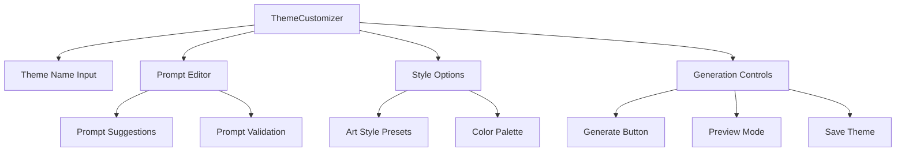

**ThemeCustomizer实现：**
```typescript
// components/ThemeCustomizer.tsx
import { useState } from 'react';
import { motion } from 'framer-motion';
import { Input, Button, Select, Slider, message } from 'antd';
import { useAppStore } from '@/lib/store';
import { generateThemeAssets } from '@/lib/api';

const { TextArea } = Input;
const { Option } = Select;

const STYLE_PRESETS = [
  { value: 'pixel-art', label: '8-bit Pixel Art', prompt: 'pixel art, 8-bit style, retro gaming' },
  { value: '16-bit', label: '16-bit Style', prompt: '16-bit pixel art, detailed sprites' },
  { value: 'minimalist', label: 'Minimalist', prompt: 'minimalist pixel art, clean lines, simple colors' },
  { value: 'detailed', label: 'Detailed', prompt: 'detailed pixel art, rich textures, complex shading' }
];

const PROMPT_SUGGESTIONS = [
  'mystical forest with glowing mushrooms',
  'cyberpunk city with neon lights',
  'underwater coral reef world',
  'steampunk mechanical landscape',
  'space station in deep space',
  'medieval castle courtyard',
  'post-apocalyptic wasteland',
  'candy land with sweet treats'
];

export function ThemeCustomizer() {
  const {
    customThemeName,
    customThemePrompt,
    setCustomTheme,
    updateThemeImages,
    isGenerating
  } = useAppStore();
  
  const [localName, setLocalName] = useState(customThemeName);
  const [localPrompt, setLocalPrompt] = useState(customThemePrompt);
  const [selectedStyle, setSelectedStyle] = useState('pixel-art');
  const [quality, setQuality] = useState(70);
  
  const handleGenerate = async () => {
    if (!localName.trim() || !localPrompt.trim()) {
      message.error('Please provide both theme name and description');
      return;
    }
    
    try {
      setCustomTheme(localName, localPrompt);
      
      const stylePreset = STYLE_PRESETS.find(s => s.value === selectedStyle);
      const enhancedPrompt = `${localPrompt}, ${stylePreset?.prompt || ''}, high quality pixel art`;
      
      const assets = await generateThemeAssets({
        prompt: enhancedPrompt,
        style: selectedStyle,
        quality: quality > 50 ? 'high' : 'standard'
      });
      
      updateThemeImages(assets);
      message.success('Theme generated successfully!');
    } catch (error) {
      console.error('Generation failed:', error);
      message.error('Failed to generate theme. Please try again.');
    }
  };
  
  const handleSuggestionClick = (suggestion: string) => {
    setLocalPrompt(suggestion);
  };
  
  return (
    <div className="space-y-6">
      {/* Theme Name */}
      <div>
        <label className="block text-sm font-medium text-white/80 mb-2">
          Theme Name
        </label>
        <Input
          placeholder="Enter theme name..."
          value={localName}
          onChange={(e) => setLocalName(e.target.value)}
          className="bg-white/10 border-white/20 text-white"
          maxLength={50}
        />
      </div>
      
      {/* Prompt Input */}
      <div>
        <label className="block text-sm font-medium text-white/80 mb-2">
          Theme Description
        </label>
        <TextArea
          placeholder="Describe your theme in detail..."
          value={localPrompt}
          onChange={(e) => setLocalPrompt(e.target.value)}
          className="bg-white/10 border-white/20 text-white"
          rows={4}
          maxLength={500}
          showCount
        />
        
        {/* Prompt Suggestions */}
        <div className="mt-2">
          <p className="text-xs text-white/60 mb-2">Suggestions:</p>
          <div className="flex flex-wrap gap-1">
            {PROMPT_SUGGESTIONS.slice(0, 4).map((suggestion, index) => (
              <motion.button
                key={index}
                className="px-2 py-1 bg-white/10 hover:bg-white/20 text-white/70 text-xs rounded transition-colors"
                onClick={() => handleSuggestionClick(suggestion)}
                whileHover={{ scale: 1.05 }}
                whileTap={{ scale: 0.95 }}
              >
                {suggestion}
              </motion.button>
            ))}
          </div>
        </div>
      </div>
      
      {/* Style Options */}
      <div className="grid grid-cols-1 gap-4">
        <div>
          <label className="block text-sm font-medium text-white/80 mb-2">
            Art Style
          </label>
          <Select
            value={selectedStyle}
            onChange={setSelectedStyle}
            className="w-full"
            dropdownClassName="bg-gray-800"
          >
            {STYLE_PRESETS.map(preset => (
              <Option key={preset.value} value={preset.value}>
                {preset.label}
              </Option>
            ))}
          </Select>
        </div>
        
        <div>
          <label className="block text-sm font-medium text-white/80 mb-2">
            Quality: {quality}%
          </label>
          <Slider
            value={quality}
            onChange={setQuality}
            min={30}
            max={100}
            step={10}
            marks={{
              30: 'Draft',
              50: 'Standard',
              80: 'High',
              100: 'Ultra'
            }}
          />
        </div>
      </div>
      
      {/* Generation Controls */}
      <div className="space-y-3">
        <Button
          type="primary"
          size="large"
          loading={isGenerating}
          disabled={!localName.trim() || !localPrompt.trim()}
          onClick={handleGenerate}
          className="w-full h-12 bg-gradient-to-r from-blue-600 to-purple-600 border-none"
        >
          {isGenerating ? 'Generating Theme...' : '✨ Generate Theme'}
        </Button>
        
        <div className="text-xs text-white/50 text-center">
          Generation typically takes 30-60 seconds
        </div>
      </div>
      
      {/* Tips */}
      <div className="p-3 bg-blue-600/10 border border-blue-500/20 rounded-lg">
        <h4 className="text-sm font-medium text-blue-300 mb-1">💡 Tips for better results:</h4>
        <ul className="text-xs text-blue-200/80 space-y-1">
          <li>• Be specific about colors, mood, and setting</li>
          <li>• Mention "pixel art" or "8-bit style" for consistency</li>
          <li>• Include lighting conditions (bright, dark, neon, etc.)</li>
          <li>• Describe the environment (forest, city, space, etc.)</li>
        </ul>
      </div>
    </div>
  );
}
```

## 5.5 Game Systems —— 游戏系统

### 5.5.1 GameCanvas —— 画布渲染（背景、像素化、UI 叠层）

**游戏画布架构**
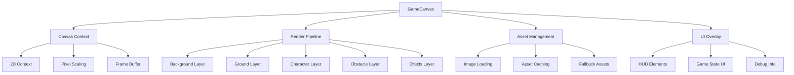

**GameCanvas实现：**
```typescript
// components/GameCanvas.tsx
import { useRef, useEffect, useCallback } from 'react';
import { useAppStore } from '@/lib/store';
import { useGameLoop } from '@/hooks/useGameLoop';
import { useInputHandler } from '@/hooks/useInputHandler';
import { GameRenderer } from '@/lib/game/renderer';
import { GamePhysics } from '@/lib/game/physics';
import { ObstacleManager } from '@/lib/game/obstacles';

interface GameCanvasProps {
  width?: number;
  height?: number;
  pixelRatio?: number;
}

export function GameCanvas({ 
  width = 800, 
  height = 600, 
  pixelRatio = 2 
}: GameCanvasProps) {
  const canvasRef = useRef<HTMLCanvasElement>(null);
  const rendererRef = useRef<GameRenderer | null>(null);
  const physicsRef = useRef<GamePhysics | null>(null);
  const obstaclesRef = useRef<ObstacleManager | null>(null);
  
  const {
    gameState,
    selectedTheme,
    themeImages,
    playerPosition,
    setPlayerPosition,
    obstacles,
    score,
    gameSpeed
  } = useAppStore();
  
  // Initialize game systems
  useEffect(() => {
    const canvas = canvasRef.current;
    if (!canvas) return;
    
    const ctx = canvas.getContext('2d');
    if (!ctx) return;
    
    // Configure canvas for pixel art
    ctx.imageSmoothingEnabled = false;
    ctx.webkitImageSmoothingEnabled = false;
    ctx.mozImageSmoothingEnabled = false;
    ctx.msImageSmoothingEnabled = false;
    
    // Initialize game systems
    rendererRef.current = new GameRenderer(ctx, {
      width,
      height,
      pixelRatio,
      theme: selectedTheme,
      assets: themeImages
    });
    
    physicsRef.current = new GamePhysics({
      gravity: 0.8,
      jumpForce: -15,
      groundLevel: height - 100,
      boundaries: { left: 0, right: width, top: 0, bottom: height }
    });
    
    obstaclesRef.current = new ObstacleManager({
      canvasWidth: width,
      canvasHeight: height,
      groundLevel: height - 100,
      speed: gameSpeed
    });
    
  }, [width, height, pixelRatio, selectedTheme]);
  
  // Game loop
  const gameLoop = useCallback((deltaTime: number) => {
    const canvas = canvasRef.current;
    const renderer = rendererRef.current;
    const physics = physicsRef.current;
    const obstacles = obstaclesRef.current;
    
    if (!canvas || !renderer || !physics || !obstacles) return;
    
    if (gameState === 'playing') {
      // Update physics
      const newPosition = physics.updatePlayer(playerPosition, deltaTime);
      setPlayerPosition(newPosition);
      
      // Update obstacles
      obstacles.update(deltaTime);
      
      // Check collisions
      const collision = obstacles.checkCollisions(newPosition);
      if (collision) {
        // Handle collision (game over, etc.)
        console.log('Collision detected!');
      }
    }
    
    // Render frame
    renderer.render({
      playerPosition,
      obstacles: obstacles.getObstacles(),
      gameState,
      score,
      deltaTime
    });
    
  }, [gameState, playerPosition, setPlayerPosition, score]);
  
  // Use game loop hook
  useGameLoop(gameLoop, gameState === 'playing');
  
  // Input handling
  useInputHandler({
    onJump: () => {
      if (gameState === 'playing' && physicsRef.current) {
        physicsRef.current.jump();
      }
    },
    onPause: () => {
      // Handle pause
    }
  });
  
  return (
    <div className="relative bg-black rounded-lg overflow-hidden border border-white/20">
      <canvas
        ref={canvasRef}
        width={width * pixelRatio}
        height={height * pixelRatio}
        style={{
          width: `${width}px`,
          height: `${height}px`,
          imageRendering: 'pixelated',
          imageRendering: '-moz-crisp-edges',
          imageRendering: 'crisp-edges'
        }}
        className="block"
      />
      
      {/* Game UI Overlay */}
      <GameUIOverlay />
      
      {/* Debug Info (development only) */}
      {process.env.NODE_ENV === 'development' && (
        <DebugOverlay
          fps={60} // Calculate actual FPS
          playerPosition={playerPosition}
          obstacleCount={obstacles.length}
        />
      )}
    </div>
  );
}

// Game Renderer Class
class GameRenderer {
  private ctx: CanvasRenderingContext2D;
  private config: any;
  private assets: Map<string, HTMLImageElement> = new Map();
  
  constructor(ctx: CanvasRenderingContext2D, config: any) {
    this.ctx = ctx;
    this.config = config;
    this.loadAssets();
  }
  
  private async loadAssets() {
    const { assets } = this.config;
    
    for (const [key, src] of Object.entries(assets)) {
      if (typeof src === 'string') {
        const img = new Image();
        img.src = src;
        await new Promise((resolve) => {
          img.onload = resolve;
          img.onerror = resolve; // Continue even if image fails
        });
        this.assets.set(key, img);
      }
    }
  }
  
  render(gameData: any) {
    const { width, height, pixelRatio } = this.config;
    const { playerPosition, obstacles, gameState } = gameData;
    
    // Clear canvas
    this.ctx.clearRect(0, 0, width * pixelRatio, height * pixelRatio);
    
    // Scale for pixel ratio
    this.ctx.save();
    this.ctx.scale(pixelRatio, pixelRatio);
    
    // Render background
    this.renderBackground();
    
    // Render ground
    this.renderGround();
    
    // Render obstacles
    this.renderObstacles(obstacles);
    
    // Render player
    this.renderPlayer(playerPosition);
    
    // Render effects
    this.renderEffects();
    
    this.ctx.restore();
  }
  
  private renderBackground() {
    const bg = this.assets.get('background');
    if (bg) {
      this.ctx.drawImage(bg, 0, 0, this.config.width, this.config.height);
    } else {
      // Fallback gradient background
      const gradient = this.ctx.createLinearGradient(0, 0, 0, this.config.height);
      gradient.addColorStop(0, '#87CEEB');
      gradient.addColorStop(1, '#98FB98');
      this.ctx.fillStyle = gradient;
      this.ctx.fillRect(0, 0, this.config.width, this.config.height);
    }
  }
  
  private renderGround() {
    const ground = this.assets.get('ground');
    const groundLevel = this.config.height - 100;
    
    if (ground) {
      // Tile ground texture
      const tileWidth = ground.width;
      const tilesNeeded = Math.ceil(this.config.width / tileWidth);
      
      for (let i = 0; i < tilesNeeded; i++) {
        this.ctx.drawImage(
          ground,
          i * tileWidth,
          groundLevel,
          tileWidth,
          100
        );
      }
    } else {
      // Fallback ground
      this.ctx.fillStyle = '#8B4513';
      this.ctx.fillRect(0, groundLevel, this.config.width, 100);
    }
  }
  
  private renderPlayer(position: { x: number; y: number }) {
    const player = this.assets.get('character');
    const size = 32;
    
    if (player) {
      this.ctx.drawImage(
        player,
        position.x - size / 2,
        position.y - size,
        size,
        size
      );
    } else {
      // Fallback player rectangle
      this.ctx.fillStyle = '#FF6B6B';
      this.ctx.fillRect(
        position.x - size / 2,
        position.y - size,
        size,
        size
      );
    }
  }
  
  private renderObstacles(obstacles: any[]) {
    const obstacleImg = this.assets.get('obstacle');
    
    obstacles.forEach(obstacle => {
      if (obstacleImg) {
        this.ctx.drawImage(
          obstacleImg,
          obstacle.x,
          obstacle.y,
          obstacle.width,
          obstacle.height
        );
      } else {
        // Fallback obstacle
        this.ctx.fillStyle = '#8B4513';
        this.ctx.fillRect(
          obstacle.x,
          obstacle.y,
          obstacle.width,
          obstacle.height
        );
      }
    });
  }
  
  private renderEffects() {
    // Particle effects, animations, etc.
    // Implementation depends on specific effects needed
  }
}
```

### 5.5.2 Input Handling —— 键鼠输入（A/D/Space/Esc 与移动/跳跃/暂停）

**输入系统架构**
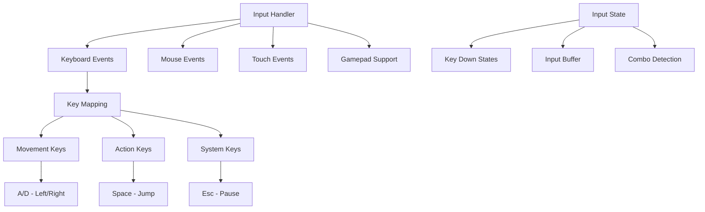

**Input Handler实现：**
```typescript
// hooks/useInputHandler.ts
import { useEffect, useCallback, useRef } from 'react';
import { useAppStore } from '@/lib/store';

interface InputConfig {
  onJump?: () => void;
  onMoveLeft?: () => void;
  onMoveRight?: () => void;
  onPause?: () => void;
  onResume?: () => void;
}

interface InputState {
  left: boolean;
  right: boolean;
  jump: boolean;
  pause: boolean;
}

export function useInputHandler(config: InputConfig = {}) {
  const inputStateRef = useRef<InputState>({
    left: false,
    right: false,
    jump: false,
    pause: false
  });
  
  const { gameState, setGameState, playerVelocity, setPlayerVelocity } = useAppStore();
  
  // Key mappings
  const keyMappings = {
    // Movement
    'KeyA': 'left',
    'ArrowLeft': 'left',
    'KeyD': 'right',
    'ArrowRight': 'right',
    
    // Actions
    'Space': 'jump',
    'ArrowUp': 'jump',
    'KeyW': 'jump',
    
    // System
    'Escape': 'pause',
    'KeyP': 'pause'
  } as const;
  
  const handleKeyDown = useCallback((event: KeyboardEvent) => {
    const action = keyMappings[event.code as keyof typeof keyMappings];
    if (!action) return;
    
    // Prevent default browser behavior
    event.preventDefault();
    
    const inputState = inputStateRef.current;
    
    switch (action) {
      case 'left':
        if (!inputState.left) {
          inputState.left = true;
          config.onMoveLeft?.();
        }
        break;
        
      case 'right':
        if (!inputState.right) {
          inputState.right = true;
          config.onMoveRight?.();
        }
        break;
        
      case 'jump':
        if (!inputState.jump && gameState === 'playing') {
          inputState.jump = true;
          config.onJump?.();
        }
        break;
        
      case 'pause':
        if (!inputState.pause) {
          inputState.pause = true;
          if (gameState === 'playing') {
            setGameState('paused');
            config.onPause?.();
          } else if (gameState === 'paused') {
            setGameState('playing');
            config.onResume?.();
          }
        }
        break;
    }
  }, [config, gameState, setGameState]);
  
  const handleKeyUp = useCallback((event: KeyboardEvent) => {
    const action = keyMappings[event.code as keyof typeof keyMappings];
    if (!action) return;
    
    const inputState = inputStateRef.current;
    
    switch (action) {
      case 'left':
        inputState.left = false;
        break;
      case 'right':
        inputState.right = false;
        break;
      case 'jump':
        inputState.jump = false;
        break;
      case 'pause':
        inputState.pause = false;
        break;
    }
  }, []);
  
  // Mouse/Touch support for mobile
  const handleMouseDown = useCallback((event: MouseEvent) => {
    if (gameState !== 'playing') return;
    
    const rect = (event.target as HTMLElement).getBoundingClientRect();
    const x = event.clientX - rect.left;
    const centerX = rect.width / 2;
    
    if (x < centerX) {
      // Left side - move left
      inputStateRef.current.left = true;
      config.onMoveLeft?.();
    } else {
      // Right side - jump or move right
      config.onJump?.();
    }
  }, [config, gameState]);
  
  const handleMouseUp = useCallback(() => {
    inputStateRef.current.left = false;
    inputStateRef.current.right = false;
  }, []);
  
  // Touch events for mobile
  const handleTouchStart = useCallback((event: TouchEvent) => {
    event.preventDefault();
    
    if (gameState !== 'playing') return;
    
    const touch = event.touches[0];
    const rect = (event.target as HTMLElement).getBoundingClientRect();
    const x = touch.clientX - rect.left;
    const centerX = rect.width / 2;
    
    if (x < centerX) {
      inputStateRef.current.left = true;
      config.onMoveLeft?.();
    } else {
      config.onJump?.();
    }
  }, [config, gameState]);
  
  const handleTouchEnd = useCallback((event: TouchEvent) => {
    event.preventDefault();
    inputStateRef.current.left = false;
    inputStateRef.current.right = false;
  }, []);
  
  // Update player velocity based on input state
  useEffect(() => {
    const updateMovement = () => {
      if (gameState !== 'playing') return;
      
      const inputState = inputStateRef.current;
      let newVelocityX = 0;
      
      if (inputState.left) {
        newVelocityX = -5; // Move left
      } else if (inputState.right) {
        newVelocityX = 5; // Move right
      }
      
      setPlayerVelocity({ x: newVelocityX, y: playerVelocity.y });
    };
    
    const interval = setInterval(updateMovement, 16); // ~60fps
    return () => clearInterval(interval);
  }, [gameState, playerVelocity.y, setPlayerVelocity]);
  
  // Setup event listeners
  useEffect(() => {
    window.addEventListener('keydown', handleKeyDown);
    window.addEventListener('keyup', handleKeyUp);
    
    return () => {
      window.removeEventListener('keydown', handleKeyDown);
      window.removeEventListener('keyup', handleKeyUp);
    };
  }, [handleKeyDown, handleKeyUp]);
  
  // Return current input state for debugging
  return {
    inputState: inputStateRef.current,
    addMouseListeners: (element: HTMLElement) => {
      element.addEventListener('mousedown', handleMouseDown);
      element.addEventListener('mouseup', handleMouseUp);
      element.addEventListener('touchstart', handleTouchStart);
      element.addEventListener('touchend', handleTouchEnd);
      
      return () => {
        element.removeEventListener('mousedown', handleMouseDown);
        element.removeEventListener('mouseup', handleMouseUp);
        element.removeEventListener('touchstart', handleTouchStart);
        element.removeEventListener('touchend', handleTouchEnd);
      };
    }
  };
}
```

### 5.5.3 Physics & Ground —— 重力/地面与边界

**物理系统设计**
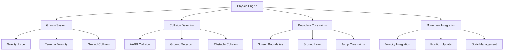

**Physics Engine实现：**
```typescript
// lib/game/physics.ts
export interface PhysicsConfig {
  gravity: number;
  jumpForce: number;
  groundLevel: number;
  boundaries: {
    left: number;
    right: number;
    top: number;
    bottom: number;
  };
  friction?: number;
  airResistance?: number;
}

export interface PhysicsBody {
  position: { x: number; y: number };
  velocity: { x: number; y: number };
  acceleration: { x: number; y: number };
  size: { width: number; height: number };
  onGround: boolean;
  canJump: boolean;
}

export class GamePhysics {
  private config: PhysicsConfig;
  private playerBody: PhysicsBody;
  
  constructor(config: PhysicsConfig) {
    this.config = {
      friction: 0.8,
      airResistance: 0.98,
      ...config
    };
    
    this.playerBody = {
      position: { x: 100, y: config.groundLevel },
      velocity: { x: 0, y: 0 },
      acceleration: { x: 0, y: 0 },
      size: { width: 32, height: 32 },
      onGround: true,
      canJump: true
    };
  }
  
  updatePlayer(currentPosition: { x: number; y: number }, deltaTime: number): { x: number; y: number } {
    // Update player body position
    this.playerBody.position = { ...currentPosition };
    
    // Apply gravity
    if (!this.playerBody.onGround) {
      this.playerBody.acceleration.y = this.config.gravity;
    } else {
      this.playerBody.acceleration.y = 0;
      this.playerBody.velocity.y = 0;
    }
    
    // Update velocity
    this.playerBody.velocity.x += this.playerBody.acceleration.x * deltaTime;
    this.playerBody.velocity.y += this.playerBody.acceleration.y * deltaTime;
    
    // Apply friction and air resistance
    if (this.playerBody.onGround) {
      this.playerBody.velocity.x *= this.config.friction!;
    } else {
      this.playerBody.velocity.x *= this.config.airResistance!;
    }
    
    // Terminal velocity
    const maxVelocity = 20;
    this.playerBody.velocity.y = Math.max(-maxVelocity, Math.min(maxVelocity, this.playerBody.velocity.y));
    this.playerBody.velocity.x = Math.max(-maxVelocity, Math.min(maxVelocity, this.playerBody.velocity.x));
    
    // Update position
    this.playerBody.position.x += this.playerBody.velocity.x * deltaTime;
    this.playerBody.position.y += this.playerBody.velocity.y * deltaTime;
    
    // Ground collision
    this.checkGroundCollision();
    
    // Boundary constraints
    this.applyBoundaryConstraints();
    
    return { ...this.playerBody.position };
  }
  
  private checkGroundCollision() {
    const playerBottom = this.playerBody.position.y;
    
    if (playerBottom >= this.config.groundLevel) {
      this.playerBody.position.y = this.config.groundLevel;
      this.playerBody.velocity.y = 0;
      this.playerBody.onGround = true;
      this.playerBody.canJump = true;
    } else {
      this.playerBody.onGround = false;
    }
  }
  
  private applyBoundaryConstraints() {
    const { boundaries } = this.config;
    const halfWidth = this.playerBody.size.width / 2;
    
    // Horizontal boundaries
    if (this.playerBody.position.x - halfWidth < boundaries.left) {
      this.playerBody.position.x = boundaries.left + halfWidth;
      this.playerBody.velocity.x = 0;
    } else if (this.playerBody.position.x + halfWidth > boundaries.right) {
      this.playerBody.position.x = boundaries.right - halfWidth;
      this.playerBody.velocity.x = 0;
    }
    
    // Vertical boundaries
    if (this.playerBody.position.y < boundaries.top) {
      this.playerBody.position.y = boundaries.top;
      this.playerBody.velocity.y = 0;
    }
  }
  
  jump(): boolean {
    if (this.playerBody.canJump && this.playerBody.onGround) {
      this.playerBody.velocity.y = this.config.jumpForce;
      this.playerBody.onGround = false;
      this.playerBody.canJump = false;
      return true;
    }
    return false;
  }
  
  setHorizontalVelocity(velocity: number) {
    this.playerBody.velocity.x = velocity;
  }
  
  checkCollision(other: { x: number; y: number; width: number; height: number }): boolean {
    const player = {
      x: this.playerBody.position.x - this.playerBody.size.width / 2,
      y: this.playerBody.position.y - this.playerBody.size.height,
      width: this.playerBody.size.width,
      height: this.playerBody.size.height
    };
    
    return this.aabbCollision(player, other);
  }
  
  private aabbCollision(
    a: { x: number; y: number; width: number; height: number },
    b: { x: number; y: number; width: number; height: number }
  ): boolean {
    return (
      a.x < b.x + b.width &&
      a.x + a.width > b.x &&
      a.y < b.y + b.height &&
      a.y + a.height > b.y
    );
  }
  
  getPlayerBody(): PhysicsBody {
    return { ...this.playerBody };
  }
  
  reset() {
    this.playerBody = {
      position: { x: 100, y: this.config.groundLevel },
      velocity: { x: 0, y: 0 },
      acceleration: { x: 0, y: 0 },
      size: { width: 32, height: 32 },
      onGround: true,
      canJump: true
    };
  }
}
```

### 5.5.4 Obstacles —— 智能分布的障碍生成与碰撞占位

**障碍生成系统架构**
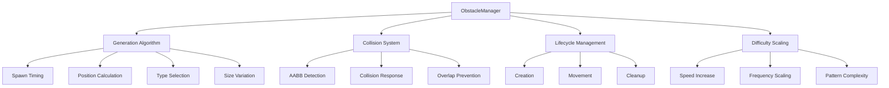

**ObstacleManager实现：**
```typescript
// lib/game/obstacles.ts
export interface Obstacle {
  id: string;
  x: number;
  y: number;
  width: number;
  height: number;
  type: 'ground' | 'air' | 'moving';
  speed: number;
  active: boolean;
  created: number;
}

export interface ObstacleConfig {
  canvasWidth: number;
  canvasHeight: number;
  groundLevel: number;
  speed: number;
  spawnRate?: number;
  minDistance?: number;
  maxDistance?: number;
  difficultyScale?: number;
}

export class ObstacleManager {
  private config: ObstacleConfig;
  private obstacles: Obstacle[] = [];
  private lastSpawnTime = 0;
  private nextSpawnDelay = 0;
  private obstacleCounter = 0;
  private difficultyMultiplier = 1;
  
  constructor(config: ObstacleConfig) {
    this.config = {
      spawnRate: 2000, // ms between spawns
      minDistance: 200,
      maxDistance: 400,
      difficultyScale: 0.02,
      ...config
    };
    
    this.calculateNextSpawn();
  }
  
  update(deltaTime: number) {
    const currentTime = Date.now();
    
    // Update difficulty over time
    this.updateDifficulty(currentTime);
    
    // Spawn new obstacles
    if (currentTime - this.lastSpawnTime > this.nextSpawnDelay) {
      this.spawnObstacle();
      this.lastSpawnTime = currentTime;
      this.calculateNextSpawn();
    }
    
    // Update existing obstacles
    this.obstacles.forEach(obstacle => {
      if (obstacle.active) {
        obstacle.x -= obstacle.speed * deltaTime * 0.016; // Convert to 60fps equivalent
        
        // Deactivate obstacles that are off-screen
        if (obstacle.x + obstacle.width < 0) {
          obstacle.active = false;
        }
      }
    });
    
    // Clean up inactive obstacles
    this.obstacles = this.obstacles.filter(obstacle => obstacle.active);
  }
  
  private updateDifficulty(currentTime: number) {
    const timeElapsed = (currentTime - this.lastSpawnTime) / 1000; // seconds
    this.difficultyMultiplier = 1 + (timeElapsed * this.config.difficultyScale!);
  }
  
  private calculateNextSpawn() {
    const baseDelay = this.config.spawnRate! / this.difficultyMultiplier;
    const variation = baseDelay * 0.3; // ±30% variation
    this.nextSpawnDelay = baseDelay + (Math.random() - 0.5) * variation;
  }
  
  private spawnObstacle() {
    const obstacleTypes = this.getAvailableTypes();
    const type = obstacleTypes[Math.floor(Math.random() * obstacleTypes.length)];
    
    const obstacle = this.createObstacle(type);
    
    // Check for overlaps with existing obstacles
    if (!this.hasOverlap(obstacle)) {
      this.obstacles.push(obstacle);
      this.obstacleCounter++;
    }
  }
  
  private getAvailableTypes(): Obstacle['type'][] {
    const types: Obstacle['type'][] = ['ground'];
    
    // Add air obstacles after some time
    if (this.difficultyMultiplier > 1.5) {
      types.push('air');
    }
    
    // Add moving obstacles at higher difficulty
    if (this.difficultyMultiplier > 2.0) {
      types.push('moving');
    }
    
    return types;
  }
  
  private createObstacle(type: Obstacle['type']): Obstacle {
    const baseSpeed = this.config.speed * this.difficultyMultiplier;
    
    switch (type) {
      case 'ground':
        return {
          id: `obstacle_${this.obstacleCounter}`,
          x: this.config.canvasWidth,
          y: this.config.groundLevel - 40,
          width: 30 + Math.random() * 20, // 30-50px wide
          height: 40 + Math.random() * 20, // 40-60px tall
          type: 'ground',
          speed: baseSpeed,
          active: true,
          created: Date.now()
        };
        
      case 'air':
        return {
          id: `obstacle_${this.obstacleCounter}`,
          x: this.config.canvasWidth,
          y: this.config.groundLevel - 120 - Math.random() * 80, // Floating obstacles
          width: 25 + Math.random() * 15,
          height: 25 + Math.random() * 15,
          type: 'air',
          speed: baseSpeed * 0.8, // Slightly slower
          active: true,
          created: Date.now()
        };
        
      case 'moving':
        return {
          id: `obstacle_${this.obstacleCounter}`,
          x: this.config.canvasWidth,
          y: this.config.groundLevel - 60,
          width: 35,
          height: 35,
          type: 'moving',
          speed: baseSpeed * 1.2, // Faster moving obstacles
          active: true,
          created: Date.now()
        };
        
      default:
        throw new Error(`Unknown obstacle type: ${type}`);
    }
  }
  
  private hasOverlap(newObstacle: Obstacle): boolean {
    const minDistance = this.config.minDistance!;
    
    return this.obstacles.some(existing => {
      if (!existing.active) return false;
      
      const distance = Math.abs(existing.x - newObstacle.x);
      return distance < minDistance;
    });
  }
  
  checkCollisions(playerPosition: { x: number; y: number }): Obstacle | null {
    const playerBounds = {
      x: playerPosition.x - 16, // Half player width
      y: playerPosition.y - 32, // Player height
      width: 32,
      height: 32
    };
    
    for (const obstacle of this.obstacles) {
      if (!obstacle.active) continue;
      
      if (this.aabbCollision(playerBounds, obstacle)) {
        return obstacle;
      }
    }
    
    return null;
  }
  
  private aabbCollision(
    a: { x: number; y: number; width: number; height: number },
    b: { x: number; y: number; width: number; height: number }
  ): boolean {
    return (
      a.x < b.x + b.width &&
      a.x + a.width > b.x &&
      a.y < b.y + b.height &&
      a.y + a.height > b.y
    );
  }
  
  getObstacles(): Obstacle[] {
    return this.obstacles.filter(obstacle => obstacle.active);
  }
  
  reset() {
    this.obstacles = [];
    this.lastSpawnTime = 0;
    this.obstacleCounter = 0;
    this.difficultyMultiplier = 1;
    this.calculateNextSpawn();
  }
  
  getDifficulty(): number {
    return this.difficultyMultiplier;
  }
}
```

### 5.5.5 HUD & Overlays —— 状态显示、暂停/结束遮罩与文案

**HUD系统架构**
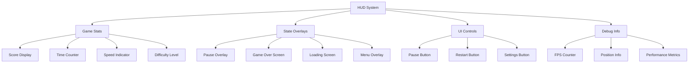

**HUD组件实现：**
```typescript
// components/GameHUD.tsx
import { useAppStore } from '@/lib/store';
import { Button } from 'antd';
import { PauseOutlined, PlayCircleOutlined, ReloadOutlined } from '@ant-design/icons';
import { motion, AnimatePresence } from 'framer-motion';

interface GameHUDProps {
  onPause?: () => void;
  onResume?: () => void;
  onRestart?: () => void;
  onBackToMenu?: () => void;
}

export function GameHUD({ onPause, onResume, onRestart, onBackToMenu }: GameHUDProps) {
  const {
    gameState,
    score,
    gameTime,
    gameSpeed,
    playerPosition,
    obstacles
  } = useAppStore();
  
  return (
    <div className="absolute inset-0 pointer-events-none">
      {/* Top HUD Bar */}
      <div className="absolute top-4 left-4 right-4 flex justify-between items-center pointer-events-auto">
        <div className="flex items-center space-x-4">
          <ScoreDisplay score={score} />
          <TimeDisplay time={gameTime} />
          <SpeedIndicator speed={gameSpeed} />
        </div>
        
        <div className="flex items-center space-x-2">
          {gameState === 'playing' ? (
            <Button
              type="primary"
              icon={<PauseOutlined />}
              onClick={onPause}
              className="bg-black/50 border-white/20 hover:bg-black/70"
            >
              暂停
            </Button>
          ) : gameState === 'paused' ? (
            <Button
              type="primary"
              icon={<PlayCircleOutlined />}
              onClick={onResume}
              className="bg-green-600/80 border-green-400/20 hover:bg-green-600"
            >
              继续
            </Button>
          ) : null}
        </div>
      </div>
      
      {/* Game State Overlays */}
      <AnimatePresence>
        {gameState === 'paused' && (
          <PauseOverlay
            onResume={onResume}
            onRestart={onRestart}
            onBackToMenu={onBackToMenu}
          />
        )}
        
        {gameState === 'gameOver' && (
          <GameOverOverlay
            score={score}
            time={gameTime}
            onRestart={onRestart}
            onBackToMenu={onBackToMenu}
          />
        )}
        
        {gameState === 'loading' && (
          <LoadingOverlay />
        )}
      </AnimatePresence>
      
      {/* Debug Info (Development Only) */}
      {process.env.NODE_ENV === 'development' && (
        <DebugOverlay
          playerPosition={playerPosition}
          obstacleCount={obstacles.length}
          gameState={gameState}
        />
      )}
    </div>
  );
}

// Score Display Component
function ScoreDisplay({ score }: { score: number }) {
  return (
    <motion.div
      className="bg-black/50 backdrop-blur-sm rounded-lg px-4 py-2 border border-white/20"
      initial={{ scale: 0.8, opacity: 0 }}
      animate={{ scale: 1, opacity: 1 }}
      key={score} // Re-animate on score change
    >
      <div className="text-white font-mono">
        <span className="text-gray-400 text-sm">得分</span>
        <div className="text-xl font-bold">{score.toLocaleString()}</div>
      </div>
    </motion.div>
  );
}

// Time Display Component
function TimeDisplay({ time }: { time: number }) {
  const formatTime = (seconds: number) => {
    const mins = Math.floor(seconds / 60);
    const secs = Math.floor(seconds % 60);
    return `${mins.toString().padStart(2, '0')}:${secs.toString().padStart(2, '0')}`;
  };
  
  return (
    <div className="bg-black/50 backdrop-blur-sm rounded-lg px-4 py-2 border border-white/20">
      <div className="text-white font-mono">
        <span className="text-gray-400 text-sm">时间</span>
        <div className="text-xl font-bold">{formatTime(time)}</div>
      </div>
    </div>
  );
}

// Speed Indicator Component
function SpeedIndicator({ speed }: { speed: number }) {
  const speedLevel = Math.floor(speed / 2) + 1;
  
  return (
    <div className="bg-black/50 backdrop-blur-sm rounded-lg px-4 py-2 border border-white/20">
      <div className="text-white font-mono">
        <span className="text-gray-400 text-sm">速度</span>
        <div className="text-xl font-bold flex items-center">
          <span>{speedLevel}</span>
          <div className="ml-2 flex space-x-1">
            {Array.from({ length: 5 }, (_, i) => (
              <div
                key={i}
                className={`w-1 h-4 rounded ${
                  i < speedLevel ? 'bg-green-400' : 'bg-gray-600'
                }`}
              />
            ))}
          </div>
        </div>
      </div>
    </div>
  );
}

// Pause Overlay Component
function PauseOverlay({ onResume, onRestart, onBackToMenu }: {
  onResume?: () => void;
  onRestart?: () => void;
  onBackToMenu?: () => void;
}) {
  return (
    <motion.div
      className="absolute inset-0 bg-black/70 backdrop-blur-sm flex items-center justify-center pointer-events-auto"
      initial={{ opacity: 0 }}
      animate={{ opacity: 1 }}
      exit={{ opacity: 0 }}
    >
      <motion.div
        className="bg-gray-900/90 rounded-2xl p-8 border border-white/20 text-center max-w-md"
        initial={{ scale: 0.8, y: 20 }}
        animate={{ scale: 1, y: 0 }}
        exit={{ scale: 0.8, y: 20 }}
      >
        <h2 className="text-3xl font-bold text-white mb-6">游戏暂停</h2>
        
        <div className="space-y-4">
          <Button
            type="primary"
            size="large"
            icon={<PlayCircleOutlined />}
            onClick={onResume}
            className="w-full bg-green-600 hover:bg-green-700 border-green-500"
          >
            继续游戏
          </Button>
          
          <Button
            size="large"
            icon={<ReloadOutlined />}
            onClick={onRestart}
            className="w-full bg-blue-600 hover:bg-blue-700 border-blue-500 text-white"
          >
            重新开始
          </Button>
          
          <Button
            size="large"
            onClick={onBackToMenu}
            className="w-full bg-gray-600 hover:bg-gray-700 border-gray-500 text-white"
          >
            返回主菜单
          </Button>
        </div>
      </motion.div>
    </motion.div>
  );
}

// Game Over Overlay Component
function GameOverOverlay({ score, time, onRestart, onBackToMenu }: {
  score: number;
  time: number;
  onRestart?: () => void;
  onBackToMenu?: () => void;
}) {
  const formatTime = (seconds: number) => {
    const mins = Math.floor(seconds / 60);
    const secs = Math.floor(seconds % 60);
    return `${mins}分${secs}秒`;
  };
  
  return (
    <motion.div
      className="absolute inset-0 bg-black/80 backdrop-blur-sm flex items-center justify-center pointer-events-auto"
      initial={{ opacity: 0 }}
      animate={{ opacity: 1 }}
      exit={{ opacity: 0 }}
    >
      <motion.div
        className="bg-gray-900/95 rounded-2xl p-8 border border-red-500/30 text-center max-w-md"
        initial={{ scale: 0.8, y: 20 }}
        animate={{ scale: 1, y: 0 }}
        exit={{ scale: 0.8, y: 20 }}
      >
        <h2 className="text-4xl font-bold text-red-400 mb-2">游戏结束</h2>
        <p className="text-gray-400 mb-6">再接再厉！</p>
        
        <div className="bg-black/50 rounded-lg p-4 mb-6 space-y-2">
          <div className="flex justify-between text-white">
            <span>最终得分:</span>
            <span className="font-bold text-yellow-400">{score.toLocaleString()}</span>
          </div>
          <div className="flex justify-between text-white">
            <span>游戏时间:</span>
            <span className="font-bold text-blue-400">{formatTime(time)}</span>
          </div>
        </div>
        
        <div className="space-y-4">
          <Button
            type="primary"
            size="large"
            icon={<ReloadOutlined />}
            onClick={onRestart}
            className="w-full bg-green-600 hover:bg-green-700 border-green-500"
          >
            再玩一次
          </Button>
          
          <Button
            size="large"
            onClick={onBackToMenu}
            className="w-full bg-gray-600 hover:bg-gray-700 border-gray-500 text-white"
          >
            返回主菜单
          </Button>
        </div>
      </motion.div>
    </motion.div>
  );
}

// Loading Overlay Component
function LoadingOverlay() {
  return (
    <motion.div
      className="absolute inset-0 bg-black/90 backdrop-blur-sm flex items-center justify-center pointer-events-auto"
      initial={{ opacity: 0 }}
      animate={{ opacity: 1 }}
      exit={{ opacity: 0 }}
    >
      <div className="text-center">
        <motion.div
          className="w-16 h-16 border-4 border-blue-500/30 border-t-blue-500 rounded-full mx-auto mb-4"
          animate={{ rotate: 360 }}
          transition={{ duration: 1, repeat: Infinity, ease: "linear" }}
        />
        <h3 className="text-xl font-semibold text-white mb-2">加载中...</h3>
        <p className="text-gray-400">正在准备游戏资源</p>
      </div>
    </motion.div>
  );
}

// Debug Overlay Component (Development Only)
function DebugOverlay({ playerPosition, obstacleCount, gameState }: {
  playerPosition: { x: number; y: number };
  obstacleCount: number;
  gameState: string;
}) {
  return (
    <div className="absolute bottom-4 left-4 bg-black/80 rounded-lg p-3 border border-yellow-500/30 font-mono text-xs text-yellow-400">
      <div>Debug Info:</div>
      <div>Player: ({Math.round(playerPosition.x)}, {Math.round(playerPosition.y)})</div>
      <div>Obstacles: {obstacleCount}</div>
      <div>State: {gameState}</div>
      <div>FPS: {Math.round(60)} (estimated)</div>
    </div>
  );
}
```

## 5.6 Data Flow —— 数据与状态流

### 5.6.1 Store Shape —— 全局状态切片与回调

**状态管理架构**
```mermaid
flowchart TD
    A[Zustand Store] --> B[Theme State]
    A --> C[Game State]
    A --> D[UI State]
    A --> E[Asset State]
    
    B --> F[Selected Theme]
    B --> G[Theme List]
    B --> H[Custom Themes]
    
    C --> I[Game Status]
    C --> J[Player Data]
    C --> K[Score & Time]
    C --> L[Physics State]
    
    D --> M[Loading States]
    D --> N[Error Messages]
    D --> O[Modal States]
    
    E --> P[Image Assets]
    E --> Q[Loading Progress]
    E --> R[Cache Status]
    
    S[Actions] --> T[Theme Actions]
    S --> U[Game Actions]
    S --> V[Asset Actions]
    
    T --> W[selectTheme]
    T --> X[updateCustomTheme]
    U --> Y[startGame]
    U --> Z[updatePlayer]
    V --> AA[loadAssets]
    V --> BB[cacheImage]
```

**Zustand Store实现：**
```typescript
// lib/store.ts
import { create } from 'zustand';
import { devtools, persist } from 'zustand/middleware';
import { immer } from 'zustand/middleware/immer';
import { PRESET_THEMES } from '@/configs/themes';
import type { Theme, ThemeImages } from '@/types';

// State interfaces
interface ThemeState {
  themes: Theme[];
  selectedTheme: Theme | null;
  customThemes: Theme[];
  themeImages: ThemeImages;
}

interface GameState {
  gameState: 'idle' | 'loading' | 'playing' | 'paused' | 'gameOver';
  score: number;
  gameTime: number;
  gameSpeed: number;
  playerPosition: { x: number; y: number };
  playerVelocity: { x: number; y: number };
  obstacles: any[];
  difficulty: number;
}

interface UIState {
  isLoading: boolean;
  loadingMessage: string;
  errorMessage: string | null;
  showSettings: boolean;
  showThemeCustomizer: boolean;
}

interface AssetState {
  loadingProgress: number;
  cachedImages: Map<string, HTMLImageElement>;
  failedImages: Set<string>;
}

// Combined store interface
interface AppStore extends ThemeState, GameState, UIState, AssetState {
  // Theme actions
  setThemes: (themes: Theme[]) => void;
  selectTheme: (theme: Theme) => void;
  addCustomTheme: (theme: Theme) => void;
  updateCustomTheme: (id: string, updates: Partial<Theme>) => void;
  deleteCustomTheme: (id: string) => void;
  loadThemeImages: (theme: Theme) => Promise<void>;
  
  // Game actions
  setGameState: (state: GameState['gameState']) => void;
  startGame: () => void;
  pauseGame: () => void;
  resumeGame: () => void;
  endGame: () => void;
  resetGame: () => void;
  updateScore: (score: number) => void;
  updateGameTime: (time: number) => void;
  setPlayerPosition: (position: { x: number; y: number }) => void;
  setPlayerVelocity: (velocity: { x: number; y: number }) => void;
  addObstacle: (obstacle: any) => void;
  updateObstacles: (obstacles: any[]) => void;
  
  // UI actions
  setLoading: (loading: boolean, message?: string) => void;
  setError: (error: string | null) => void;
  toggleSettings: () => void;
  toggleThemeCustomizer: () => void;
  
  // Asset actions
  updateLoadingProgress: (progress: number) => void;
  cacheImage: (key: string, image: HTMLImageElement) => void;
  markImageFailed: (key: string) => void;
  clearCache: () => void;
}

// Create the store
export const useAppStore = create<AppStore>()()
  devtools(
    persist(
      immer((set, get) => ({
        // Initial theme state
        themes: PRESET_THEMES,
        selectedTheme: PRESET_THEMES[0] || null,
        customThemes: [],
        themeImages: {
          character: '',
          background: '',
          ground: '',
          obstacle: ''
        },
        
        // Initial game state
        gameState: 'idle',
        score: 0,
        gameTime: 0,
        gameSpeed: 5,
        playerPosition: { x: 100, y: 500 },
        playerVelocity: { x: 0, y: 0 },
        obstacles: [],
        difficulty: 1,
        
        // Initial UI state
        isLoading: false,
        loadingMessage: '',
        errorMessage: null,
        showSettings: false,
        showThemeCustomizer: false,
        
        // Initial asset state
        loadingProgress: 0,
        cachedImages: new Map(),
        failedImages: new Set(),
        
        // Theme actions
        setThemes: (themes) => set((state) => {
          state.themes = themes;
        }),
        
        selectTheme: (theme) => set((state) => {
          state.selectedTheme = theme;
          // Reset game when theme changes
          if (state.gameState !== 'idle') {
            state.gameState = 'idle';
            state.score = 0;
            state.gameTime = 0;
            state.playerPosition = { x: 100, y: 500 };
            state.playerVelocity = { x: 0, y: 0 };
            state.obstacles = [];
          }
        }),
        
        addCustomTheme: (theme) => set((state) => {
          state.customThemes.push(theme);
        }),
        
        updateCustomTheme: (id, updates) => set((state) => {
          const index = state.customThemes.findIndex(t => t.id === id);
          if (index !== -1) {
            Object.assign(state.customThemes[index], updates);
          }
        }),
        
        deleteCustomTheme: (id) => set((state) => {
          state.customThemes = state.customThemes.filter(t => t.id !== id);
        }),
        
        loadThemeImages: async (theme) => {
          const { setLoading, updateLoadingProgress, cacheImage, markImageFailed } = get();
          
          setLoading(true, '加载主题资源...');
          
          const imageKeys = ['character', 'background', 'ground', 'obstacle'] as const;
          const totalImages = imageKeys.length;
          let loadedCount = 0;
          
          const loadImage = async (key: string, src: string): Promise<HTMLImageElement | null> => {
            try {
              const img = new Image();
              img.crossOrigin = 'anonymous';
              
              return new Promise((resolve, reject) => {
                img.onload = () => {
                  cacheImage(key, img);
                  loadedCount++;
                  updateLoadingProgress((loadedCount / totalImages) * 100);
                  resolve(img);
                };
                
                img.onerror = () => {
                  markImageFailed(key);
                  loadedCount++;
                  updateLoadingProgress((loadedCount / totalImages) * 100);
                  reject(new Error(`Failed to load ${key}`));
                };
                
                img.src = src;
              });
            } catch (error) {
              markImageFailed(key);
              return null;
            }
          };
          
          try {
            const results = await Promise.allSettled([
              loadImage('character', theme.character),
              loadImage('background', theme.background),
              loadImage('ground', theme.ground),
              loadImage('obstacle', theme.obstacle)
            ]);
            
            // Update theme images with loaded or fallback URLs
            set((state) => {
              state.themeImages = {
                character: theme.character,
                background: theme.background,
                ground: theme.ground,
                obstacle: theme.obstacle
              };
            });
            
          } catch (error) {
            console.error('Error loading theme images:', error);
            get().setError('加载主题资源失败，将使用默认资源');
          } finally {
            setLoading(false);
            updateLoadingProgress(0);
          }
        },
        
        // Game actions
        setGameState: (gameState) => set((state) => {
          state.gameState = gameState;
        }),
        
        startGame: () => set((state) => {
          state.gameState = 'playing';
          state.score = 0;
          state.gameTime = 0;
          state.gameSpeed = 5;
          state.playerPosition = { x: 100, y: 500 };
          state.playerVelocity = { x: 0, y: 0 };
          state.obstacles = [];
          state.difficulty = 1;
        }),
        
        pauseGame: () => set((state) => {
          if (state.gameState === 'playing') {
            state.gameState = 'paused';
          }
        }),
        
        resumeGame: () => set((state) => {
          if (state.gameState === 'paused') {
            state.gameState = 'playing';
          }
        }),
        
        endGame: () => set((state) => {
          state.gameState = 'gameOver';
        }),
        
        resetGame: () => set((state) => {
          state.gameState = 'idle';
          state.score = 0;
          state.gameTime = 0;
          state.gameSpeed = 5;
          state.playerPosition = { x: 100, y: 500 };
          state.playerVelocity = { x: 0, y: 0 };
          state.obstacles = [];
          state.difficulty = 1;
        }),
        
        updateScore: (score) => set((state) => {
          state.score = score;
        }),
        
        updateGameTime: (time) => set((state) => {
          state.gameTime = time;
          // Increase speed over time
          state.gameSpeed = 5 + Math.floor(time / 30); // Increase every 30 seconds
          state.difficulty = 1 + (time / 60); // Increase every minute
        }),
        
        setPlayerPosition: (position) => set((state) => {
          state.playerPosition = position;
        }),
        
        setPlayerVelocity: (velocity) => set((state) => {
          state.playerVelocity = velocity;
        }),
        
        addObstacle: (obstacle) => set((state) => {
          state.obstacles.push(obstacle);
        }),
        
        updateObstacles: (obstacles) => set((state) => {
          state.obstacles = obstacles;
        }),
        
        // UI actions
        setLoading: (loading, message = '') => set((state) => {
          state.isLoading = loading;
          state.loadingMessage = message;
        }),
        
        setError: (error) => set((state) => {
          state.errorMessage = error;
        }),
        
        toggleSettings: () => set((state) => {
          state.showSettings = !state.showSettings;
        }),
        
        toggleThemeCustomizer: () => set((state) => {
          state.showThemeCustomizer = !state.showThemeCustomizer;
        }),
        
        // Asset actions
        updateLoadingProgress: (progress) => set((state) => {
          state.loadingProgress = progress;
        }),
        
        cacheImage: (key, image) => set((state) => {
          state.cachedImages.set(key, image);
        }),
        
        markImageFailed: (key) => set((state) => {
          state.failedImages.add(key);
        }),
        
        clearCache: () => set((state) => {
          state.cachedImages.clear();
          state.failedImages.clear();
        })
      })),
      {
        name: 'pixel-seed-store',
        partialize: (state) => ({
          // Only persist certain parts of the state
          themes: state.themes,
          customThemes: state.customThemes,
          selectedTheme: state.selectedTheme
        })
      }
    ),
    {
      name: 'pixel-seed-store'
    }
  )
);

// Selectors for optimized re-renders
export const useThemeState = () => useAppStore((state) => ({
  themes: state.themes,
  selectedTheme: state.selectedTheme,
  customThemes: state.customThemes,
  themeImages: state.themeImages
}));

export const useGameState = () => useAppStore((state) => ({
  gameState: state.gameState,
  score: state.score,
  gameTime: state.gameTime,
  gameSpeed: state.gameSpeed,
  playerPosition: state.playerPosition,
  playerVelocity: state.playerVelocity,
  obstacles: state.obstacles,
  difficulty: state.difficulty
}));

export const useUIState = () => useAppStore((state) => ({
  isLoading: state.isLoading,
  loadingMessage: state.loadingMessage,
  errorMessage: state.errorMessage,
  showSettings: state.showSettings,
  showThemeCustomizer: state.showThemeCustomizer
}));
```

### 5.6.2 Image Slots —— 角色/背景/地面/障碍的资源流与兜底

**资源管理流程**
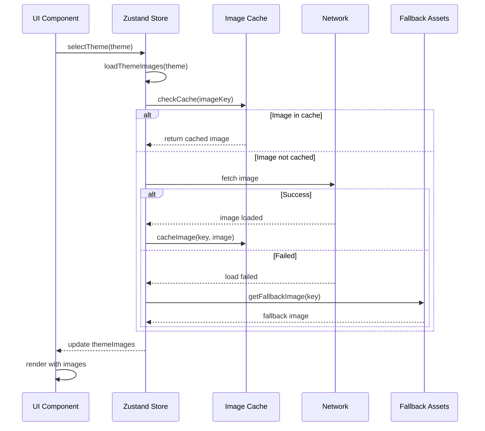

### 5.6.3 Loading & Errors —— 进度、消息与失败处理

**错误处理策略**
```mermaid
flowchart TD
    A[Image Load Request] --> B{Network Available?}
    B -->|No| C[Show Offline Message]
    B -->|Yes| D[Attempt Load]
    
    D --> E{Load Success?}
    E -->|Yes| F[Cache Image]
    E -->|No| G[Retry Logic]
    
    G --> H{Retry Count < 3?}
    H -->|Yes| I[Wait & Retry]
    H -->|No| J[Use Fallback]
    
    I --> D
    J --> K[Show Warning]
    F --> L[Update UI]
    K --> L
    C --> L
    
    L --> M[Continue Game]
```

## 5.7 Build & Deployment —— 构建与部署

### 5.7.1 next.config / tsconfig —— 构建与类型配置

**Next.js配置：**
```javascript
// next.config.js
/** @type {import('next').NextConfig} */
const nextConfig = {
  // 启用实验性功能
  experimental: {
    appDir: true,
    serverComponentsExternalPackages: []
  },
  
  // 图片优化配置
  images: {
    domains: [
      'localhost',
      'pixel-seed.vercel.app',
      'cdn.pixelseed.com'
    ],
    formats: ['image/webp', 'image/avif'],
    deviceSizes: [640, 750, 828, 1080, 1200, 1920, 2048, 3840],
    imageSizes: [16, 32, 48, 64, 96, 128, 256, 384]
  },
  
  // 性能优化
  compiler: {
    removeConsole: process.env.NODE_ENV === 'production'
  },
  
  // 输出配置
  output: 'standalone',
  
  // 环境变量
  env: {
    CUSTOM_KEY: process.env.CUSTOM_KEY
  },
  
  // 重定向规则
  async redirects() {
    return [
      {
        source: '/home',
        destination: '/',
        permanent: true
      }
    ];
  },
  
  // 头部配置
  async headers() {
    return [
      {
        source: '/(.*)',
        headers: [
          {
            key: 'X-Frame-Options',
            value: 'DENY'
          },
          {
            key: 'X-Content-Type-Options',
            value: 'nosniff'
          },
          {
            key: 'Referrer-Policy',
            value: 'origin-when-cross-origin'
          }
        ]
      }
    ];
  },
  
  // Webpack配置
  webpack: (config, { buildId, dev, isServer, defaultLoaders, webpack }) => {
    // 自定义webpack配置
    config.module.rules.push({
      test: /\.(glsl|vs|fs|vert|frag)$/,
      use: ['raw-loader']
    });
    
    return config;
  }
};

module.exports = nextConfig;
```

**TypeScript配置：**
```json
{
  "compilerOptions": {
    "target": "es5",
    "lib": ["dom", "dom.iterable", "es6"],
    "allowJs": true,
    "skipLibCheck": true,
    "strict": true,
    "noEmit": true,
    "esModuleInterop": true,
    "module": "esnext",
    "moduleResolution": "bundler",
    "resolveJsonModule": true,
    "isolatedModules": true,
    "jsx": "preserve",
    "incremental": true,
    "plugins": [
      {
        "name": "next"
      }
    ],
    "baseUrl": ".",
    "paths": {
      "@/*": ["./*"],
      "@/components/*": ["./components/*"],
      "@/lib/*": ["./lib/*"],
      "@/types/*": ["./types/*"],
      "@/configs/*": ["./configs/*"],
      "@/hooks/*": ["./hooks/*"]
    },
    "forceConsistentCasingInFileNames": true,
    "noUncheckedIndexedAccess": true,
    "noImplicitReturns": true,
    "noFallthroughCasesInSwitch": true
  },
  "include": [
    "next-env.d.ts",
    "**/*.ts",
    "**/*.tsx",
    ".next/types/**/*.ts"
  ],
  "exclude": [
    "node_modules"
  ]
}
```

### 5.7.2 Vercel / CDN —— 托管与静态资源策略

**Vercel部署配置：**
```json
{
  "version": 2,
  "name": "pixel-seed",
  "builds": [
    {
      "src": "package.json",
      "use": "@vercel/next"
    }
  ],
  "routes": [
    {
      "src": "/api/(.*)",
      "dest": "/api/$1"
    },
    {
      "src": "/(.*)",
      "dest": "/$1"
    }
  ],
  "env": {
    "NODE_ENV": "production"
  },
  "functions": {
    "app/api/**/*.ts": {
      "maxDuration": 30
    }
  },
  "headers": [
    {
      "source": "/api/(.*)",
      "headers": [
        {
          "key": "Access-Control-Allow-Origin",
          "value": "*"
        },
        {
          "key": "Access-Control-Allow-Methods",
          "value": "GET, POST, PUT, DELETE, OPTIONS"
        },
        {
          "key": "Access-Control-Allow-Headers",
          "value": "Content-Type, Authorization"
        }
      ]
    },
    {
      "source": "/(.*\\.(js|css|png|jpg|jpeg|gif|svg|woff|woff2))",
      "headers": [
        {
          "key": "Cache-Control",
          "value": "public, max-age=31536000, immutable"
        }
      ]
    }
  ]
}
```

### 5.7.3 性能与可观测性 —— 体积、LCP/CLS 指标与日志

**性能监控配置**
```mermaid
flowchart TD
    A[Performance Monitoring] --> B[Core Web Vitals]
    A --> C[Bundle Analysis]
    A --> D[Runtime Metrics]
    A --> E[Error Tracking]
    
    B --> F[LCP - Largest Contentful Paint]
    B --> G[FID - First Input Delay]
    B --> H[CLS - Cumulative Layout Shift]
    B --> I[FCP - First Contentful Paint]
    
    C --> J[Bundle Size]
    C --> K[Code Splitting]
    C --> L[Tree Shaking]
    
    D --> M[Memory Usage]
    D --> N[CPU Usage]
    D --> O[Network Requests]
    
    E --> P[JavaScript Errors]
    E --> Q[Network Errors]
    E --> R[User Actions]
```

**性能优化实现：**
```typescript
// lib/performance.ts
export class PerformanceMonitor {
  private metrics: Map<string, number> = new Map();
  private observer: PerformanceObserver | null = null;
  
  constructor() {
    this.initializeObserver();
    this.trackWebVitals();
  }
  
  private initializeObserver() {
    if (typeof window === 'undefined') return;
    
    try {
      this.observer = new PerformanceObserver((list) => {
        for (const entry of list.getEntries()) {
          this.handlePerformanceEntry(entry);
        }
      });
      
      this.observer.observe({ entryTypes: ['measure', 'navigation', 'paint'] });
    } catch (error) {
      console.warn('Performance Observer not supported:', error);
    }
  }
  
  private handlePerformanceEntry(entry: PerformanceEntry) {
    switch (entry.entryType) {
      case 'paint':
        if (entry.name === 'first-contentful-paint') {
          this.metrics.set('FCP', entry.startTime);
        }
        break;
      case 'largest-contentful-paint':
        this.metrics.set('LCP', entry.startTime);
        break;
      case 'layout-shift':
        const cls = this.metrics.get('CLS') || 0;
        this.metrics.set('CLS', cls + (entry as any).value);
        break;
    }
  }
  
  private trackWebVitals() {
    // Track Core Web Vitals
    import('web-vitals').then(({ getCLS, getFID, getFCP, getLCP, getTTFB }) => {
      getCLS((metric) => {
        this.metrics.set('CLS', metric.value);
        this.reportMetric('CLS', metric.value);
      });
      
      getFID((metric) => {
        this.metrics.set('FID', metric.value);
        this.reportMetric('FID', metric.value);
      });
      
      getFCP((metric) => {
        this.metrics.set('FCP', metric.value);
        this.reportMetric('FCP', metric.value);
      });
      
      getLCP((metric) => {
        this.metrics.set('LCP', metric.value);
        this.reportMetric('LCP', metric.value);
      });
      
      getTTFB((metric) => {
        this.metrics.set('TTFB', metric.value);
        this.reportMetric('TTFB', metric.value);
      });
    });
  }
  
  private reportMetric(name: string, value: number) {
    // Report to analytics service
    if (process.env.NODE_ENV === 'production') {
      // Send to your analytics service
      console.log(`Performance Metric - ${name}: ${value}`);
    }
  }
  
  public getMetrics() {
    return Object.fromEntries(this.metrics);
  }
  
  public measureGamePerformance() {
    const startTime = performance.now();
    
    return {
      end: () => {
        const duration = performance.now() - startTime;
        this.metrics.set('GameFrameTime', duration);
        return duration;
      }
    };
  }
}

// Initialize performance monitoring
export const performanceMonitor = new PerformanceMonitor();
```

---

*本节详细介绍了Pixel Seed的完整实现，包括项目结构、技术栈、UI组件、游戏系统、数据流管理和构建部署配置。实现部分展示了从前端架构到游戏引擎的完整技术方案。*