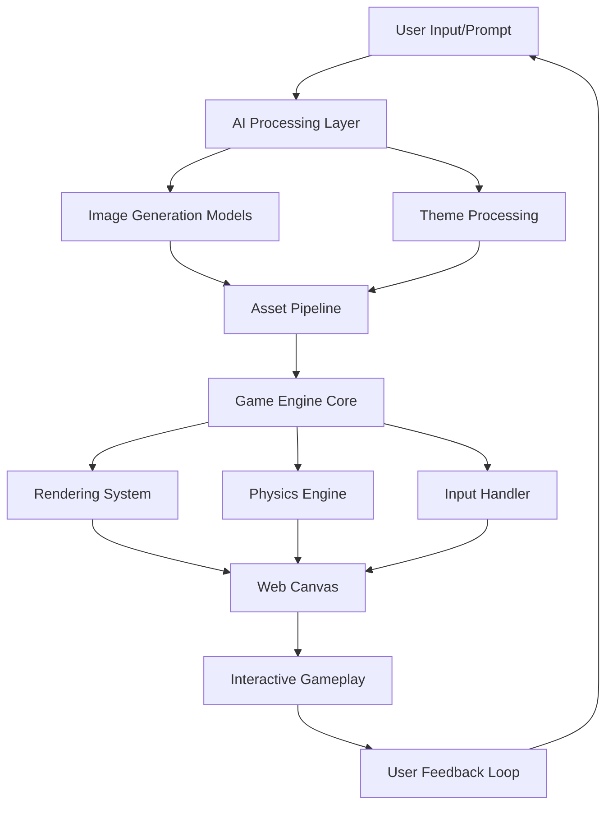
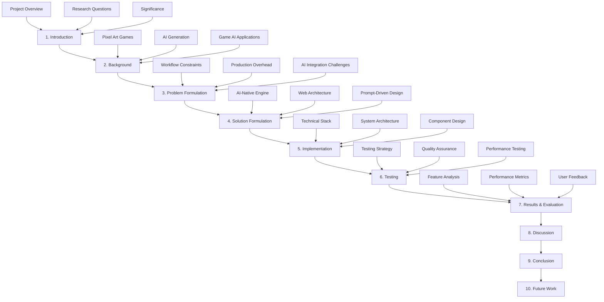

# 1. Introduction 引言

## 1.1 Summary —— 项目概述

### Project Background

Pixel Seed is an innovative web-based AI-native game engine designed to revolutionize the creation and experience of pixel art platformer games. In an era where artificial intelligence is transforming creative industries, game development remains largely constrained by traditional engine-centric workflows that separate content creation from gameplay mechanics.

### Core Innovation

The project introduces a paradigm shift from conventional game development approaches by:

- **Integrating AI as a first-class citizen** in the game engine architecture
- **Eliminating the traditional asset pipeline** through real-time AI generation
- **Enabling prompt-driven world creation** that democratizes game development
- **Providing instant playability** of AI-generated content

### System Overview

### Technical Foundation

Pixel Seed is built on modern web technologies including:
- **Frontend**: Next.js 15, TypeScript, Tailwind CSS
- **State Management**: Zustand for lightweight state handling
- **AI Integration**: OpenAI API and compatible image generation models
- **Rendering**: HTML5 Canvas with optimized pixel art rendering
- **Architecture**: Component-based modular design

## 1.2 Outline —— 研究提纲

### Research Questions

1. **Feasibility**: Can AI-generated content maintain the aesthetic and functional requirements of pixel art games?
2. **Performance**: How does web-based AI integration affect real-time gameplay performance?
3. **User Experience**: What are the usability implications of prompt-driven game creation?
4. **Scalability**: How can AI-native game engines scale compared to traditional approaches?
5. **Innovation**: What new gameplay possibilities emerge from real-time AI content generation?

### Research Methodology

### Investigation Scope

#### Technical Scope
- AI model integration and optimization
- Web-based game engine architecture
- Real-time asset generation and caching
- Cross-platform compatibility and performance

#### User Experience Scope
- Prompt design and natural language processing
- Visual consistency and aesthetic quality
- Gameplay mechanics and interaction design
- Accessibility and usability considerations

#### Evaluation Scope
- Functional testing and quality assurance
- Performance benchmarking and optimization
- User feedback collection and analysis
- Comparative analysis with existing solutions

## 1.3 Significance —— 研究意义

### Academic Significance

#### Theoretical Contributions
1. **AI-Native Architecture Theory**: Establishes design principles for AI-first game engines
2. **Prompt-Driven Development Paradigm**: Introduces natural language as a primary development interface
3. **Real-Time Content Generation**: Advances understanding of AI integration in interactive systems
4. **Web-Based Game Engine Design**: Contributes to modern web gaming architecture patterns

#### Research Impact
- **Cross-Disciplinary Innovation**: Bridges AI research, game development, and web technologies
- **Methodological Advancement**: Provides frameworks for evaluating AI-assisted creative tools
- **Future Research Foundation**: Establishes baseline for next-generation game development tools

### Practical Significance

#### Industry Applications
1. **Democratized Game Development**: Lowers barriers to entry for indie developers and creators
2. **Rapid Prototyping**: Enables faster iteration cycles in game design and development
3. **Personalized Gaming**: Opens possibilities for player-specific content generation
4. **Educational Tools**: Provides platforms for teaching AI integration and game development

#### Economic Impact
- **Reduced Development Costs**: Minimizes traditional asset creation overhead
- **Faster Time-to-Market**: Accelerates game development and deployment cycles
- **New Business Models**: Enables AI-as-a-Service approaches in gaming
- **Market Accessibility**: Expands gaming to new demographics through simplified creation tools

### Social and Cultural Significance

#### Creative Empowerment
- **Artistic Accessibility**: Makes pixel art creation accessible to non-artists
- **Cultural Expression**: Enables diverse cultural themes and representations
- **Community Building**: Fosters collaborative creation and sharing

#### Educational Value
- **STEM Education**: Demonstrates practical AI applications in creative contexts
- **Digital Literacy**: Promotes understanding of AI capabilities and limitations
- **Creative Problem Solving**: Encourages innovative approaches to content creation

## 1.4 Structure —— 论文结构

### Document Organization

This research paper is structured to provide a comprehensive analysis of the Pixel Seed project, from theoretical foundations to practical implementation and evaluation.

### Chapter Descriptions

#### Theoretical Foundation (Chapters 1-4)
- **Chapter 1**: Establishes research context and objectives
- **Chapter 2**: Reviews relevant literature and existing approaches
- **Chapter 3**: Identifies specific problems and limitations
- **Chapter 4**: Proposes innovative solutions and approaches

#### Implementation and Validation (Chapters 5-7)
- **Chapter 5**: Details technical implementation and architecture
- **Chapter 6**: Describes comprehensive testing methodologies
- **Chapter 7**: Presents results and performance evaluation

#### Analysis and Conclusions (Chapters 8-10)
- **Chapter 8**: Discusses findings and implications
- **Chapter 9**: Summarizes contributions and conclusions
- **Chapter 10**: Outlines future research directions

### Reading Guide

#### For Technical Readers
- Focus on Chapters 5-6 for implementation details
- Review Chapter 7 for performance analysis
- Examine Appendix for code examples and technical specifications

#### For Research Community
- Emphasize Chapters 2-4 for theoretical contributions
- Study Chapter 8 for research implications
- Consider Chapter 10 for future research opportunities

#### For Industry Practitioners
- Prioritize Chapters 4-5 for practical applications
- Review Chapter 7 for real-world performance insights
- Consult deployment guides for implementation strategies

---

*This introduction establishes the foundation for understanding Pixel Seed's innovative approach to AI-native game development. The following chapters will delve deeper into the technical, theoretical, and practical aspects of this research.*