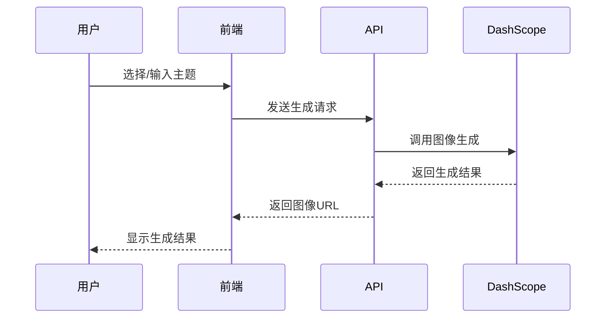
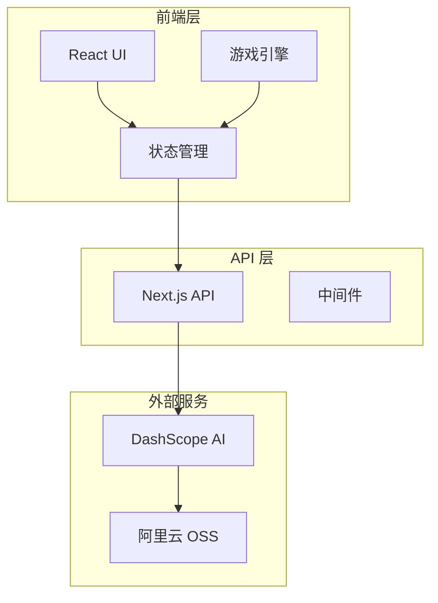

# 产品需求文档 (PRD)

## 📋 项目概述

### 项目名称
**Pixel Seed** - AI 驱动的像素风游戏生成器

### 项目愿景
> **"A Seed, A World."**  
> 通过 AI 技术，让每个人都能轻松创造属于自己的像素游戏世界。

### 核心价值主张
- **AI 驱动创作**：使用先进的 AI 技术自动生成游戏内容
- **即时游戏化**：生成的内容可立即转化为可玩的游戏体验
- **无限创意**：每次生成都是独特的，提供无限的创作可能性
- **零门槛创作**：无需编程或美术技能，人人都能创作游戏

## 🎯 产品定位

### 目标用户

#### 主要用户群体
1. **游戏爱好者** (40%)
   - 年龄：18-35 岁
   - 特征：喜欢独立游戏、像素艺术、创意内容
   - 需求：寻找新颖有趣的游戏体验

2. **创意工作者** (30%)
   - 年龄：20-40 岁
   - 特征：设计师、艺术家、内容创作者
   - 需求：快速原型制作、创意灵感、作品展示

3. **教育工作者** (20%)
   - 年龄：25-50 岁
   - 特征：教师、培训师、教育技术爱好者
   - 需求：教学工具、学生互动、技术展示

4. **技术爱好者** (10%)
   - 年龄：20-45 岁
   - 特征：开发者、AI 爱好者、早期采用者
   - 需求：体验新技术、学习 AI 应用、技术探索

### 市场定位
- **细分市场**：AI 生成内容 × 休闲游戏 × 创意工具
- **竞争优势**：首个将 AI 生成与即时游戏化结合的产品
- **差异化**：主题驱动的完整游戏世界生成，而非单一素材生成

## 🚀 核心功能

### 1. 主题选择系统

#### 1.1 预设主题
**功能描述**：提供精心设计的预设主题供用户快速开始

**预设主题列表**：
- 🏰 **史诗魔幻 (Epic Fantasy)**
  - 元素：魔法、龙、城堡、森林、法师
  - 色调：神秘紫色、金色、深绿色
  - 氛围：史诗、冒险、神秘

- 🌃 **赛博朋克 (Cyberpunk)**
  - 元素：霓虹灯、机械、未来城市、黑客
  - 色调：霓虹蓝、粉红、暗色调
  - 氛围：未来、科技、反叛

- 🤠 **西部世界 (Western World)**
  - 元素：牛仔、酒馆、沙漠、边疆小镇
  - 色调：土黄、棕色、橙红色
  - 氛围：粗犷、自由、冒险

- 🐠 **海底世界 (Underwater World)**
  - 元素：珊瑚礁、深海生物、古代文明
  - 色调：深蓝、青绿、珍珠白
  - 氛围：神秘、宁静、探索

**技术实现**：
```typescript
interface PresetTheme {
  id: string;
  name: string;
  description: string;
  elements: string[];
  colorPalette: string[];
  atmosphere: string[];
  prompt: string;
}
```

#### 1.2 自定义主题
**功能描述**：允许用户输入自定义主题描述创建独特世界

**输入规范**：
- 字符限制：10-200 字符
- 支持中英文输入
- 实时字符计数显示
- 智能提示和建议

**优化功能**：
- 提示词优化建议
- 关键词提取和高亮
- 风格一致性检查
- 历史主题记录

### 2. AI 图像生成系统

#### 2.1 生成规格
**技术规格**：
- **AI 模型**：阿里云 DashScope Qwen-Image
- **图像风格**：像素艺术，参考《死亡细胞》调色板
- **生成质量**：高质量，适合游戏使用

**图像类型和规格**：

| 类型 | 尺寸 | 用途 | 特殊要求 |
|------|------|------|----------|
| 角色 (Character) | 1328×1328px | 玩家控制的游戏角色 | 透明背景，支持动画 |
| 背景 (Background) | 1664×928px | 游戏场景背景 | 横向构图，层次丰富 |
| 地面 (Ground) | 自适应 | 可行走的地面纹理 | 可平铺，与主题一致 |
| 障碍物 (Obstacle) | 自适应 | 环境装饰和障碍 | 多样化，增加丰富度 |

#### 2.2 生成流程


#### 2.3 提示词工程
**提示词构建策略**：
```typescript
const buildPrompt = (theme: string, type: ImageType) => {
  const basePrompt = theme;
  const typeSpecific = TYPE_PROMPTS[type];
  const styleGuide = 'pixel art style, Dead Cells inspired color palette';
  const qualityModifiers = 'high quality, detailed, game ready';
  
  return `${basePrompt}, ${typeSpecific}, ${styleGuide}, ${qualityModifiers}`;
};
```

### 3. 游戏引擎系统

#### 3.1 渲染架构
**混合渲染方案**：
- **背景层**：CSS 背景图片，支持视差滚动
- **游戏层**：HTML 元素绝对定位，硬件加速
- **UI 层**：React 组件覆盖层

**性能优化**：
- 60fps 游戏循环
- GPU 加速变换
- 智能渲染裁剪
- 资源预加载

#### 3.2 物理系统
**核心物理特性**：
```typescript
interface PhysicsConfig {
  gravity: 980;           // 像素/秒²
  friction: 0.8;          // 地面摩擦系数
  jumpForce: 400;         // 跳跃力度
  maxVelocity: 300;       // 最大移动速度
  airResistance: 0.95;    // 空气阻力
}
```

**碰撞检测**：
- AABB (轴对齐包围盒) 碰撞检测
- 地面检测和着陆
- 边界限制
- 障碍物交互

#### 3.3 输入系统
**支持的输入方式**：
- **键盘**：WASD / 方向键 / 空格键
- **手柄**：Xbox / PlayStation 控制器
- **触屏**：虚拟按键（移动端）

**输入映射**：
```typescript
interface InputMapping {
  left: ['KeyA', 'ArrowLeft', 'GamepadLeft'];
  right: ['KeyD', 'ArrowRight', 'GamepadRight'];
  jump: ['KeyW', 'ArrowUp', 'Space', 'GamepadA'];
  crouch: ['KeyS', 'ArrowDown', 'GamepadB'];
}
```

### 4. 用户界面系统

#### 4.1 主界面设计
**设计原则**：
- 简洁直观的用户体验
- 响应式设计，支持多设备
- 现代化的视觉风格
- 无障碍访问支持

**界面布局**：
```
┌─────────────────────────────────────┐
│              Header                 │
├─────────────────────────────────────┤
│  Theme Selection  │   Preview       │
│                   │   Area          │
├─────────────────────────────────────┤
│         Generation Controls         │
├─────────────────────────────────────┤
│              Footer                 │
└─────────────────────────────────────┘
```

#### 4.2 交互流程
**用户操作流程**：
1. **主题选择** → 2. **内容生成** → 3. **预览调整** → 4. **开始游戏**

**状态管理**：
```typescript
interface AppState {
  currentStep: 'theme' | 'generating' | 'preview' | 'playing';
  selectedTheme: Theme | null;
  generatedAssets: GameAssets | null;
  gameState: GameState;
}
```

#### 4.3 响应式设计
**断点设计**：
- **桌面端**：≥ 1024px - 完整功能体验
- **平板端**：768px - 1023px - 优化布局
- **移动端**：< 768px - 简化界面，触屏优化

## 🛠️ 技术架构

### 技术栈选择

#### 前端技术栈
```json
{
  "framework": "Next.js 15.5.2",
  "styling": "Tailwind CSS 4.0",
  "stateManagement": "Zustand 5.0.8",
  "uiComponents": "Ant Design 5.27.1",
  "animation": "Framer Motion 12.23.12",
  "typeScript": "5.x"
}
```

#### 后端服务
```json
{
  "runtime": "Next.js API Routes",
  "aiService": "阿里云 DashScope",
  "imageStorage": "阿里云 OSS",
  "database": "本地存储 (localStorage + IndexedDB)"
}
```

### 系统架构图


### 数据流设计
```typescript
// 数据流架构
interface DataFlow {
  // 用户输入 → 状态更新
  userInput: (action: UserAction) => void;
  
  // 状态变化 → UI 更新
  stateChange: (newState: AppState) => void;
  
  // API 调用 → 异步状态更新
  apiCall: (request: APIRequest) => Promise<APIResponse>;
  
  // 游戏循环 → 实时状态更新
  gameLoop: (deltaTime: number) => void;
}
```

## 📊 产品指标

### 核心指标 (North Star Metrics)

#### 用户参与度
- **DAU (日活跃用户)**：目标 1000+ (3个月内)
- **生成次数**：平均每用户每日 3+ 次生成
- **游戏时长**：平均每次游戏 5+ 分钟
- **主题创建**：30% 用户创建自定义主题

#### 技术性能
- **生成成功率**：≥ 95%
- **平均生成时间**：≤ 30 秒
- **页面加载时间**：≤ 3 秒
- **游戏帧率**：稳定 60fps

#### 用户体验
- **用户满意度**：≥ 4.5/5.0
- **功能完成率**：≥ 90%
- **错误率**：≤ 2%
- **用户留存率**：7日留存 ≥ 40%

### 业务指标

#### 增长指标
- **新用户获取**：每周 100+ 新用户
- **病毒系数**：K值 ≥ 0.3
- **推荐率**：NPS ≥ 50
- **社交分享**：20% 用户分享作品

#### 成本指标
- **AI 生成成本**：≤ $0.05 每次生成
- **服务器成本**：≤ $0.01 每用户每月
- **获客成本**：≤ $2 每新用户

## 🎨 设计规范

### 视觉设计

#### 色彩系统
```css
:root {
  /* 主色调 */
  --primary-50: #f0f9ff;
  --primary-500: #3b82f6;
  --primary-900: #1e3a8a;
  
  /* 辅助色 */
  --secondary-500: #8b5cf6;
  --accent-500: #f59e0b;
  
  /* 中性色 */
  --gray-50: #f9fafb;
  --gray-500: #6b7280;
  --gray-900: #111827;
  
  /* 语义色 */
  --success: #10b981;
  --warning: #f59e0b;
  --error: #ef4444;
}
```

#### 字体系统
```css
.font-system {
  /* 标题字体 */
  font-family: 'Inter', -apple-system, BlinkMacSystemFont, sans-serif;
  
  /* 代码字体 */
  font-family: 'JetBrains Mono', 'Fira Code', monospace;
  
  /* 字体大小 */
  --text-xs: 0.75rem;    /* 12px */
  --text-sm: 0.875rem;   /* 14px */
  --text-base: 1rem;     /* 16px */
  --text-lg: 1.125rem;   /* 18px */
  --text-xl: 1.25rem;    /* 20px */
  --text-2xl: 1.5rem;    /* 24px */
  --text-3xl: 1.875rem;  /* 30px */
  --text-4xl: 2.25rem;   /* 36px */
}
```

#### 间距系统
```css
.spacing-system {
  --space-1: 0.25rem;   /* 4px */
  --space-2: 0.5rem;    /* 8px */
  --space-3: 0.75rem;   /* 12px */
  --space-4: 1rem;      /* 16px */
  --space-6: 1.5rem;    /* 24px */
  --space-8: 2rem;      /* 32px */
  --space-12: 3rem;     /* 48px */
  --space-16: 4rem;     /* 64px */
}
```

### 交互设计

#### 动画规范
```css
.animation-system {
  /* 缓动函数 */
  --ease-in: cubic-bezier(0.4, 0, 1, 1);
  --ease-out: cubic-bezier(0, 0, 0.2, 1);
  --ease-in-out: cubic-bezier(0.4, 0, 0.2, 1);
  
  /* 动画时长 */
  --duration-fast: 150ms;
  --duration-normal: 300ms;
  --duration-slow: 500ms;
}
```

#### 微交互
- **按钮悬停**：颜色渐变 + 轻微缩放
- **加载状态**：骨架屏 + 进度指示
- **状态反馈**：成功/错误提示动画
- **页面转场**：淡入淡出 + 滑动效果

## 🚦 开发路线图

### Phase 1: MVP (最小可行产品) - 4 周

#### Week 1-2: 核心功能开发
- [x] 项目初始化和基础架构
- [x] 主题选择系统（预设主题）
- [x] AI 图像生成集成
- [x] 基础 UI 界面

#### Week 3-4: 游戏引擎和优化
- [x] 游戏渲染引擎
- [x] 物理系统和碰撞检测
- [x] 输入控制系统
- [x] 性能优化和测试

### Phase 2: 功能增强 - 6 周

#### Week 5-6: 用户体验优化
- [ ] 自定义主题功能
- [ ] 图像重新生成功能
- [ ] 响应式设计优化
- [ ] 错误处理和用户反馈

#### Week 7-8: 高级功能
- [ ] 主题管理系统
- [ ] 游戏数据持久化
- [ ] 性能监控和分析
- [ ] 多语言支持

#### Week 9-10: 扩展功能
- [ ] 社交分享功能
- [ ] 主题市场
- [ ] 高级游戏机制
- [ ] 音效系统

### Phase 3: 生态建设 - 8 周

#### Week 11-14: 开发者工具
- [ ] API 文档和 SDK
- [ ] 插件系统
- [ ] 主题编辑器
- [ ] 开发者社区

#### Week 15-18: 商业化准备
- [ ] 用户分析系统
- [ ] A/B 测试框架
- [ ] 付费功能设计
- [ ] 企业版功能

## 🔍 竞品分析

### 直接竞品

#### 1. AI Dungeon
**优势**：
- 成熟的 AI 文本生成
- 大量用户基础
- 丰富的故事内容

**劣势**：
- 纯文本体验，缺乏视觉元素
- 没有游戏化的交互
- 生成内容质量不稳定

**差异化**：我们提供视觉化的游戏体验，而非纯文本

#### 2. Artbreeder
**优势**：
- 强大的图像生成能力
- 用户可以精细控制生成参数
- 活跃的创作者社区

**劣势**：
- 专注于静态图像，没有游戏化
- 学习曲线较陡峭
- 缺乏主题化的完整体验

**差异化**：我们提供主题驱动的完整游戏世界生成

### 间接竞品

#### 1. Mario Maker 系列
**优势**：
- 成熟的关卡编辑器
- 强大的社区分享功能
- 高质量的游戏体验

**劣势**：
- 需要手动创建内容
- 学习成本较高
- 限制在特定游戏风格

**差异化**：我们使用 AI 自动生成，降低创作门槛

#### 2. Dreams (PlayStation)
**优势**：
- 极其强大的创作工具
- 专业级的内容创作能力
- 3D 游戏支持

**劣势**：
- 学习曲线极其陡峭
- 平台限制（仅 PlayStation）
- 创作时间成本很高

**差异化**：我们提供即时的、零门槛的创作体验

### 竞争优势总结

| 维度 | Pixel Seed | 竞品平均水平 | 优势程度 |
|------|------------|--------------|----------|
| 创作门槛 | 极低 | 中-高 | ⭐⭐⭐⭐⭐ |
| 生成速度 | 30秒 | 5-30分钟 | ⭐⭐⭐⭐⭐ |
| 视觉质量 | 高 | 中 | ⭐⭐⭐⭐ |
| 游戏化程度 | 高 | 低-中 | ⭐⭐⭐⭐⭐ |
| 主题一致性 | 高 | 低 | ⭐⭐⭐⭐⭐ |
| 平台兼容性 | 全平台 | 部分平台 | ⭐⭐⭐⭐ |

## 📈 商业模式

### 免费版 (Freemium)
**包含功能**：
- 4 个预设主题
- 每日 5 次免费生成
- 基础游戏功能
- 社区分享

**限制**：
- 生成次数限制
- 不支持自定义主题
- 无法保存多个项目
- 基础技术支持

### 付费版 (Premium)
**定价**：$9.99/月 或 $99/年

**增值功能**：
- 无限生成次数
- 自定义主题创建
- 高级编辑工具
- 优先生成队列
- 高分辨率导出
- 批量生成功能
- 优先技术支持

### 企业版 (Enterprise)
**定价**：$299/月起

**企业功能**：
- API 访问权限
- 私有部署选项
- 自定义品牌
- 团队协作功能
- 企业级安全
- 专属客户经理
- SLA 保障

### 收入预测

#### Year 1 目标
- **免费用户**：10,000 人
- **付费用户**：500 人 (5% 转化率)
- **企业客户**：5 家
- **预计收入**：$75,000

#### Year 2 目标
- **免费用户**：50,000 人
- **付费用户**：3,000 人 (6% 转化率)
- **企业客户**：20 家
- **预计收入**：$420,000

## 🎯 营销策略

### 目标市场细分

#### 1. 游戏爱好者社区
**渠道策略**：
- Reddit (r/IndieGaming, r/PixelArt)
- Discord 游戏社区
- Twitch/YouTube 游戏主播合作
- Steam 社区

**内容策略**：
- 游戏演示视频
- 创作过程直播
- 社区挑战活动
- 用户作品展示

#### 2. 创意工作者
**渠道策略**：
- Behance/Dribbble
- Twitter 设计师社区
- 设计博客和媒体
- 创意工具评测网站

**内容策略**：
- 设计工具评测
- 创意流程案例
- 设计师访谈
- 工具使用教程

#### 3. 教育市场
**渠道策略**：
- 教育技术会议
- 教师社交网络
- 教育博客和期刊
- 学校合作项目

**内容策略**：
- 教学应用案例
- 课程设计指南
- 学生作品展示
- 教育价值白皮书

### 增长策略

#### 1. 产品驱动增长 (PLG)
- **病毒循环**：用户分享作品 → 吸引新用户 → 创作更多内容
- **网络效应**：社区内容越丰富，平台价值越高
- **降低摩擦**：一键分享，零门槛体验

#### 2. 内容营销
- **SEO 优化**："AI 游戏生成"、"像素艺术工具" 等关键词
- **技术博客**：AI 技术分享，开发经验
- **用户故事**：成功案例和创作故事

#### 3. 社区建设
- **官方社区**：Discord 服务器
- **用户生成内容**：作品展示和评选
- **开发者生态**：API 和插件开发

## 🔒 风险评估

### 技术风险

#### 1. AI 服务依赖
**风险描述**：过度依赖第三方 AI 服务
**影响程度**：高
**缓解策略**：
- 多 AI 服务商备选方案
- 本地模型部署计划
- 服务降级机制

#### 2. 性能瓶颈
**风险描述**：用户增长导致的性能问题
**影响程度**：中
**缓解策略**：
- 可扩展架构设计
- CDN 和缓存优化
- 性能监控和预警

### 市场风险

#### 1. 竞争加剧
**风险描述**：大厂推出类似产品
**影响程度**：高
**缓解策略**：
- 快速迭代和创新
- 建立用户粘性
- 专利和知识产权保护

#### 2. 用户接受度
**风险描述**：目标用户不接受 AI 生成内容
**影响程度**：中
**缓解策略**：
- 用户教育和引导
- 提升生成质量
- 增加用户控制选项

### 法律风险

#### 1. 版权问题
**风险描述**：AI 生成内容的版权争议
**影响程度**：中
**缓解策略**：
- 明确用户协议
- 法律咨询和合规
- 内容审核机制

#### 2. 数据隐私
**风险描述**：用户数据保护合规
**影响程度**：中
**缓解策略**：
- GDPR/CCPA 合规
- 数据最小化原则
- 透明的隐私政策

## 📋 成功指标

### 短期目标 (3个月)
- [ ] 完成 MVP 开发和发布
- [ ] 获得 1,000+ 注册用户
- [ ] 实现 10,000+ 图像生成
- [ ] 用户满意度 ≥ 4.0/5.0
- [ ] 技术稳定性 ≥ 99%

### 中期目标 (6个月)
- [ ] 用户数增长到 5,000+
- [ ] 付费用户转化率 ≥ 3%
- [ ] 月活跃用户 ≥ 2,000
- [ ] 社区内容 ≥ 1,000 个作品
- [ ] 获得种子轮融资

### 长期目标 (12个月)
- [ ] 用户数突破 50,000
- [ ] 月收入 ≥ $10,000
- [ ] 建立开发者生态
- [ ] 国际化扩展
- [ ] A 轮融资准备

## 📚 附录

### 技术术语表

| 术语 | 定义 |
|------|------|
| **AI 生成** | 使用人工智能模型自动创建内容 |
| **像素艺术** | 以像素为基本单位的数字艺术风格 |
| **主题种子** | 用于生成游戏世界的主题描述输入 |
| **游戏循环** | 游戏运行时的核心更新和渲染循环 |
| **碰撞检测** | 检测游戏对象之间相互接触的算法 |
| **状态管理** | 管理应用程序数据状态的系统 |

### 参考资料

1. **技术文档**
   - [Next.js 官方文档](https://nextjs.org/docs)
   - [阿里云 DashScope API](https://help.aliyun.com/zh/dashscope/)
   - [Tailwind CSS 指南](https://tailwindcss.com/docs)

2. **设计参考**
   - [《死亡细胞》艺术风格分析](https://www.gamedeveloper.com/art/dead-cells-art-style)
   - [像素艺术设计原则](https://blog.studiominiboss.com/pixelart)

3. **市场研究**
   - [AI 生成内容市场报告 2024](https://www.marketsandmarkets.com/)
   - [独立游戏市场趋势分析](https://www.newzoo.com/)

---

**文档版本**：v1.0  
**最后更新**：2024年1月  
**负责人**：Pixel Seed 产品团队  
**审核状态**：已批准 ✅