# 3. Formulation of the Problem —— 问题的提出

## 3.1 Engine-Centric Workflow Constraints —— 引擎中心化工作流的约束

### 工具链碎片化问题

传统游戏开发依赖于复杂的工具链生态系统，这种碎片化带来了显著的开发障碍：

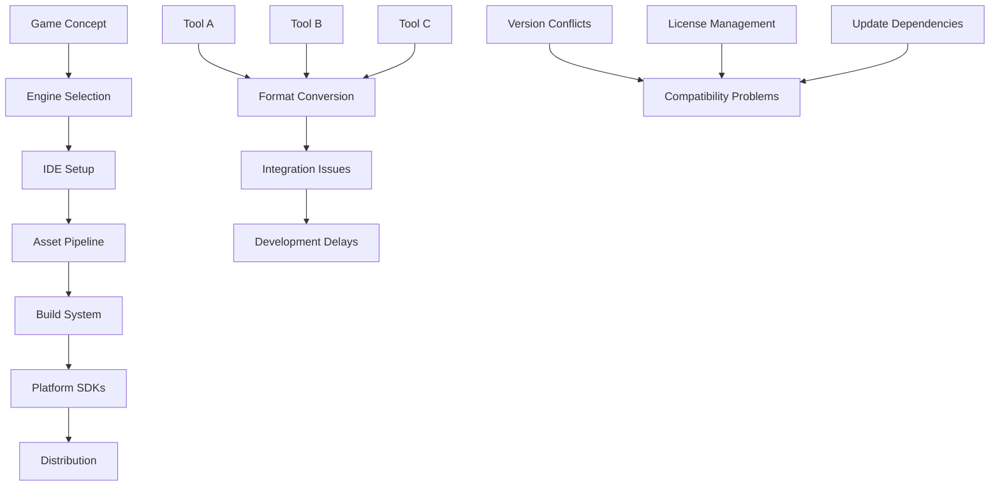
```mermaid
flowchart TD
    A[Game Concept] --> B[Engine Selection]
    B --> C[IDE Setup]
    C --> D[Asset Pipeline]
    D --> E[Build System]
    E --> F[Platform SDKs]
    F --> G[Distribution]
    
    H[Tool A] --> I[Format Conversion]
    J[Tool B] --> I
    K[Tool C] --> I
    I --> L[Integration Issues]
    L --> M[Development Delays]
    
    N[Version Conflicts] --> O[Compatibility Problems]
    P[License Management] --> O
    Q[Update Dependencies] --> O
```

**具体表现：**
1. **多工具依赖**：美术工具、音频工具、脚本编辑器等需要独立管理
2. **格式转换开销**：不同工具间的数据格式不兼容
3. **版本同步困难**：工具链更新导致的兼容性问题
4. **学习成本高**：开发者需要掌握多个专业工具

### 跨平台打包复杂性

**平台适配挑战**
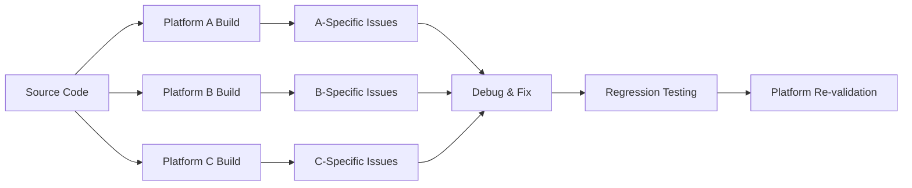
```mermaid
graph LR
    A[Source Code] --> B[Platform A Build]
    A --> C[Platform B Build]
    A --> D[Platform C Build]
    
    B --> E[A-Specific Issues]
    C --> F[B-Specific Issues]
    D --> G[C-Specific Issues]
    
    E --> H[Debug & Fix]
    F --> H
    G --> H
    
    H --> I[Regression Testing]
    I --> J[Platform Re-validation]
```

**关键问题：**
- **构建环境差异**：不同平台需要不同的编译工具链
- **性能优化分歧**：各平台的性能特征差异巨大
- **API兼容性**：平台特定的API调用和限制
- **资源管理**：内存、存储、网络等资源的平台差异

### 资产导入导出代价

**传统资产管理流程**
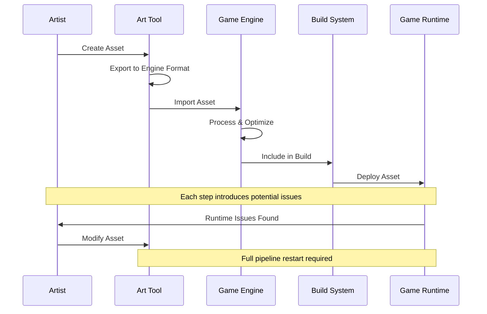
```mermaid
sequenceDiagram
    participant A as Artist
    participant T as Art Tool
    participant E as Game Engine
    participant B as Build System
    participant G as Game Runtime
    
    A->>T: Create Asset
    T->>T: Export to Engine Format
    T->>E: Import Asset
    E->>E: Process & Optimize
    E->>B: Include in Build
    B->>G: Deploy Asset
    
    Note over A,G: Each step introduces potential issues
    
    G->>A: Runtime Issues Found
    A->>T: Modify Asset
    Note over T,G: Full pipeline restart required
```

**效率损失点：**
1. **重复处理**：每次修改都需要完整的导入-处理-构建流程
2. **格式限制**：引擎支持的格式限制了创作自由度
3. **批处理瓶颈**：大量资产的批量处理时间成本
4. **版本管理**：资产版本与代码版本的同步困难

## 3.2 Content Production Overhead —— 内容生产开销

### 手工美术周期长

**传统美术制作流程**

```mermaid
gantt
    title 传统像素艺术制作周期
    dateFormat X
    axisFormat %d天
    
    section 概念设计
    概念草图 :concept, 0, 3
    风格确定 :style, after concept, 2
    
    section 资产制作
    角色设计 :char, after style, 5
    环境设计 :env, after style, 7
    动画制作 :anim, after char, 8
    
    section 整合测试
    资产整合 :integration, after env, 3
    视觉调优 :polish, after integration, 4
    
    section 迭代优化
    反馈收集 :feedback, after polish, 2
    修改调整 :revision, after feedback, 6
```

**时间成本分析：**
- **单个角色**：5-10个工作日（包含多个动画状态）
- **环境tile set**：7-14个工作日（完整的可拼接tile集合）
- **特效动画**：3-8个工作日（取决于复杂度）
- **UI元素**：2-5个工作日（完整的界面套件）

### 迭代速度慢

**迭代反馈循环**
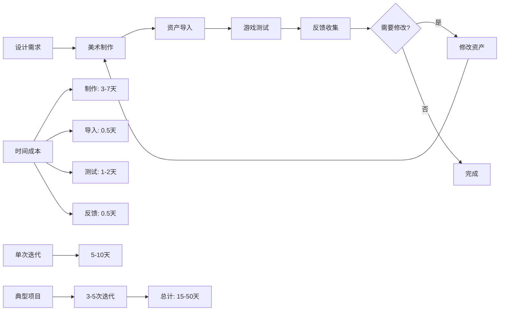
```mermaid
flowchart LR
    A[设计需求] --> B[美术制作]
    B --> C[资产导入]
    C --> D[游戏测试]
    D --> E[反馈收集]
    E --> F{需要修改?}
    F -->|是| G[修改资产]
    G --> B
    F -->|否| H[完成]
    
    I[时间成本] --> J[制作: 3-7天]
    I --> K[导入: 0.5天]
    I --> L[测试: 1-2天]
    I --> M[反馈: 0.5天]
    
    N[单次迭代] --> O[5-10天]
    P[典型项目] --> Q[3-5次迭代]
    Q --> R[总计: 15-50天]
```

### 多人协作成本

**团队协作挑战**
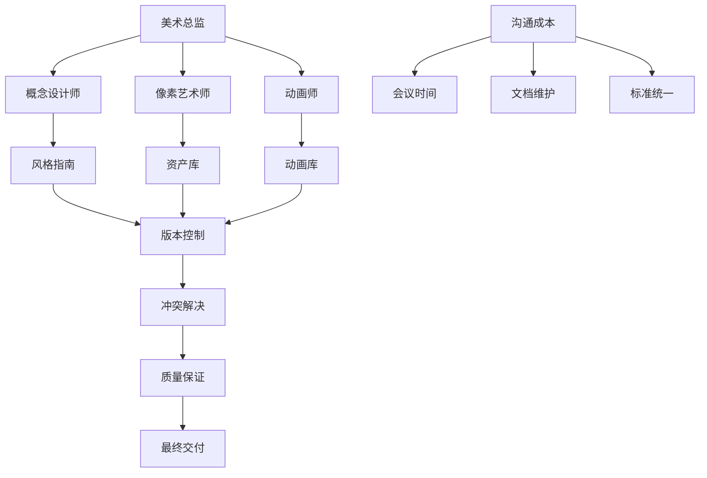
```mermaid
graph TD
    A[美术总监] --> B[概念设计师]
    A --> C[像素艺术师]
    A --> D[动画师]
    
    B --> E[风格指南]
    C --> F[资产库]
    D --> G[动画库]
    
    E --> H[版本控制]
    F --> H
    G --> H
    
    H --> I[冲突解决]
    I --> J[质量保证]
    J --> K[最终交付]
    
    L[沟通成本] --> M[会议时间]
    L --> N[文档维护]
    L --> O[标准统一]
```

**协作问题：**
1. **风格一致性**：多人制作时保持视觉风格统一困难
2. **资产标准化**：命名规范、尺寸规格、格式要求的统一
3. **版本同步**：多人同时修改同一资产时的冲突处理
4. **质量控制**：确保所有资产符合项目质量标准

## 3.3 Content Rigidity in Non-AI Games —— 非AI游戏的内容僵化

### 静态内容限制

**传统内容架构**
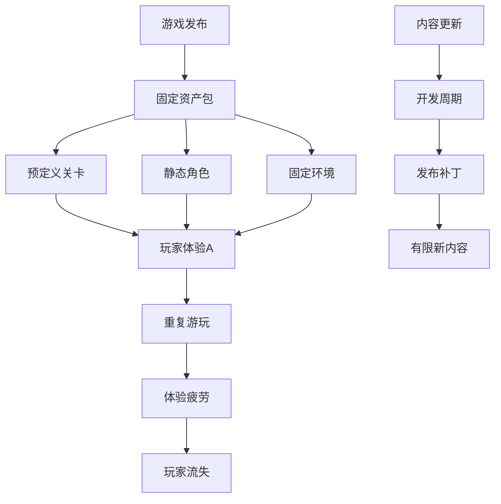
```mermaid
flowchart TD
    A[游戏发布] --> B[固定资产包]
    B --> C[预定义关卡]
    B --> D[静态角色]
    B --> E[固定环境]
    
    C --> F[玩家体验A]
    D --> F
    E --> F
    
    F --> G[重复游玩]
    G --> H[体验疲劳]
    H --> I[玩家流失]
    
    J[内容更新] --> K[开发周期]
    K --> L[发布补丁]
    L --> M[有限新内容]
```

**僵化表现：**
1. **预设路径**：玩家只能体验预先设计的内容路径
2. **有限变化**：即使有随机元素，变化范围也很有限
3. **更新依赖**：新内容需要通过更新包提供
4. **重玩价值低**：多次游玩体验高度相似

### 个性化缺失

**千篇一律的体验**
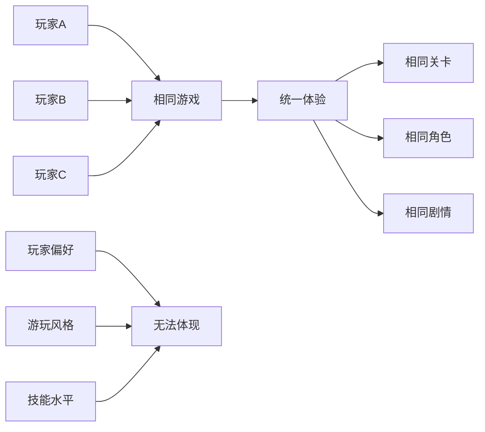
```mermaid
graph LR
    A[玩家A] --> B[相同游戏]
    C[玩家B] --> B
    D[玩家C] --> B
    
    B --> E[统一体验]
    E --> F[相同关卡]
    E --> G[相同角色]
    E --> H[相同剧情]
    
    I[玩家偏好] --> J[无法体现]
    K[游玩风格] --> J
    L[技能水平] --> J
```

## 3.4 Scalability Issues of Conventional Engines —— 传统引擎的扩展性问题

### Unity引擎局限性

**Unity工作流问题**
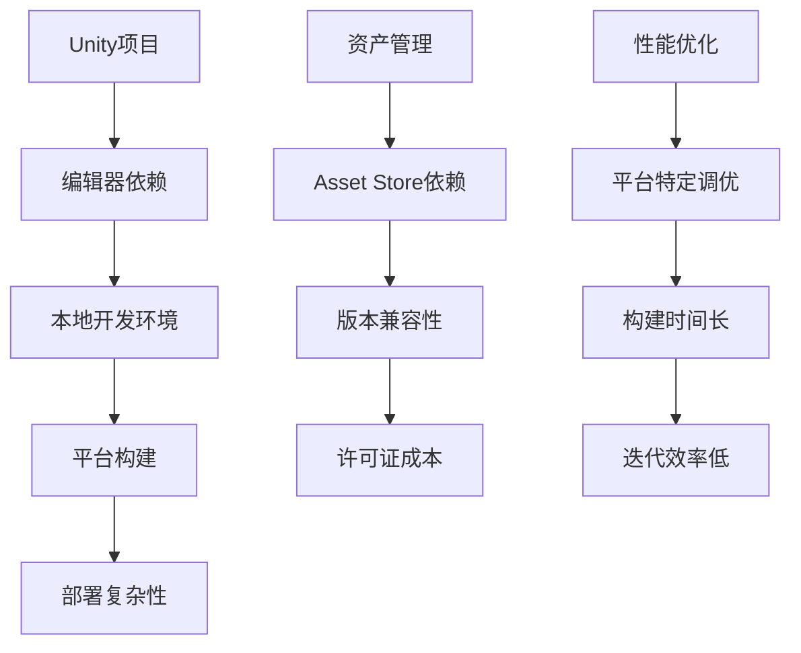
```mermaid
flowchart TD
    A[Unity项目] --> B[编辑器依赖]
    B --> C[本地开发环境]
    C --> D[平台构建]
    D --> E[部署复杂性]
    
    F[资产管理] --> G[Asset Store依赖]
    G --> H[版本兼容性]
    H --> I[许可证成本]
    
    J[性能优化] --> K[平台特定调优]
    K --> L[构建时间长]
    L --> M[迭代效率低]
```

**具体限制：**
1. **编辑器绑定**：必须使用Unity编辑器进行开发
2. **构建依赖**：需要完整的Unity安装和许可证
3. **平台限制**：某些平台需要额外的许可证费用
4. **版本锁定**：项目与特定Unity版本强绑定

### GameMaker等引擎问题

**专用引擎的限制**
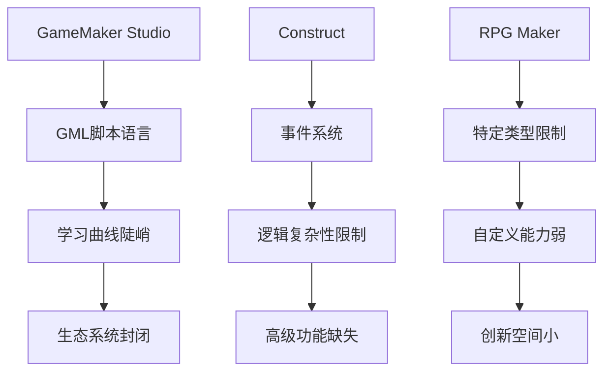
```mermaid
graph TD
    A[GameMaker Studio] --> B[GML脚本语言]
    B --> C[学习曲线陡峭]
    C --> D[生态系统封闭]
    
    E[Construct] --> F[事件系统]
    F --> G[逻辑复杂性限制]
    G --> H[高级功能缺失]
    
    I[RPG Maker] --> J[特定类型限制]
    J --> K[自定义能力弱]
    K --> L[创新空间小]
```

### 现代Web技术优势对比

**Web vs 传统引擎**
```mermaid
comparison
    title Web技术 vs 传统引擎对比
    
    Web技术:
        + 跨平台天然支持
        + 即时部署和更新
        + 开发工具丰富
        + 社区生态活跃
        + 学习资源充足
        - 性能相对较低
        - 离线能力有限
    
    传统引擎:
        + 性能优化更好
        + 离线运行支持
        + 专业工具集成
        - 平台适配复杂
        - 部署流程繁琐
        - 学习成本高
        - 许可证费用
```

## 3.5 Lack of Personalized Content —— 缺乏个性化内容

### 统一化体验问题

**当前游戏的同质化**
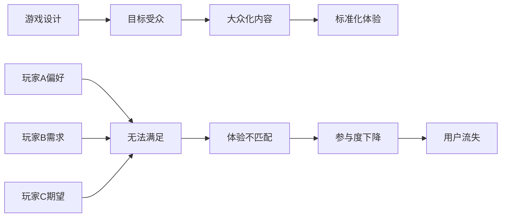
```mermaid
flowchart LR
    A[游戏设计] --> B[目标受众]
    B --> C[大众化内容]
    C --> D[标准化体验]
    
    E[玩家A偏好] --> F[无法满足]
    G[玩家B需求] --> F
    H[玩家C期望] --> F
    
    F --> I[体验不匹配]
    I --> J[参与度下降]
    J --> K[用户流失]
```

### 动态适应能力缺失

**静态vs动态内容生成**
```mermaid
comparison
    title 静态内容 vs 动态生成对比
    
    静态内容:
        特点: 预先制作，固定不变
        优势: 质量可控，性能稳定
        劣势: 缺乏变化，重玩价值低
        适用: 叙事驱动游戏
    
    动态生成:
        特点: 实时创建，个性化适应
        优势: 无限变化，高重玩价值
        劣势: 质量不稳定，技术复杂
        适用: 沙盒类，Roguelike游戏
```

## 3.6 Limitations in AI-assisted Games —— AI辅助游戏的局限性

### 当前AI游戏应用的问题

**AI集成的常见问题**
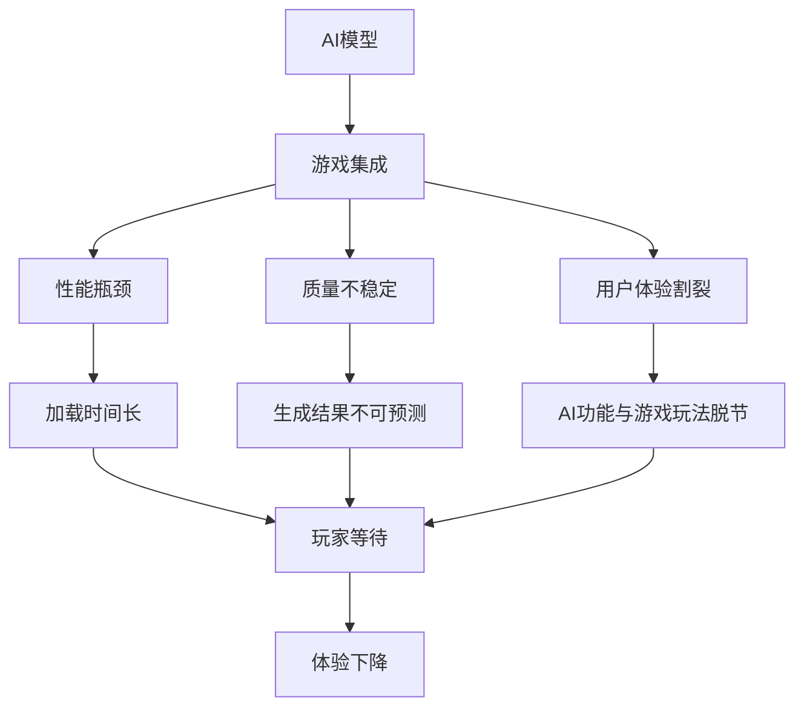
```mermaid
flowchart TD
    A[AI模型] --> B[游戏集成]
    B --> C[性能瓶颈]
    B --> D[质量不稳定]
    B --> E[用户体验割裂]
    
    C --> F[加载时间长]
    D --> G[生成结果不可预测]
    E --> H[AI功能与游戏玩法脱节]
    
    F --> I[玩家等待]
    G --> I
    H --> I
    I --> J[体验下降]
```

**技术挑战：**
1. **实时性要求**：游戏需要快速响应，AI生成通常较慢
2. **质量控制**：AI生成内容的质量难以保证
3. **上下文理解**：AI难以理解复杂的游戏上下文
4. **用户期望管理**：玩家对AI生成内容的期望过高

### 现有解决方案的不足

**市场上AI游戏的问题**
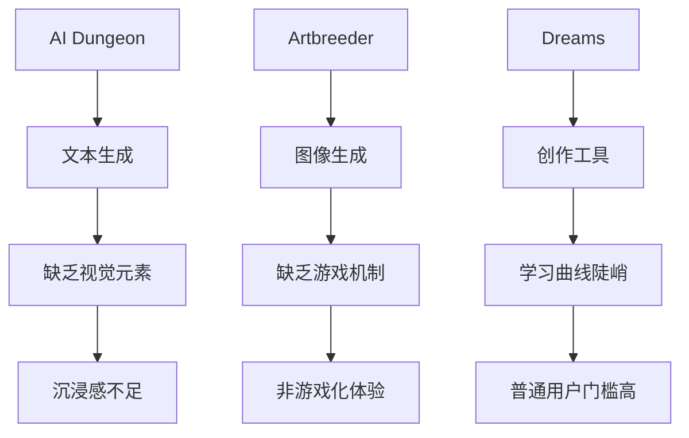
```mermaid
graph TD
    A[AI Dungeon] --> B[文本生成]
    B --> C[缺乏视觉元素]
    C --> D[沉浸感不足]
    
    E[Artbreeder] --> F[图像生成]
    F --> G[缺乏游戏机制]
    G --> H[非游戏化体验]
    
    I[Dreams] --> J[创作工具]
    J --> K[学习曲线陡峭]
    K --> L[普通用户门槛高]
```

## 3.7 Fragmentation of AI Pipelines —— AI管道的碎片化

### 工具链分散问题

**当前AI工具生态**
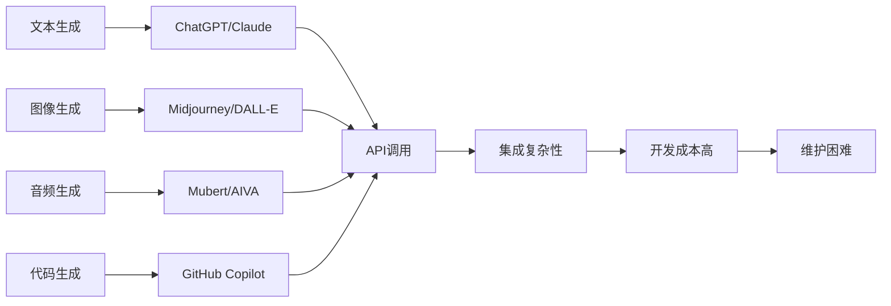
```mermaid
flowchart LR
    A[文本生成] --> B[ChatGPT/Claude]
    C[图像生成] --> D[Midjourney/DALL-E]
    E[音频生成] --> F[Mubert/AIVA]
    G[代码生成] --> H[GitHub Copilot]
    
    B --> I[API调用]
    D --> I
    F --> I
    H --> I
    
    I --> J[集成复杂性]
    J --> K[开发成本高]
    K --> L[维护困难]
```

**集成挑战：**
1. **API不统一**：不同服务的接口标准差异很大
2. **数据格式**：各工具的输入输出格式不兼容
3. **服务依赖**：依赖多个外部服务的稳定性
4. **成本控制**：多个付费服务的成本累积

### 工作流断裂

**传统开发vs AI辅助开发**
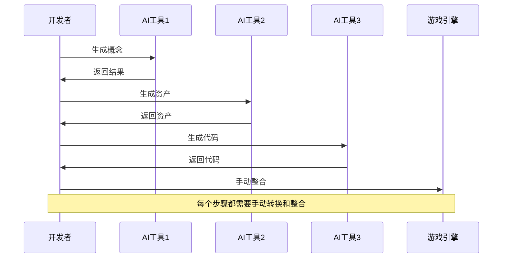
```mermaid
sequenceDiagram
    participant D as 开发者
    participant T1 as AI工具1
    participant T2 as AI工具2
    participant T3 as AI工具3
    participant G as 游戏引擎
    
    D->>T1: 生成概念
    T1->>D: 返回结果
    D->>T2: 生成资产
    T2->>D: 返回资产
    D->>T3: 生成代码
    T3->>D: 返回代码
    D->>G: 手动整合
    
    Note over D,G: 每个步骤都需要手动转换和整合
```

## 3.8 Similar Attempts with API-driven Games —— 类似API驱动游戏的问题

### 现有尝试的局限性

**API驱动游戏的常见问题**
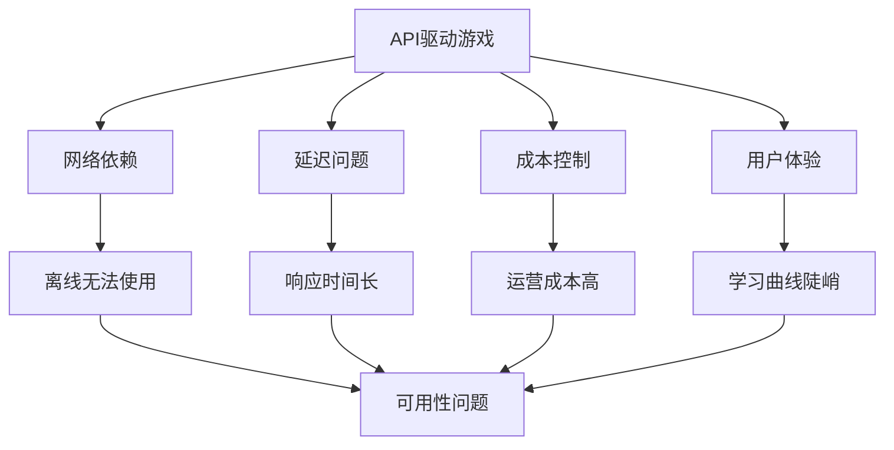
```mermaid
flowchart TD
    A[API驱动游戏] --> B[网络依赖]
    A --> C[延迟问题]
    A --> D[成本控制]
    A --> E[用户体验]
    
    B --> F[离线无法使用]
    C --> G[响应时间长]
    D --> H[运营成本高]
    E --> I[学习曲线陡峭]
    
    F --> J[可用性问题]
    G --> J
    H --> J
    I --> J
```

### 技术架构缺陷

**典型架构问题**
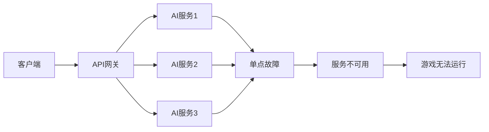
```mermaid
graph LR
    A[客户端] --> B[API网关]
    B --> C[AI服务1]
    B --> D[AI服务2]
    B --> E[AI服务3]
    
    C --> F[单点故障]
    D --> F
    E --> F
    
    F --> G[服务不可用]
    G --> H[游戏无法运行]
```

**关键问题：**
1. **单点故障**：依赖外部API服务的可用性
2. **成本不可控**：API调用费用随用户增长线性增加
3. **数据隐私**：用户数据需要发送到外部服务
4. **定制化困难**：难以针对特定游戏需求优化AI模型

---

## 问题总结

通过以上分析，我们可以看到当前游戏开发和AI应用领域存在的核心问题：

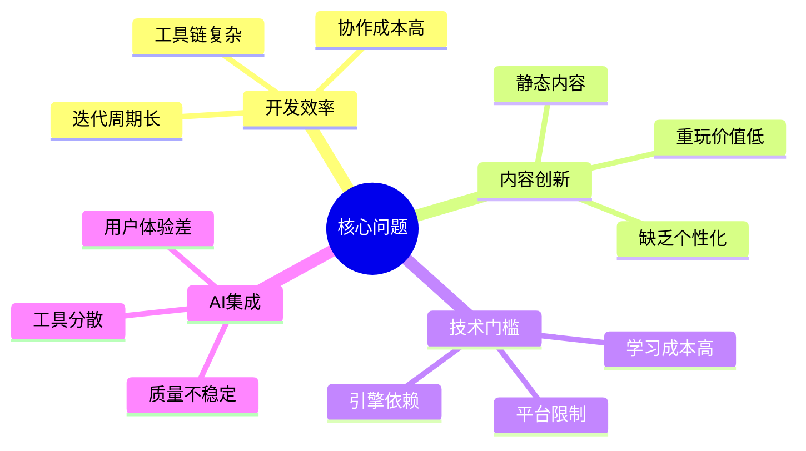
```mermaid
mindmap
  root((核心问题))
    开发效率
      工具链复杂
      迭代周期长
      协作成本高
    内容创新
      静态内容
      缺乏个性化
      重玩价值低
    技术门槛
      引擎依赖
      平台限制
      学习成本高
    AI集成
      工具分散
      质量不稳定
      用户体验差
```

这些问题为Pixel Seed项目的创新方向提供了明确的目标：**创建一个Web原生、AI驱动、用户友好的游戏创作和体验平台**，解决传统游戏开发中的效率、创新和可访问性问题。

---

*下一章节将详细阐述Pixel Seed如何针对这些问题提出创新的解决方案。*