# 4. Formulation of the Solution —— 解决方案的提出

## 4.1 Pixel Seed: Web-based AI-native Engine —— Pixel Seed：网页端AI原生引擎

### 核心设计理念

Pixel Seed采用"AI-First"的设计哲学，将人工智能作为核心驱动力而非附加功能，创建了一个全新的游戏创作和体验范式：

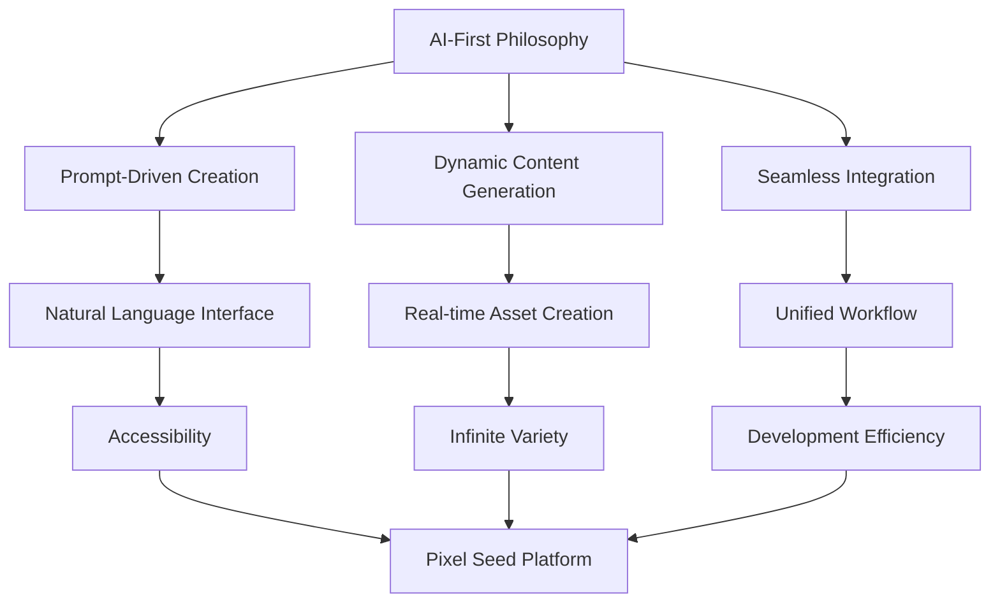

### 架构创新点

**Web-Native Architecture**
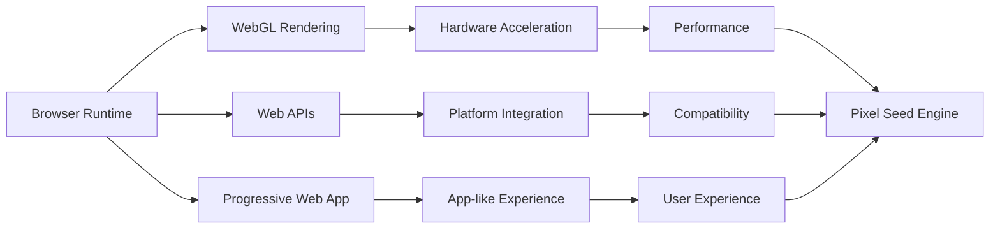

**关键优势：**
1. **零安装部署**：通过浏览器直接访问，无需下载安装
2. **跨平台兼容**：支持桌面、移动、平板等所有现代设备
3. **即时更新**：新功能和内容可以实时推送
4. **云端协作**：天然支持多人协作和分享

### AI集成策略

**原生AI集成架构**
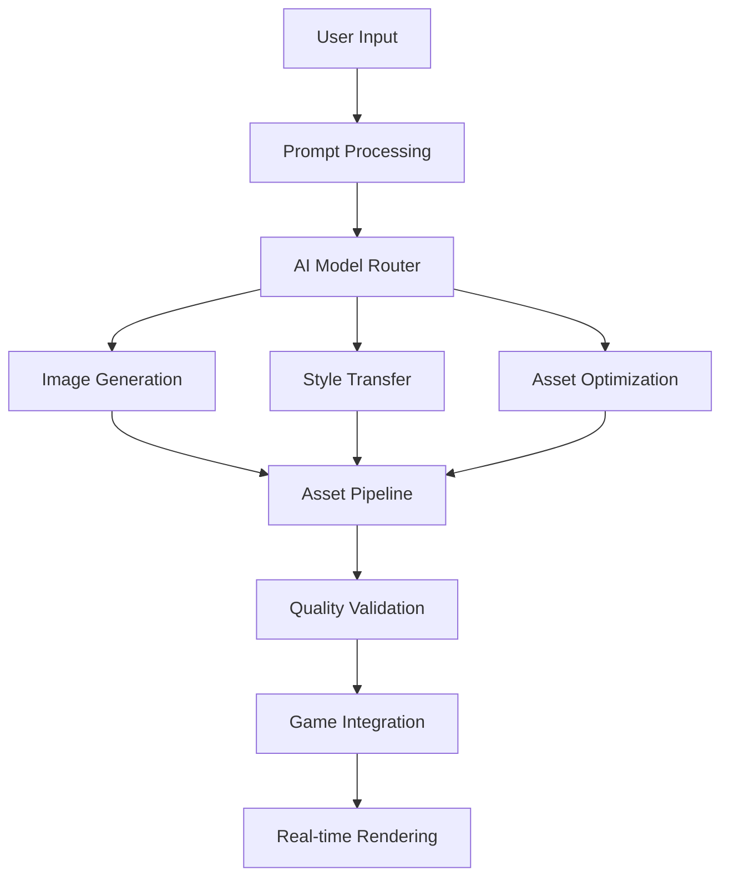

## 4.2 Accessibility via Prompt-driven Design —— 基于提示词驱动的可及性

### 自然语言接口

传统游戏开发需要掌握复杂的技术栈，Pixel Seed通过自然语言接口大幅降低了创作门槛：

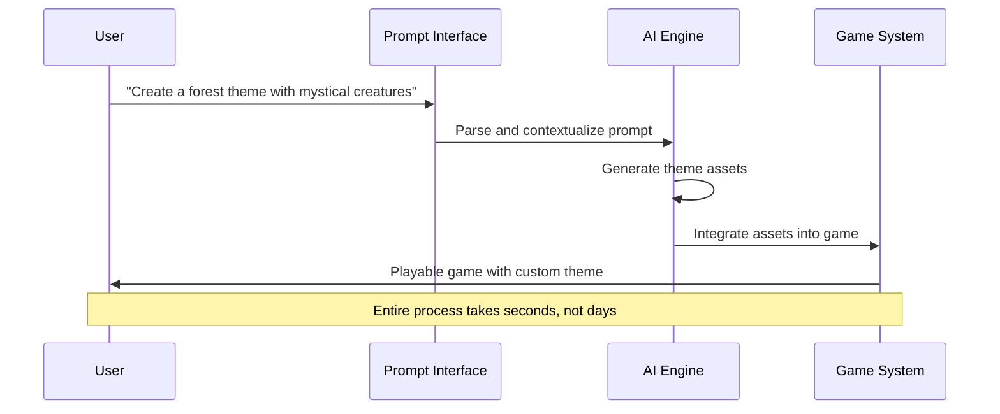

### 渐进式复杂度

**学习曲线优化**
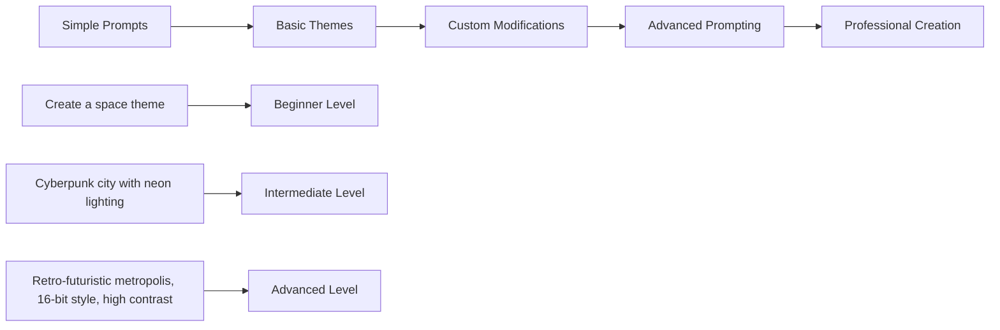

**用户能力分层：**
1. **入门用户**：使用预设主题和简单描述
2. **进阶用户**：掌握提示词技巧，创建个性化内容
3. **专业用户**：深度定制，结合技术参数优化

### 即时反馈机制

**实时预览系统**
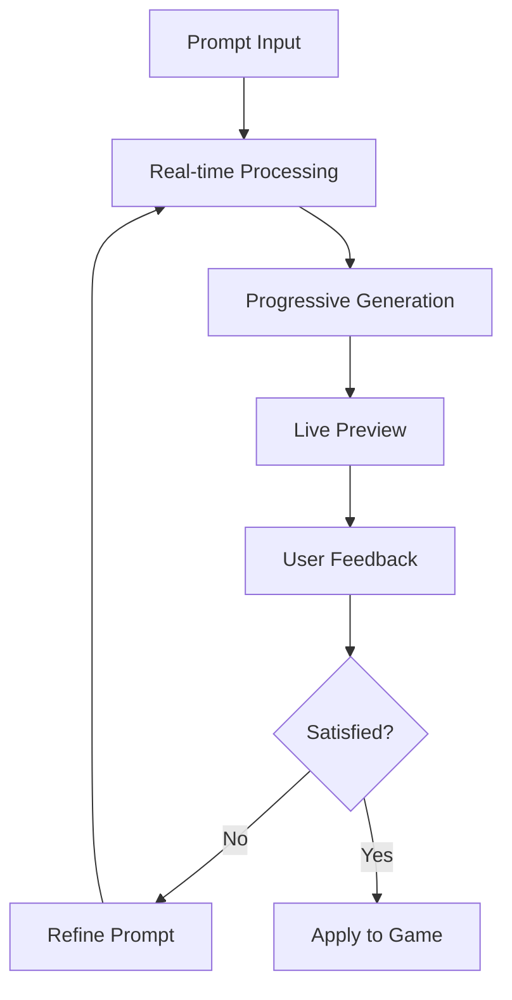

## 4.3 Dynamic World-building —— 动态世界构建

### 程序化内容生成

**动态主题系统**
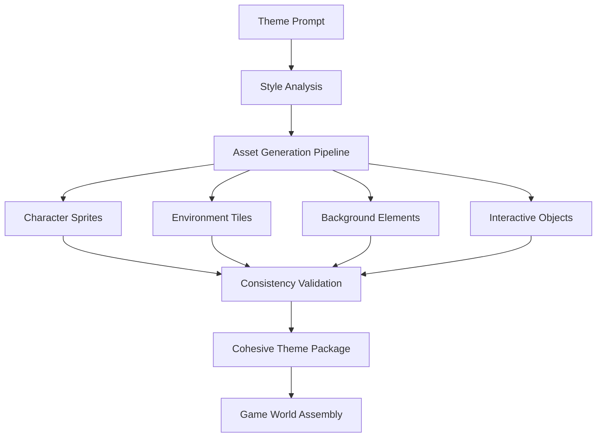

**生成策略：**
1. **风格一致性**：确保所有生成资产保持统一的艺术风格
2. **功能适配性**：生成的资产符合游戏机制要求
3. **视觉和谐性**：色彩、比例、细节层次的协调统一
4. **技术规范性**：符合像素艺术的技术标准

### 自适应难度系统

**智能关卡生成**
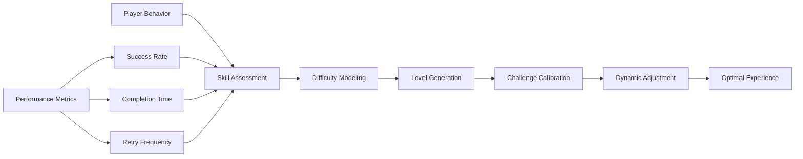

### 无限内容可能性

**内容生成空间**
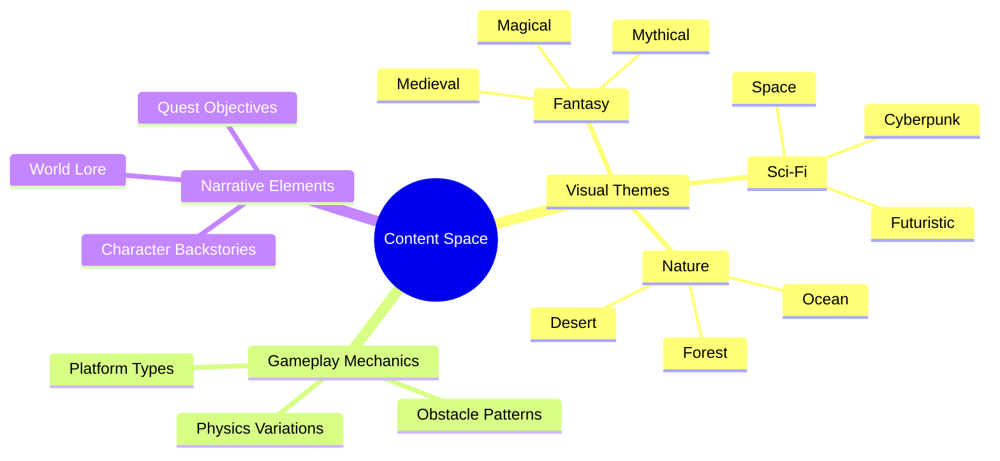

## 4.4 Scalability through Web-based Architecture —— 基于网页架构的扩展性

### 云原生扩展

**弹性架构设计**
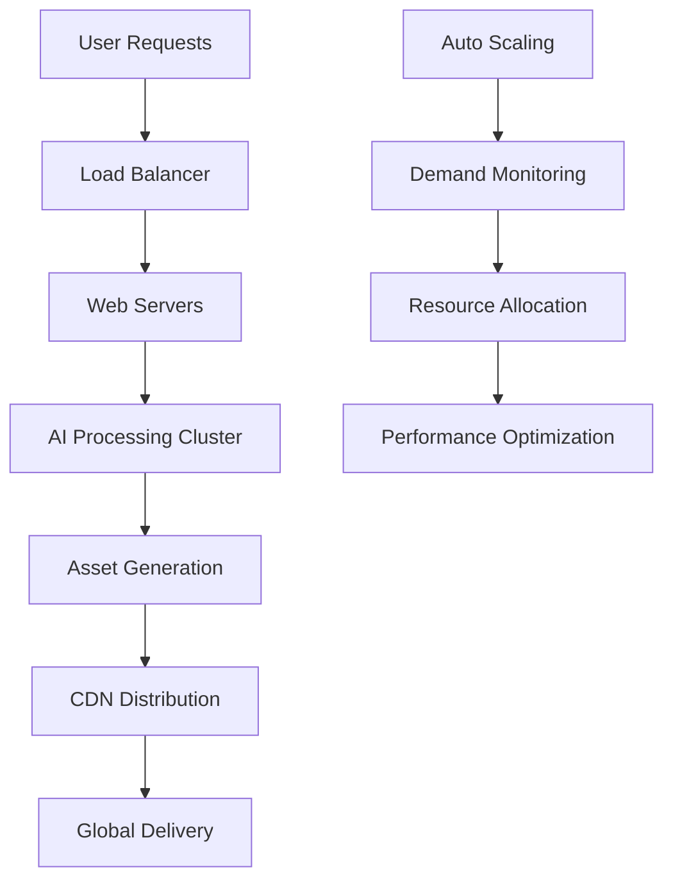

**扩展优势：**
1. **水平扩展**：根据用户需求自动调整计算资源
2. **地理分布**：全球CDN确保低延迟访问
3. **服务解耦**：微服务架构支持独立扩展
4. **成本优化**：按需付费，避免资源浪费

### 渐进式Web应用(PWA)

**PWA特性集成**
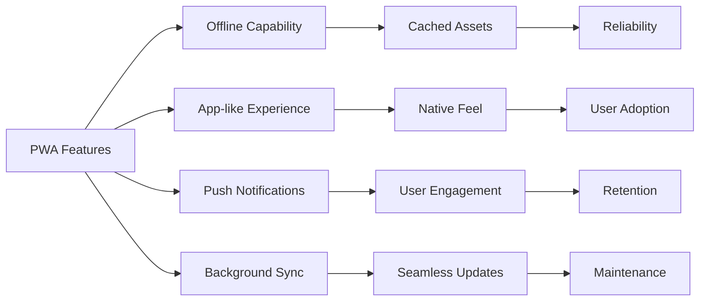

### 性能优化策略

**多层缓存系统**
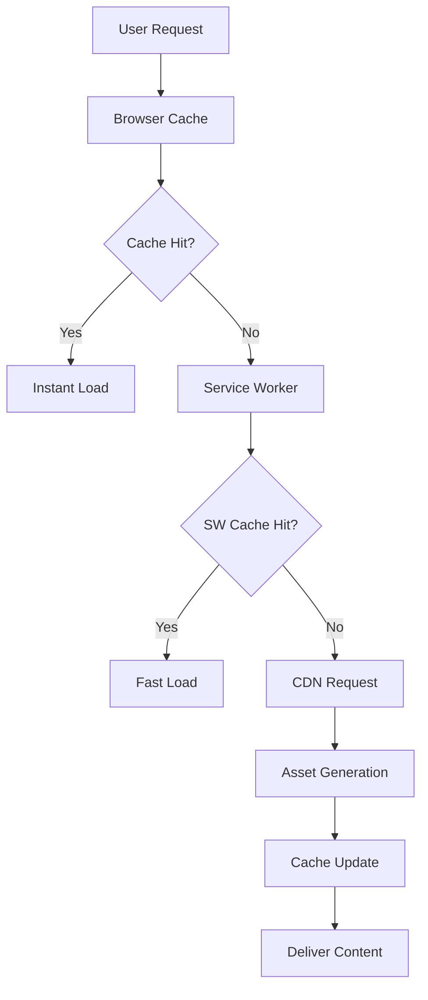

## 4.5 Personalized Play Experience —— 个性化的游玩体验

### 用户偏好学习

**个性化推荐系统**
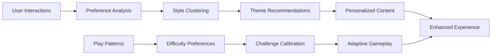

**学习维度：**
1. **视觉偏好**：喜欢的艺术风格、色彩搭配
2. **游戏风格**：偏好的难度级别、游戏节奏
3. **交互模式**：操作习惯、控制偏好
4. **内容类型**：主题偏好、叙事风格

### 动态内容适配

**实时个性化流程**
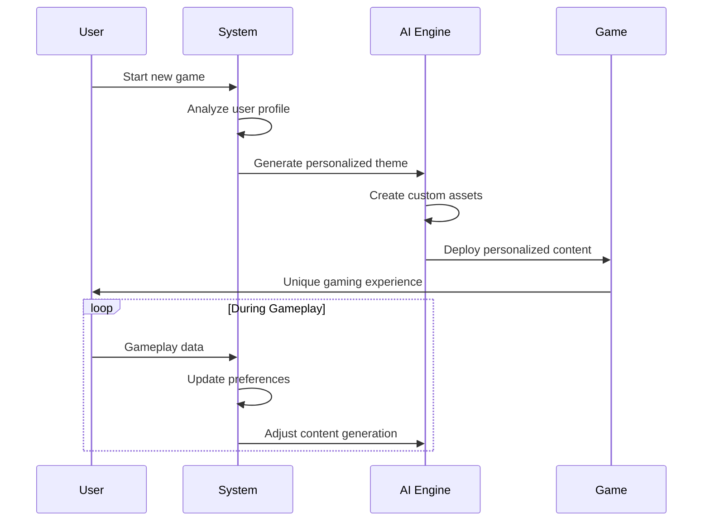

### 社交化个性化

**社区驱动的内容发现**
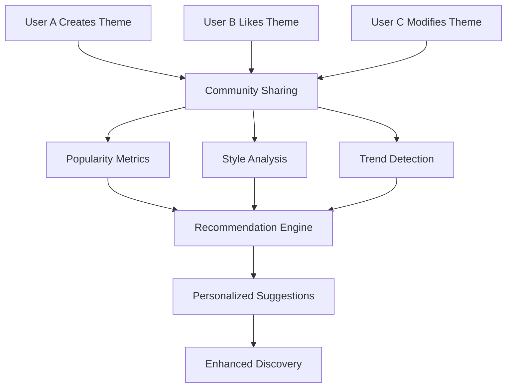

## 4.6 Seamless AI Integration —— 无缝AI整合

### 透明化AI体验

**用户视角的AI集成**
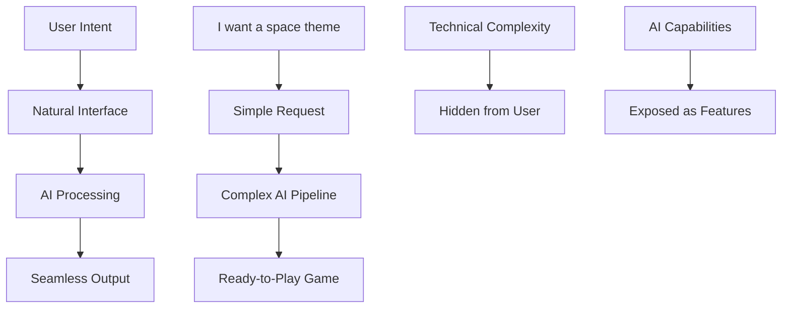

**设计原则：**
1. **隐藏复杂性**：用户无需了解AI技术细节
2. **突出价值**：强调AI带来的创作能力提升
3. **即时反馈**：AI处理过程可视化和进度提示
4. **错误恢复**：AI失败时的优雅降级处理

### 多模态AI协作

**AI能力整合**
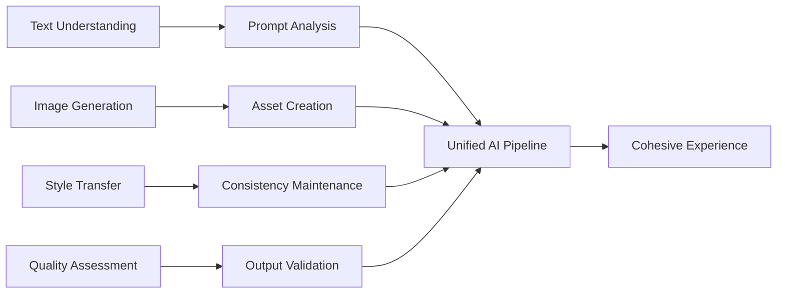

### 渐进式AI增强

**AI能力演进路径**
```mermaid
gantt
    title AI Integration Roadmap
    dateFormat X
    axisFormat Phase %d
    
    section Phase 1
    Basic Theme Generation :phase1, 0, 1
    
    section Phase 2
    Advanced Customization :phase2, 1, 1
    
    section Phase 3
    Dynamic Level Generation :phase3, 2, 1
    
    section Phase 4
    Intelligent NPCs :phase4, 3, 1
    
    section Phase 5
    Narrative Generation :phase5, 4, 1
```

## 4.7 Unified Pipeline —— 统一的生成管道

### 端到端工作流

**统一内容生成流程**
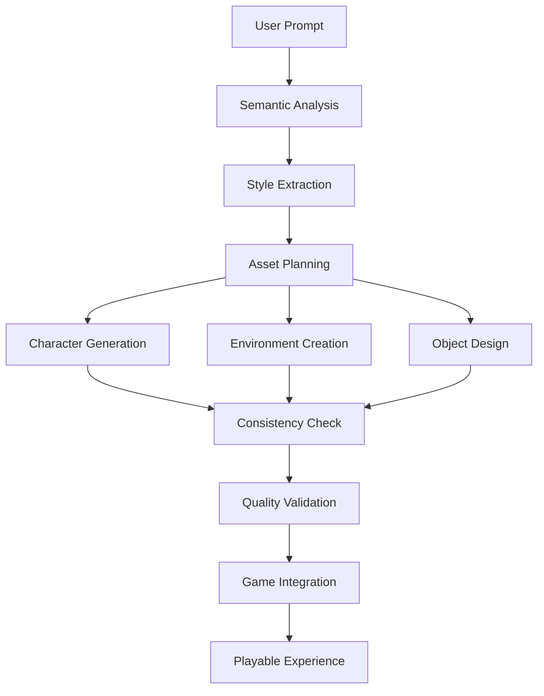

**流程优势：**
1. **一致性保证**：统一的风格和质量标准
2. **效率优化**：避免重复处理和格式转换
3. **质量控制**：集成的验证和优化机制
4. **用户体验**：从创意到游戏的无缝转换

### 模块化架构

**可扩展的组件系统**
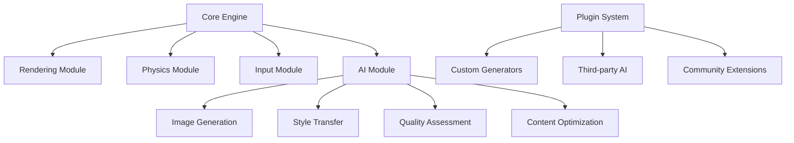

### 数据流优化

**高效的数据处理管道**
```mermaid
flowchart LR
    A[Input Data] --> B[Preprocessing]
    B --> C[Parallel Processing]
    C --> D[Result Aggregation]
    D --> E[Post-processing]
    E --> F[Output Delivery]
    
    G[Caching Layer] --> H[Frequent Requests]
    I[Optimization Layer] --> J[Performance Tuning]
    K[Monitoring Layer] --> L[Quality Metrics]
```

## 4.8 Comparative Innovation —— 与类似项目的对比创新

### 与现有解决方案的差异

**竞品对比分析**
```mermaid
comparison
    title Pixel Seed vs 现有解决方案
    
    Pixel Seed:
        + Web原生，零安装
        + AI驱动的内容生成
        + 统一的创作流程
        + 个性化体验
        + 实时协作支持
        - 功能相对简化
        - 依赖网络连接
    
    Unity + AI插件:
        + 功能强大完整
        + 专业开发工具
        - 学习曲线陡峭
        - 需要本地安装
        - AI集成复杂
    
    GameMaker Studio:
        + 2D游戏专业工具
        + 可视化编程
        - 缺乏AI集成
        - 平台限制
        - 许可证费用
    
    Scratch/Construct:
        + 易于学习
        + 可视化编程
        - 功能有限
        - 缺乏AI能力
        - 输出质量限制
```

### 技术创新点

**核心技术优势**
```mermaid
mindmap
  root((Technical Innovation))
    Web-First Architecture
      Progressive Web App
      WebGL Rendering
      Service Worker Caching
    AI-Native Design
      Prompt-Driven Interface
      Real-time Generation
      Quality Validation
    Unified Pipeline
      End-to-End Workflow
      Consistent Output
      Seamless Integration
    Personalization Engine
      Preference Learning
      Adaptive Content
      Social Discovery
```

### 市场定位创新

**目标用户群体**
```mermaid
flowchart TD
    A[Pixel Seed] --> B[创意爱好者]
    A --> C[独立开发者]
    A --> D[教育用户]
    A --> E[休闲玩家]
    
    B --> F["低门槛创作工具"]
    C --> G["快速原型验证"]
    D --> H["编程教学辅助"]
    E --> I["个性化游戏体验"]
    
    F --> J[市场空白]
    G --> J
    H --> J
    I --> J
```

**价值主张差异化：**
1. **创作民主化**：让非技术用户也能创作游戏
2. **即时满足**：从想法到可玩游戏的极短路径
3. **无限可能**：AI驱动的无限内容生成
4. **社交化创作**：分享和协作的社区生态

---

## 解决方案总结

Pixel Seed通过以下核心创新解决了传统游戏开发中的关键问题：

```mermaid
flowchart TD
    A[传统问题] --> B[Pixel Seed解决方案]
    
    C[工具链复杂] --> D[Web原生统一平台]
    E[开发门槛高] --> F[自然语言接口]
    G[内容静态化] --> H[AI动态生成]
    I[个性化缺失] --> J[智能推荐系统]
    K[协作困难] --> L[云端实时协作]
    M[部署复杂] --> N[即时发布分享]
    
    D --> B
    F --> B
    H --> B
    J --> B
    L --> B
    N --> B
    
    B --> O[革命性游戏创作体验]
```

通过这些创新，Pixel Seed不仅解决了现有问题，更开创了一个全新的游戏创作和体验范式，为游戏行业的未来发展指明了方向。

---

*下一章节将详细介绍Pixel Seed的具体实现方案和技术架构。*