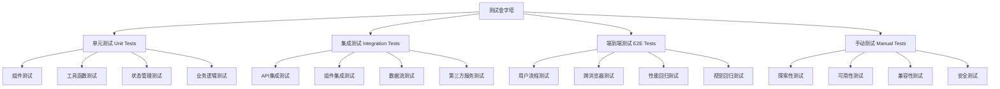
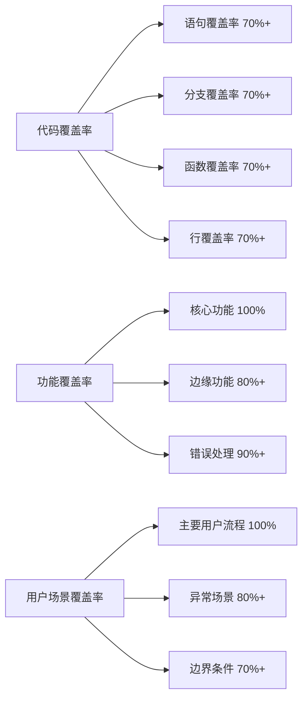
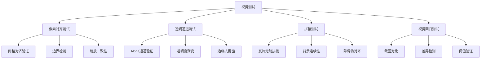
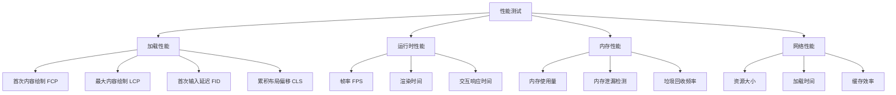
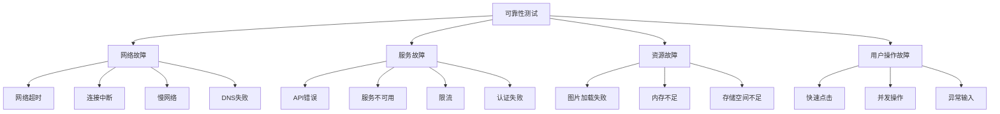
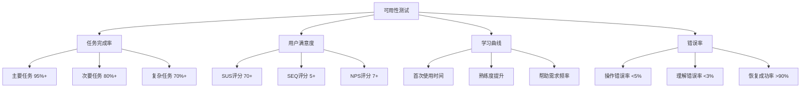
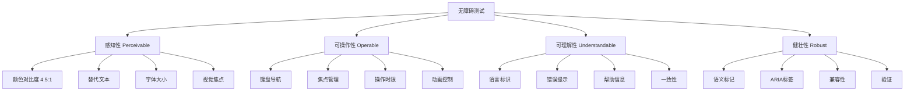
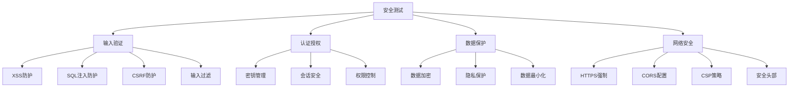
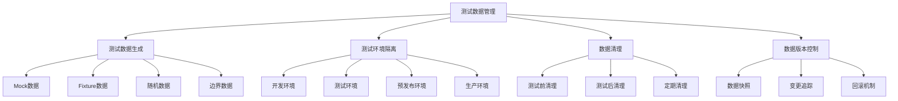

# 6. Testing 测试（专业化方法）

本章详细介绍了Pixel Seed项目的全面测试策略，涵盖功能、性能、可用性、安全性等多个维度的专业化测试方法。

## 6.1 Test Strategy —— 测试策略（单元/集成/端到端的金字塔）

### 6.1.1 测试金字塔架构

**测试层级结构**


**测试策略配置：**
```typescript
// jest.config.js
module.exports = {
  testEnvironment: 'jsdom',
  setupFilesAfterEnv: ['<rootDir>/jest.setup.js'],
  testPathIgnorePatterns: ['<rootDir>/.next/', '<rootDir>/node_modules/'],
  moduleNameMapping: {
    '^@/(.*)$': '<rootDir>/$1',
    '^@/components/(.*)$': '<rootDir>/components/$1',
    '^@/lib/(.*)$': '<rootDir>/lib/$1',
    '^@/types/(.*)$': '<rootDir>/types/$1'
  },
  collectCoverageFrom: [
    'components/**/*.{js,jsx,ts,tsx}',
    'lib/**/*.{js,jsx,ts,tsx}',
    'app/**/*.{js,jsx,ts,tsx}',
    '!**/*.d.ts',
    '!**/node_modules/**'
  ],
  coverageThreshold: {
    global: {
      branches: 70,
      functions: 70,
      lines: 70,
      statements: 70
    }
  },
  testMatch: [
    '**/__tests__/**/*.(test|spec).(js|jsx|ts|tsx)',
    '**/*.(test|spec).(js|jsx|ts|tsx)'
  ]
};

// playwright.config.ts
import { defineConfig, devices } from '@playwright/test';

export default defineConfig({
  testDir: './e2e',
  fullyParallel: true,
  forbidOnly: !!process.env.CI,
  retries: process.env.CI ? 2 : 0,
  workers: process.env.CI ? 1 : undefined,
  reporter: 'html',
  use: {
    baseURL: 'http://localhost:3000',
    trace: 'on-first-retry',
    screenshot: 'only-on-failure'
  },
  projects: [
    {
      name: 'chromium',
      use: { ...devices['Desktop Chrome'] }
    },
    {
      name: 'firefox',
      use: { ...devices['Desktop Firefox'] }
    },
    {
      name: 'webkit',
      use: { ...devices['Desktop Safari'] }
    },
    {
      name: 'Mobile Chrome',
      use: { ...devices['Pixel 5'] }
    },
    {
      name: 'Mobile Safari',
      use: { ...devices['iPhone 12'] }
    }
  ],
  webServer: {
    command: 'npm run dev',
    url: 'http://localhost:3000',
    reuseExistingServer: !process.env.CI
  }
});
```

### 6.1.2 测试覆盖率策略

**覆盖率目标与监控**


## 6.2 Functional Testing —— 功能测试（主题选择、预览、开始游戏、暂停/返回）

### 6.2.1 主题系统功能测试

**主题选择测试用例：**
```typescript
// __tests__/components/ThemesList.test.tsx
import { render, screen, fireEvent, waitFor } from '@testing-library/react';
import { ThemesList } from '@/components/ThemesList';
import { useAppStore } from '@/lib/store';
import { PRESET_THEMES } from '@/configs/themes';

// Mock store
jest.mock('@/lib/store');
const mockUseAppStore = useAppStore as jest.MockedFunction<typeof useAppStore>;

describe('ThemesList Component', () => {
  const mockSelectTheme = jest.fn();
  const mockSetLoading = jest.fn();
  
  beforeEach(() => {
    mockUseAppStore.mockReturnValue({
      themes: PRESET_THEMES,
      selectedTheme: PRESET_THEMES[0],
      selectTheme: mockSelectTheme,
      setLoading: mockSetLoading,
      isLoading: false
    });
  });
  
  afterEach(() => {
    jest.clearAllMocks();
  });
  
  it('should render all preset themes', () => {
    render(<ThemesList />);
    
    PRESET_THEMES.forEach(theme => {
      expect(screen.getByText(theme.name)).toBeInTheDocument();
    });
  });
  
  it('should highlight selected theme', () => {
    render(<ThemesList />);
    
    const selectedThemeElement = screen.getByTestId(`theme-${PRESET_THEMES[0].id}`);
    expect(selectedThemeElement).toHaveClass('selected');
  });
  
  it('should call selectTheme when theme is clicked', async () => {
    render(<ThemesList />);
    
    const themeElement = screen.getByTestId(`theme-${PRESET_THEMES[1].id}`);
    fireEvent.click(themeElement);
    
    await waitFor(() => {
      expect(mockSelectTheme).toHaveBeenCalledWith(PRESET_THEMES[1]);
    });
  });
  
  it('should show loading state during theme selection', async () => {
    mockUseAppStore.mockReturnValue({
      themes: PRESET_THEMES,
      selectedTheme: PRESET_THEMES[0],
      selectTheme: mockSelectTheme,
      setLoading: mockSetLoading,
      isLoading: true
    });
    
    render(<ThemesList />);
    
    expect(screen.getByTestId('loading-spinner')).toBeInTheDocument();
  });
  
  it('should handle theme selection error gracefully', async () => {
    mockSelectTheme.mockRejectedValue(new Error('Network error'));
    
    render(<ThemesList />);
    
    const themeElement = screen.getByTestId(`theme-${PRESET_THEMES[1].id}`);
    fireEvent.click(themeElement);
    
    await waitFor(() => {
      expect(screen.getByText(/加载主题失败/)).toBeInTheDocument();
    });
  });
});
```

### 6.2.2 游戏流程功能测试

**游戏状态管理测试：**
```typescript
// __tests__/lib/store.test.ts
import { renderHook, act } from '@testing-library/react';
import { useAppStore } from '@/lib/store';

describe('Game State Management', () => {
  beforeEach(() => {
    // Reset store state
    act(() => {
      useAppStore.getState().resetGame();
    });
  });
  
  it('should initialize with idle game state', () => {
    const { result } = renderHook(() => useAppStore());
    
    expect(result.current.gameState).toBe('idle');
    expect(result.current.score).toBe(0);
    expect(result.current.gameTime).toBe(0);
  });
  
  it('should start game correctly', () => {
    const { result } = renderHook(() => useAppStore());
    
    act(() => {
      result.current.startGame();
    });
    
    expect(result.current.gameState).toBe('playing');
    expect(result.current.playerPosition).toEqual({ x: 100, y: 500 });
    expect(result.current.obstacles).toHaveLength(0);
  });
  
  it('should pause and resume game', () => {
    const { result } = renderHook(() => useAppStore());
    
    act(() => {
      result.current.startGame();
    });
    
    act(() => {
      result.current.pauseGame();
    });
    
    expect(result.current.gameState).toBe('paused');
    
    act(() => {
      result.current.resumeGame();
    });
    
    expect(result.current.gameState).toBe('playing');
  });
  
  it('should end game and show game over state', () => {
    const { result } = renderHook(() => useAppStore());
    
    act(() => {
      result.current.startGame();
      result.current.updateScore(100);
      result.current.endGame();
    });
    
    expect(result.current.gameState).toBe('gameOver');
    expect(result.current.score).toBe(100);
  });
  
  it('should reset game state correctly', () => {
    const { result } = renderHook(() => useAppStore());
    
    act(() => {
      result.current.startGame();
      result.current.updateScore(50);
      result.current.updateGameTime(30);
      result.current.resetGame();
    });
    
    expect(result.current.gameState).toBe('idle');
    expect(result.current.score).toBe(0);
    expect(result.current.gameTime).toBe(0);
  });
});
```

### 6.2.3 端到端功能测试

**完整用户流程测试：**
```typescript
// e2e/game-flow.spec.ts
import { test, expect } from '@playwright/test';

test.describe('Game Flow E2E Tests', () => {
  test.beforeEach(async ({ page }) => {
    await page.goto('/');
    await page.waitForLoadState('networkidle');
  });
  
  test('should complete full game flow', async ({ page }) => {
    // 1. Select a theme
    await page.click('[data-testid="theme-forest"]');
    await expect(page.locator('[data-testid="theme-forest"]')).toHaveClass(/selected/);
    
    // 2. Wait for theme to load
    await page.waitForSelector('[data-testid="theme-preview-loaded"]');
    
    // 3. Start game
    await page.click('[data-testid="start-game-button"]');
    await expect(page.locator('[data-testid="game-canvas"]')).toBeVisible();
    
    // 4. Verify game is running
    await expect(page.locator('[data-testid="game-score"]')).toContainText('0');
    await expect(page.locator('[data-testid="game-time"]')).toBeVisible();
    
    // 5. Test player movement
    await page.keyboard.press('KeyD'); // Move right
    await page.waitForTimeout(100);
    await page.keyboard.press('Space'); // Jump
    
    // 6. Pause game
    await page.keyboard.press('Escape');
    await expect(page.locator('[data-testid="pause-overlay"]')).toBeVisible();
    
    // 7. Resume game
    await page.click('[data-testid="resume-button"]');
    await expect(page.locator('[data-testid="pause-overlay"]')).not.toBeVisible();
    
    // 8. Return to menu
    await page.keyboard.press('Escape');
    await page.click('[data-testid="return-menu-button"]');
    await expect(page.locator('[data-testid="theme-list"]')).toBeVisible();
  });
  
  test('should handle theme switching during game', async ({ page }) => {
    // Start with one theme
    await page.click('[data-testid="theme-forest"]');
    await page.click('[data-testid="start-game-button"]');
    
    // Return to menu and switch theme
    await page.keyboard.press('Escape');
    await page.click('[data-testid="return-menu-button"]');
    await page.click('[data-testid="theme-desert"]');
    
    // Verify theme switched
    await expect(page.locator('[data-testid="theme-desert"]')).toHaveClass(/selected/);
    
    // Start new game with new theme
    await page.click('[data-testid="start-game-button"]');
    await expect(page.locator('[data-testid="game-canvas"]')).toBeVisible();
  });
  
  test('should handle network errors gracefully', async ({ page }) => {
    // Simulate network failure
    await page.route('**/*', route => route.abort());
    
    await page.click('[data-testid="theme-custom"]');
    
    // Should show error message
    await expect(page.locator('[data-testid="error-message"]')).toContainText(/网络错误/);
    
    // Should fallback to default assets
    await expect(page.locator('[data-testid="fallback-assets"]')).toBeVisible();
  });
});
```

## 6.3 Visual & Pixel Tests —— 视觉与像素测试（像素对齐、透明通道、无缝/拼接）

### 6.3.1 像素精度测试

**像素对齐验证**


**像素测试实现：**
```typescript
// __tests__/visual/pixel-alignment.test.ts
import { test, expect } from '@playwright/test';
import pixelmatch from 'pixelmatch';
import { PNG } from 'pngjs';
import fs from 'fs';

test.describe('Pixel Alignment Tests', () => {
  test('should maintain pixel-perfect alignment', async ({ page }) => {
    await page.goto('/');
    await page.click('[data-testid="theme-pixel-perfect"]');
    await page.click('[data-testid="start-game-button"]');
    
    // Wait for game to stabilize
    await page.waitForTimeout(1000);
    
    // Take screenshot of game canvas
    const canvas = page.locator('[data-testid="game-canvas"]');
    const screenshot = await canvas.screenshot();
    
    // Load reference image
    const referencePath = './visual-tests/references/pixel-perfect-game.png';
    const reference = fs.readFileSync(referencePath);
    
    // Compare images
    const img1 = PNG.sync.read(screenshot);
    const img2 = PNG.sync.read(reference);
    const { width, height } = img1;
    const diff = new PNG({ width, height });
    
    const numDiffPixels = pixelmatch(
      img1.data, img2.data, diff.data, width, height,
      { threshold: 0.1, includeAA: false }
    );
    
    // Allow for minimal differences (< 1% of pixels)
    const maxDiffPixels = (width * height) * 0.01;
    expect(numDiffPixels).toBeLessThan(maxDiffPixels);
  });
  
  test('should handle transparent pixels correctly', async ({ page }) => {
    await page.goto('/');
    await page.click('[data-testid="theme-with-transparency"]');
    await page.click('[data-testid="start-game-button"]');
    
    // Test transparency by checking canvas pixel data
    const canvasPixelData = await page.evaluate(() => {
      const canvas = document.querySelector('[data-testid="game-canvas"]') as HTMLCanvasElement;
      const ctx = canvas.getContext('2d')!;
      const imageData = ctx.getImageData(0, 0, canvas.width, canvas.height);
      
      // Check for transparent pixels (alpha = 0)
      let transparentPixels = 0;
      for (let i = 3; i < imageData.data.length; i += 4) {
        if (imageData.data[i] === 0) {
          transparentPixels++;
        }
      }
      
      return {
        totalPixels: imageData.data.length / 4,
        transparentPixels,
        hasTransparency: transparentPixels > 0
      };
    });
    
    expect(canvasPixelData.hasTransparency).toBe(true);
    expect(canvasPixelData.transparentPixels).toBeGreaterThan(0);
  });
  
  test('should maintain seamless tiling', async ({ page }) => {
    await page.goto('/');
    await page.click('[data-testid="theme-tiled-background"]');
    await page.click('[data-testid="start-game-button"]');
    
    // Test tiling by checking pattern repetition
    const tilingData = await page.evaluate(() => {
      const canvas = document.querySelector('[data-testid="game-canvas"]') as HTMLCanvasElement;
      const ctx = canvas.getContext('2d')!;
      
      // Sample pixels at tile boundaries
      const tileSize = 32; // Assuming 32x32 tiles
      const samples = [];
      
      for (let x = 0; x < canvas.width; x += tileSize) {
        for (let y = 0; y < canvas.height; y += tileSize) {
          const imageData = ctx.getImageData(x, y, 1, 1);
          samples.push({
            x, y,
            r: imageData.data[0],
            g: imageData.data[1],
            b: imageData.data[2],
            a: imageData.data[3]
          });
        }
      }
      
      return samples;
    });
    
    // Verify pattern consistency
    expect(tilingData.length).toBeGreaterThan(0);
    
    // Check that adjacent tiles have consistent edge pixels
    // (This would require more sophisticated edge detection logic)
  });
});
```

### 6.3.2 视觉回归测试

**自动化视觉对比：**
```typescript
// __tests__/visual/regression.test.ts
import { test, expect } from '@playwright/test';

test.describe('Visual Regression Tests', () => {
  const themes = ['forest', 'desert', 'space', 'underwater'];
  
  themes.forEach(theme => {
    test(`should match visual baseline for ${theme} theme`, async ({ page }) => {
      await page.goto('/');
      await page.click(`[data-testid="theme-${theme}"]`);
      
      // Wait for theme to load completely
      await page.waitForSelector('[data-testid="theme-preview-loaded"]');
      
      // Take screenshot of theme preview
      const preview = page.locator('[data-testid="theme-preview"]');
      await expect(preview).toHaveScreenshot(`${theme}-preview.png`);
      
      // Start game and take gameplay screenshot
      await page.click('[data-testid="start-game-button"]');
      await page.waitForTimeout(2000); // Let game stabilize
      
      const gameCanvas = page.locator('[data-testid="game-canvas"]');
      await expect(gameCanvas).toHaveScreenshot(`${theme}-gameplay.png`);
    });
  });
  
  test('should maintain UI consistency across viewports', async ({ page }) => {
    const viewports = [
      { width: 1920, height: 1080 },
      { width: 1366, height: 768 },
      { width: 768, height: 1024 },
      { width: 375, height: 667 }
    ];
    
    for (const viewport of viewports) {
      await page.setViewportSize(viewport);
      await page.goto('/');
      
      // Wait for responsive layout
      await page.waitForTimeout(500);
      
      await expect(page).toHaveScreenshot(`ui-${viewport.width}x${viewport.height}.png`);
    }
  });
});
```

## 6.4 Performance Testing —— 性能测试（加载时延、FPS、内存与资源体积）

### 6.4.1 加载性能测试

**性能指标监控**


**性能测试实现：**
```typescript
// __tests__/performance/loading.test.ts
import { test, expect } from '@playwright/test';

test.describe('Loading Performance Tests', () => {
  test('should meet Core Web Vitals thresholds', async ({ page }) => {
    // Navigate and measure performance
    const response = await page.goto('/', { waitUntil: 'networkidle' });
    expect(response?.status()).toBe(200);
    
    // Measure Core Web Vitals
    const vitals = await page.evaluate(() => {
      return new Promise((resolve) => {
        const vitals: any = {};
        
        // FCP - First Contentful Paint
        new PerformanceObserver((list) => {
          for (const entry of list.getEntries()) {
            if (entry.name === 'first-contentful-paint') {
              vitals.fcp = entry.startTime;
            }
          }
        }).observe({ entryTypes: ['paint'] });
        
        // LCP - Largest Contentful Paint
        new PerformanceObserver((list) => {
          const entries = list.getEntries();
          const lastEntry = entries[entries.length - 1];
          vitals.lcp = lastEntry.startTime;
        }).observe({ entryTypes: ['largest-contentful-paint'] });
        
        // CLS - Cumulative Layout Shift
        let clsValue = 0;
        new PerformanceObserver((list) => {
          for (const entry of list.getEntries()) {
            if (!(entry as any).hadRecentInput) {
              clsValue += (entry as any).value;
            }
          }
          vitals.cls = clsValue;
        }).observe({ entryTypes: ['layout-shift'] });
        
        // Wait for measurements to complete
        setTimeout(() => resolve(vitals), 3000);
      });
    });
    
    // Assert Core Web Vitals thresholds
    expect(vitals.fcp).toBeLessThan(1800); // FCP < 1.8s (good)
    expect(vitals.lcp).toBeLessThan(2500); // LCP < 2.5s (good)
    expect(vitals.cls).toBeLessThan(0.1);  // CLS < 0.1 (good)
  });
  
  test('should load theme assets efficiently', async ({ page }) => {
    await page.goto('/');
    
    // Monitor network requests
    const requests: any[] = [];
    page.on('request', request => {
      if (request.url().includes('image') || request.url().includes('asset')) {
        requests.push({
          url: request.url(),
          method: request.method(),
          startTime: Date.now()
        });
      }
    });
    
    const responses: any[] = [];
    page.on('response', response => {
      if (response.url().includes('image') || response.url().includes('asset')) {
        responses.push({
          url: response.url(),
          status: response.status(),
          size: response.headers()['content-length'],
          endTime: Date.now()
        });
      }
    });
    
    // Select theme and measure loading
    const startTime = Date.now();
    await page.click('[data-testid="theme-forest"]');
    await page.waitForSelector('[data-testid="theme-preview-loaded"]');
    const loadTime = Date.now() - startTime;
    
    // Assert loading performance
    expect(loadTime).toBeLessThan(3000); // Theme should load within 3 seconds
    expect(responses.every(r => r.status === 200)).toBe(true); // All assets loaded successfully
    
    // Check asset sizes
    const totalSize = responses.reduce((sum, r) => sum + parseInt(r.size || '0'), 0);
    expect(totalSize).toBeLessThan(5 * 1024 * 1024); // Total assets < 5MB
  });
});
```

### 6.4.2 游戏性能测试

**FPS和渲染性能：**
```typescript
// __tests__/performance/gameplay.test.ts
import { test, expect } from '@playwright/test';

test.describe('Gameplay Performance Tests', () => {
  test('should maintain stable FPS during gameplay', async ({ page }) => {
    await page.goto('/');
    await page.click('[data-testid="theme-forest"]');
    await page.click('[data-testid="start-game-button"]');
    
    // Measure FPS over time
    const fpsData = await page.evaluate(() => {
      return new Promise((resolve) => {
        const fps: number[] = [];
        let frameCount = 0;
        let lastTime = performance.now();
        
        const measureFPS = () => {
          frameCount++;
          const currentTime = performance.now();
          
          if (currentTime - lastTime >= 1000) {
            fps.push(frameCount);
            frameCount = 0;
            lastTime = currentTime;
          }
          
          if (fps.length < 10) {
            requestAnimationFrame(measureFPS);
          } else {
            resolve(fps);
          }
        };
        
        requestAnimationFrame(measureFPS);
      });
    });
    
    // Assert FPS stability
    const avgFPS = fpsData.reduce((sum: number, fps: number) => sum + fps, 0) / fpsData.length;
    const minFPS = Math.min(...fpsData);
    
    expect(avgFPS).toBeGreaterThan(30); // Average FPS > 30
    expect(minFPS).toBeGreaterThan(20); // Minimum FPS > 20
    
    // Check FPS consistency (low variance)
    const variance = fpsData.reduce((sum: number, fps: number) => sum + Math.pow(fps - avgFPS, 2), 0) / fpsData.length;
    expect(variance).toBeLessThan(100); // Low FPS variance
  });
  
  test('should handle memory efficiently during extended gameplay', async ({ page }) => {
    await page.goto('/');
    await page.click('[data-testid="theme-forest"]');
    await page.click('[data-testid="start-game-button"]');
    
    // Simulate extended gameplay
    const memoryUsage = [];
    
    for (let i = 0; i < 10; i++) {
      // Simulate game actions
      await page.keyboard.press('KeyD');
      await page.keyboard.press('Space');
      await page.waitForTimeout(1000);
      
      // Measure memory usage
      const memory = await page.evaluate(() => {
        if ('memory' in performance) {
          return {
            used: (performance as any).memory.usedJSHeapSize,
            total: (performance as any).memory.totalJSHeapSize,
            limit: (performance as any).memory.jsHeapSizeLimit
          };
        }
        return null;
      });
      
      if (memory) {
        memoryUsage.push(memory);
      }
    }
    
    if (memoryUsage.length > 0) {
      // Check for memory leaks
      const initialMemory = memoryUsage[0].used;
      const finalMemory = memoryUsage[memoryUsage.length - 1].used;
      const memoryIncrease = finalMemory - initialMemory;
      
      // Memory increase should be reasonable (< 50MB)
      expect(memoryIncrease).toBeLessThan(50 * 1024 * 1024);
      
      // Memory usage should not exceed 80% of limit
      const maxUsage = Math.max(...memoryUsage.map(m => m.used));
      const memoryLimit = memoryUsage[0].limit;
      expect(maxUsage / memoryLimit).toBeLessThan(0.8);
    }
  });
});
```

## 6.5 Reliability & Resilience —— 可靠性（接口超时/失败注入、重试与降级）

### 6.5.1 错误注入测试

**故障模拟策略**


**故障注入测试实现：**
```typescript
// __tests__/reliability/fault-injection.test.ts
import { test, expect } from '@playwright/test';

test.describe('Fault Injection Tests', () => {
  test('should handle network timeouts gracefully', async ({ page }) => {
    await page.goto('/');
    
    // Simulate slow network
    await page.route('**/*', async route => {
      await new Promise(resolve => setTimeout(resolve, 5000)); // 5s delay
      await route.continue();
    });
    
    const startTime = Date.now();
    await page.click('[data-testid="theme-forest"]');
    
    // Should show loading state
    await expect(page.locator('[data-testid="loading-spinner"]')).toBeVisible();
    
    // Should timeout and show error after reasonable time
    await expect(page.locator('[data-testid="error-message"]')).toBeVisible({ timeout: 10000 });
    
    const loadTime = Date.now() - startTime;
    expect(loadTime).toBeLessThan(12000); // Should timeout within 12 seconds
  });
  
  test('should retry failed requests', async ({ page }) => {
    let requestCount = 0;
    
    await page.route('**/api/themes/**', route => {
      requestCount++;
      if (requestCount < 3) {
        // Fail first 2 requests
        route.fulfill({ status: 500, body: 'Server Error' });
      } else {
        // Succeed on 3rd request
        route.continue();
      }
    });
    
    await page.goto('/');
    await page.click('[data-testid="theme-custom"]');
    
    // Should eventually succeed after retries
    await expect(page.locator('[data-testid="theme-preview-loaded"]')).toBeVisible({ timeout: 15000 });
    expect(requestCount).toBe(3); // Should have retried 3 times
  });
  
  test('should fallback to default assets when loading fails', async ({ page }) => {
    await page.goto('/');
    
    // Block all image requests
    await page.route('**/*.{png,jpg,jpeg,gif,svg}', route => {
      route.fulfill({ status: 404, body: 'Not Found' });
    });
    
    await page.click('[data-testid="theme-forest"]');
    
    // Should show fallback assets
    await expect(page.locator('[data-testid="fallback-character"]')).toBeVisible();
    await expect(page.locator('[data-testid="fallback-background"]')).toBeVisible();
    
    // Game should still be playable
    await page.click('[data-testid="start-game-button"]');
    await expect(page.locator('[data-testid="game-canvas"]')).toBeVisible();
  });
  
  test('should handle rapid user interactions', async ({ page }) => {
    await page.goto('/');
    
    // Rapidly click different themes
    const themes = ['forest', 'desert', 'space', 'underwater'];
    
    for (let i = 0; i < 10; i++) {
      const theme = themes[i % themes.length];
      await page.click(`[data-testid="theme-${theme}"]`);
      await page.waitForTimeout(100); // Small delay between clicks
    }
    
    // Should handle rapid clicks without crashing
    await expect(page.locator('[data-testid="theme-list"]')).toBeVisible();
    
    // Final theme should be selected
    const finalTheme = themes[(10 - 1) % themes.length];
    await expect(page.locator(`[data-testid="theme-${finalTheme}"]`)).toHaveClass(/selected/);
  });
});
```

### 6.5.2 恢复机制测试

**自动恢复测试：**
```typescript
// __tests__/reliability/recovery.test.ts
import { test, expect } from '@playwright/test';

test.describe('Recovery Mechanism Tests', () => {
  test('should recover from temporary network issues', async ({ page }) => {
    await page.goto('/');
    
    let networkEnabled = true;
    
    // Toggle network availability
    await page.route('**/*', route => {
      if (networkEnabled) {
        route.continue();
      } else {
        route.abort('failed');
      }
    });
    
    // Start with working network
    await page.click('[data-testid="theme-forest"]');
    await expect(page.locator('[data-testid="theme-preview-loaded"]')).toBeVisible();
    
    // Disable network
    networkEnabled = false;
    await page.click('[data-testid="theme-desert"]');
    await expect(page.locator('[data-testid="error-message"]')).toBeVisible();
    
    // Re-enable network
    networkEnabled = true;
    await page.click('[data-testid="retry-button"]');
    
    // Should recover and load theme
    await expect(page.locator('[data-testid="theme-preview-loaded"]')).toBeVisible();
    await expect(page.locator('[data-testid="error-message"]')).not.toBeVisible();
  });
  
  test('should maintain game state during interruptions', async ({ page }) => {
    await page.goto('/');
    await page.click('[data-testid="theme-forest"]');
    await page.click('[data-testid="start-game-button"]');
    
    // Play for a bit to accumulate score
    await page.keyboard.press('KeyD');
    await page.waitForTimeout(2000);
    
    // Get current game state
    const gameState = await page.evaluate(() => {
      const scoreElement = document.querySelector('[data-testid="game-score"]');
      const timeElement = document.querySelector('[data-testid="game-time"]');
      return {
        score: scoreElement?.textContent,
        time: timeElement?.textContent
      };
    });
    
    // Simulate interruption (pause/resume)
    await page.keyboard.press('Escape');
    await expect(page.locator('[data-testid="pause-overlay"]')).toBeVisible();
    
    await page.waitForTimeout(1000);
    await page.click('[data-testid="resume-button"]');
    
    // Game state should be preserved
    await expect(page.locator('[data-testid="game-score"]')).toContainText(gameState.score || '0');
    await expect(page.locator('[data-testid="game-time"]')).toContainText(gameState.time || '0');
  });
});
```

## 6.6 Usability Testing —— 可用性（任务完成率、SUS/SEQ、响应与可发现性）

### 6.6.1 用户任务测试

**任务完成率测试**


**可用性测试实现：**
```typescript
// __tests__/usability/task-completion.test.ts
import { test, expect } from '@playwright/test';

test.describe('Usability Task Tests', () => {
  const userTasks = [
    {
      id: 'select-theme',
      description: '选择一个主题',
      steps: [
        '浏览可用主题',
        '点击选择主题',
        '确认主题已选中'
      ],
      expectedTime: 30000, // 30 seconds
      priority: 'primary'
    },
    {
      id: 'start-game',
      description: '开始游戏',
      steps: [
        '点击开始游戏按钮',
        '等待游戏加载',
        '确认游戏界面显示'
      ],
      expectedTime: 15000, // 15 seconds
      priority: 'primary'
    },
    {
      id: 'play-game',
      description: '进行游戏操作',
      steps: [
        '使用键盘控制角色移动',
        '跳跃避开障碍物',
        '观察分数变化'
      ],
      expectedTime: 60000, // 60 seconds
      priority: 'primary'
    },
    {
      id: 'pause-resume',
      description: '暂停和恢复游戏',
      steps: [
        '按ESC暂停游戏',
        '确认暂停界面显示',
        '点击恢复按钮',
        '确认游戏继续'
      ],
      expectedTime: 20000, // 20 seconds
      priority: 'secondary'
    },
    {
      id: 'return-menu',
      description: '返回主菜单',
      steps: [
        '暂停游戏',
        '点击返回菜单',
        '确认回到主题选择界面'
      ],
      expectedTime: 15000, // 15 seconds
      priority: 'secondary'
    }
  ];
  
  userTasks.forEach(task => {
    test(`should complete task: ${task.description}`, async ({ page }) => {
      const startTime = Date.now();
      
      await page.goto('/');
      
      switch (task.id) {
        case 'select-theme':
          // Task: Select a theme
          await expect(page.locator('[data-testid="theme-list"]')).toBeVisible();
          await page.click('[data-testid="theme-forest"]');
          await expect(page.locator('[data-testid="theme-forest"]')).toHaveClass(/selected/);
          break;
          
        case 'start-game':
          // Task: Start game
          await page.click('[data-testid="theme-forest"]');
          await page.click('[data-testid="start-game-button"]');
          await expect(page.locator('[data-testid="game-canvas"]')).toBeVisible();
          break;
          
        case 'play-game':
          // Task: Play game
          await page.click('[data-testid="theme-forest"]');
          await page.click('[data-testid="start-game-button"]');
          
          // Simulate gameplay
          await page.keyboard.press('KeyD'); // Move right
          await page.waitForTimeout(500);
          await page.keyboard.press('Space'); // Jump
          await page.waitForTimeout(500);
          
          // Check score updated
          const score = await page.locator('[data-testid="game-score"]').textContent();
          expect(parseInt(score || '0')).toBeGreaterThanOrEqual(0);
          break;
          
        case 'pause-resume':
          // Task: Pause and resume
          await page.click('[data-testid="theme-forest"]');
          await page.click('[data-testid="start-game-button"]');
          
          await page.keyboard.press('Escape');
          await expect(page.locator('[data-testid="pause-overlay"]')).toBeVisible();
          
          await page.click('[data-testid="resume-button"]');
          await expect(page.locator('[data-testid="pause-overlay"]')).not.toBeVisible();
          break;
          
        case 'return-menu':
          // Task: Return to menu
          await page.click('[data-testid="theme-forest"]');
          await page.click('[data-testid="start-game-button"]');
          
          await page.keyboard.press('Escape');
          await page.click('[data-testid="return-menu-button"]');
          await expect(page.locator('[data-testid="theme-list"]')).toBeVisible();
          break;
      }
      
      const completionTime = Date.now() - startTime;
      
      // Assert task completed within expected time
      expect(completionTime).toBeLessThan(task.expectedTime);
      
      // Log task completion data
      console.log(`Task "${task.description}" completed in ${completionTime}ms (expected: ${task.expectedTime}ms)`);
    });
  });
  
  test('should provide clear visual feedback', async ({ page }) => {
    await page.goto('/');
    
    // Test hover states
    await page.hover('[data-testid="theme-forest"]');
    await expect(page.locator('[data-testid="theme-forest"]')).toHaveClass(/hover/);
    
    // Test selection feedback
    await page.click('[data-testid="theme-forest"]');
    await expect(page.locator('[data-testid="theme-forest"]')).toHaveClass(/selected/);
    
    // Test loading states
    await page.click('[data-testid="start-game-button"]');
    await expect(page.locator('[data-testid="loading-indicator"]')).toBeVisible();
    
    // Test game state feedback
    await expect(page.locator('[data-testid="game-canvas"]')).toBeVisible();
    await expect(page.locator('[data-testid="game-hud"]')).toBeVisible();
  });
});
```

### 6.6.2 响应性和可发现性测试

**交互响应测试：**
```typescript
// __tests__/usability/responsiveness.test.ts
import { test, expect } from '@playwright/test';

test.describe('Responsiveness Tests', () => {
  test('should respond to user interactions within acceptable time', async ({ page }) => {
    await page.goto('/');
    
    const interactions = [
      {
        action: () => page.click('[data-testid="theme-forest"]'),
        expectedResponse: '[data-testid="theme-forest"].selected',
        maxTime: 200
      },
      {
        action: () => page.click('[data-testid="start-game-button"]'),
        expectedResponse: '[data-testid="loading-indicator"]',
        maxTime: 100
      },
      {
        action: () => page.keyboard.press('Escape'),
        expectedResponse: '[data-testid="pause-overlay"]',
        maxTime: 50
      }
    ];
    
    for (const interaction of interactions) {
      const startTime = Date.now();
      await interaction.action();
      
      await expect(page.locator(interaction.expectedResponse)).toBeVisible();
      
      const responseTime = Date.now() - startTime;
      expect(responseTime).toBeLessThan(interaction.maxTime);
      
      console.log(`Interaction response time: ${responseTime}ms (max: ${interaction.maxTime}ms)`);
    }
  });
  
  test('should provide discoverable interface elements', async ({ page }) => {
    await page.goto('/');
    
    // Check for clear labels and instructions
    await expect(page.locator('[data-testid="app-title"]')).toContainText('Pixel Seed');
    await expect(page.locator('[data-testid="theme-section-title"]')).toContainText('选择主题');
    
    // Check for visual hierarchy
    const titleSize = await page.locator('[data-testid="app-title"]').evaluate(el => {
      return window.getComputedStyle(el).fontSize;
    });
    
    const subtitleSize = await page.locator('[data-testid="theme-section-title"]').evaluate(el => {
      return window.getComputedStyle(el).fontSize;
    });
    
    expect(parseInt(titleSize)).toBeGreaterThan(parseInt(subtitleSize));
    
    // Check for interactive element affordances
    const buttonElements = page.locator('button, [role="button"]');
    const buttonCount = await buttonElements.count();
    
    for (let i = 0; i < buttonCount; i++) {
      const button = buttonElements.nth(i);
      const cursor = await button.evaluate(el => {
        return window.getComputedStyle(el).cursor;
      });
      expect(cursor).toBe('pointer');
    }
  });
});
```

## 6.7 Accessibility —— 无障碍（对比度、键盘可达性、语义标签）

### 6.7.1 无障碍标准测试

**WCAG 2.1 合规性测试**


**无障碍测试实现：**
```typescript
// __tests__/accessibility/wcag.test.ts
import { test, expect } from '@playwright/test';
import AxeBuilder from '@axe-core/playwright';

test.describe('Accessibility Tests', () => {
  test('should meet WCAG 2.1 AA standards', async ({ page }) => {
    await page.goto('/');
    
    const accessibilityScanResults = await new AxeBuilder({ page })
      .withTags(['wcag2a', 'wcag2aa', 'wcag21aa'])
      .analyze();
    
    expect(accessibilityScanResults.violations).toEqual([]);
  });
  
  test('should have proper color contrast ratios', async ({ page }) => {
    await page.goto('/');
    
    // Test text contrast
    const textElements = [
      '[data-testid="app-title"]',
      '[data-testid="theme-name"]',
      '[data-testid="start-game-button"]'
    ];
    
    for (const selector of textElements) {
      const element = page.locator(selector);
      
      const contrast = await element.evaluate((el) => {
        const styles = window.getComputedStyle(el);
        const textColor = styles.color;
        const backgroundColor = styles.backgroundColor;
        
        // Calculate contrast ratio (simplified)
        const getLuminance = (color: string) => {
          const rgb = color.match(/\d+/g)?.map(Number) || [0, 0, 0];
          const [r, g, b] = rgb.map(c => {
            c = c / 255;
            return c <= 0.03928 ? c / 12.92 : Math.pow((c + 0.055) / 1.055, 2.4);
          });
          return 0.2126 * r + 0.7152 * g + 0.0722 * b;
        };
        
        const textLum = getLuminance(textColor);
        const bgLum = getLuminance(backgroundColor);
        
        const ratio = (Math.max(textLum, bgLum) + 0.05) / (Math.min(textLum, bgLum) + 0.05);
        return ratio;
      });
      
      // WCAG AA requires 4.5:1 for normal text, 3:1 for large text
      expect(contrast).toBeGreaterThan(4.5);
    }
  });
  
  test('should support keyboard navigation', async ({ page }) => {
    await page.goto('/');
    
    // Test tab navigation
    const focusableElements = [
      '[data-testid="theme-forest"]',
      '[data-testid="theme-desert"]',
      '[data-testid="start-game-button"]'
    ];
    
    for (let i = 0; i < focusableElements.length; i++) {
      await page.keyboard.press('Tab');
      
      const focusedElement = await page.evaluate(() => {
        return document.activeElement?.getAttribute('data-testid');
      });
      
      const expectedElement = focusableElements[i].replace(/\[data-testid="(.+)"\]/, '$1');
      expect(focusedElement).toBe(expectedElement);
    }
    
    // Test Enter/Space activation
    await page.keyboard.press('Enter');
    await expect(page.locator('[data-testid="game-canvas"]')).toBeVisible();
    
    // Test Escape key
    await page.keyboard.press('Escape');
    await expect(page.locator('[data-testid="pause-overlay"]')).toBeVisible();
  });
  
  test('should have proper ARIA labels and roles', async ({ page }) => {
    await page.goto('/');
    
    // Check for proper ARIA labels
    const ariaElements = [
      { selector: '[data-testid="theme-list"]', expectedRole: 'list' },
      { selector: '[data-testid="theme-forest"]', expectedRole: 'button' },
      { selector: '[data-testid="start-game-button"]', expectedRole: 'button' },
      { selector: '[data-testid="game-canvas"]', expectedRole: 'application' }
    ];
    
    for (const { selector, expectedRole } of ariaElements) {
      const element = page.locator(selector);
      
      if (await element.isVisible()) {
        const role = await element.getAttribute('role');
        expect(role).toBe(expectedRole);
        
        // Check for aria-label or accessible name
        const ariaLabel = await element.getAttribute('aria-label');
        const ariaLabelledBy = await element.getAttribute('aria-labelledby');
        const textContent = await element.textContent();
        
        expect(ariaLabel || ariaLabelledBy || textContent).toBeTruthy();
      }
    }
  });
  
  test('should provide screen reader support', async ({ page }) => {
    await page.goto('/');
    
    // Test live regions for dynamic content
    await page.click('[data-testid="theme-forest"]');
    
    const liveRegion = page.locator('[aria-live="polite"]');
    await expect(liveRegion).toContainText(/主题已选择/);
    
    // Test game state announcements
    await page.click('[data-testid="start-game-button"]');
    
    const gameAnnouncement = page.locator('[aria-live="assertive"]');
    await expect(gameAnnouncement).toContainText(/游戏开始/);
  });
});
```

## 6.8 Security & Privacy —— 安全与隐私（密钥、CORS、错误回显最小化）

### 6.8.1 安全性测试

**安全漏洞检测**


**安全测试实现：**
```typescript
// __tests__/security/security.test.ts
import { test, expect } from '@playwright/test';

test.describe('Security Tests', () => {
  test('should have proper security headers', async ({ page }) => {
    const response = await page.goto('/');
    
    const headers = response?.headers() || {};
    
    // Check for security headers
    expect(headers['x-frame-options']).toBe('DENY');
    expect(headers['x-content-type-options']).toBe('nosniff');
    expect(headers['referrer-policy']).toBe('origin-when-cross-origin');
    
    // Check for HTTPS redirect (in production)
    if (process.env.NODE_ENV === 'production') {
      expect(headers['strict-transport-security']).toBeTruthy();
    }
  });
  
  test('should prevent XSS attacks', async ({ page }) => {
    await page.goto('/');
    
    // Test XSS in theme name input
    const maliciousScript = '<script>alert("XSS")</script>';
    
    await page.fill('[data-testid="custom-theme-name"]', maliciousScript);
    
    // Should not execute script
    const alertPromise = page.waitForEvent('dialog', { timeout: 1000 }).catch(() => null);
    const alert = await alertPromise;
    expect(alert).toBeNull();
    
    // Should escape HTML in display
    const displayedName = await page.locator('[data-testid="theme-name-display"]').textContent();
    expect(displayedName).toBe(maliciousScript); // Should show as text, not execute
  });
  
  test('should handle CORS properly', async ({ page }) => {
    await page.goto('/');
    
    // Test cross-origin requests
    const corsResponse = await page.evaluate(async () => {
      try {
        const response = await fetch('https://external-api.example.com/data', {
          method: 'GET',
          headers: {
            'Content-Type': 'application/json'
          }
        });
        return { success: true, status: response.status };
      } catch (error) {
        return { success: false, error: error.message };
      }
    });
    
    // Should handle CORS errors gracefully
    if (!corsResponse.success) {
      expect(corsResponse.error).toContain('CORS');
    }
  });
  
  test('should not expose sensitive information in errors', async ({ page }) => {
    await page.goto('/');
    
    // Trigger an error condition
    await page.route('**/api/**', route => {
      route.fulfill({
        status: 500,
        body: JSON.stringify({
          error: 'Internal server error',
          // Should not include sensitive details like:
          // stack: 'Error at /path/to/sensitive/file.js:123',
          // config: { apiKey: 'secret-key' }
        })
      });
    });
    
    await page.click('[data-testid="theme-custom"]');
    
    const errorMessage = await page.locator('[data-testid="error-message"]').textContent();
    
    // Should show generic error message
    expect(errorMessage).toContain('加载失败');
    expect(errorMessage).not.toContain('stack');
    expect(errorMessage).not.toContain('apiKey');
    expect(errorMessage).not.toContain('password');
  });
  
  test('should validate input data', async ({ page }) => {
    await page.goto('/');
    
    // Test input validation for custom theme
    const invalidInputs = [
      { field: 'name', value: 'a'.repeat(1000), error: '名称过长' },
      { field: 'prompt', value: '', error: '提示词不能为空' },
      { field: 'prompt', value: 'javascript:alert(1)', error: '包含不安全内容' }
    ];
    
    for (const { field, value, error } of invalidInputs) {
      await page.fill(`[data-testid="custom-theme-${field}"]`, value);
      await page.click('[data-testid="save-custom-theme"]');
      
      await expect(page.locator('[data-testid="validation-error"]')).toContainText(error);
    }
  });
});
```

## 6.9 Test Data & Logs —— 测试数据、缺陷与变更记录

### 6.9.1 测试数据管理

**测试数据策略**


**测试数据配置：**
```typescript
// __tests__/fixtures/test-data.ts
export const testThemes = {
  valid: {
    id: 'test-theme-1',
    name: 'Test Forest Theme',
    character: '/test-assets/character.png',
    background: '/test-assets/background.png',
    ground: '/test-assets/ground.png',
    obstacle: '/test-assets/obstacle.png'
  },
  
  withLongName: {
    id: 'test-theme-2',
    name: 'A'.repeat(100),
    character: '/test-assets/character.png',
    background: '/test-assets/background.png',
    ground: '/test-assets/ground.png',
    obstacle: '/test-assets/obstacle.png'
  },
  
  withInvalidUrls: {
    id: 'test-theme-3',
    name: 'Invalid URLs Theme',
    character: 'invalid-url',
    background: 'javascript:alert(1)',
    ground: '',
    obstacle: 'http://malicious-site.com/image.png'
  },
  
  withSpecialCharacters: {
    id: 'test-theme-4',
    name: 'Special 字符 & Émojis 🎮',
    character: '/test-assets/character.png',
    background: '/test-assets/background.png',
    ground: '/test-assets/ground.png',
    obstacle: '/test-assets/obstacle.png'
  }
};

export const testGameStates = {
  initial: {
    gameState: 'idle',
    score: 0,
    gameTime: 0,
    playerPosition: { x: 100, y: 500 },
    obstacles: []
  },
  
  midGame: {
    gameState: 'playing',
    score: 150,
    gameTime: 45,
    playerPosition: { x: 250, y: 450 },
    obstacles: [
      { x: 400, y: 500, width: 32, height: 32 },
      { x: 600, y: 480, width: 32, height: 64 }
    ]
  },
  
  gameOver: {
    gameState: 'gameOver',
    score: 300,
    gameTime: 120,
    playerPosition: { x: 180, y: 500 },
    obstacles: []
  }
};

// Test data factory
export class TestDataFactory {
  static createRandomTheme() {
    return {
      id: `theme-${Math.random().toString(36).substr(2, 9)}`,
      name: `Random Theme ${Math.floor(Math.random() * 1000)}`,
      character: `/assets/character-${Math.floor(Math.random() * 5)}.png`,
      background: `/assets/background-${Math.floor(Math.random() * 5)}.png`,
      ground: `/assets/ground-${Math.floor(Math.random() * 5)}.png`,
      obstacle: `/assets/obstacle-${Math.floor(Math.random() * 5)}.png`
    };
  }
  
  static createBoundaryTestCases() {
    return {
      emptyName: { ...testThemes.valid, name: '' },
      maxLengthName: { ...testThemes.valid, name: 'A'.repeat(255) },
      unicodeName: { ...testThemes.valid, name: '测试主题 🎮🎨🎯' },
      nullValues: { ...testThemes.valid, character: null, background: null },
      undefinedValues: { ...testThemes.valid, ground: undefined, obstacle: undefined }
    };
  }
}
```

### 6.9.2 缺陷追踪和报告

**缺陷管理流程：**
```typescript
// __tests__/utils/bug-reporter.ts
export interface BugReport {
  id: string;
  title: string;
  description: string;
  severity: 'critical' | 'high' | 'medium' | 'low';
  priority: 'urgent' | 'high' | 'normal' | 'low';
  status: 'open' | 'in-progress' | 'resolved' | 'closed';
  steps: string[];
  expectedResult: string;
  actualResult: string;
  environment: {
    browser: string;
    version: string;
    os: string;
    viewport: string;
  };
  attachments: string[];
  createdAt: Date;
  updatedAt: Date;
}

export class BugReporter {
  private bugs: BugReport[] = [];
  
  reportBug(bug: Omit<BugReport, 'id' | 'createdAt' | 'updatedAt'>) {
    const newBug: BugReport = {
      ...bug,
      id: `BUG-${Date.now()}`,
      createdAt: new Date(),
      updatedAt: new Date()
    };
    
    this.bugs.push(newBug);
    
    // Log to console for CI/CD
    console.log(`🐛 Bug Report: ${newBug.title}`);
    console.log(`   Severity: ${newBug.severity}`);
    console.log(`   Description: ${newBug.description}`);
    
    return newBug.id;
  }
  
  updateBugStatus(id: string, status: BugReport['status']) {
    const bug = this.bugs.find(b => b.id === id);
    if (bug) {
      bug.status = status;
      bug.updatedAt = new Date();
    }
  }
  
  getBugReport() {
    return {
      total: this.bugs.length,
      byStatus: this.bugs.reduce((acc, bug) => {
        acc[bug.status] = (acc[bug.status] || 0) + 1;
        return acc;
      }, {} as Record<string, number>),
      bySeverity: this.bugs.reduce((acc, bug) => {
        acc[bug.severity] = (acc[bug.severity] || 0) + 1;
        return acc;
      }, {} as Record<string, number>),
      bugs: this.bugs
    };
  }
}

// Global bug reporter instance
export const bugReporter = new BugReporter();
```

### 6.9.3 测试执行记录

**测试报告生成：**
```typescript
// __tests__/utils/test-reporter.ts
export interface TestResult {
  testName: string;
  status: 'passed' | 'failed' | 'skipped';
  duration: number;
  error?: string;
  screenshots?: string[];
  metrics?: {
    performance?: any;
    accessibility?: any;
    coverage?: any;
  };
}

export class TestReporter {
  private results: TestResult[] = [];
  
  addResult(result: TestResult) {
    this.results.push(result);
  }
  
  generateReport() {
    const summary = {
      total: this.results.length,
      passed: this.results.filter(r => r.status === 'passed').length,
      failed: this.results.filter(r => r.status === 'failed').length,
      skipped: this.results.filter(r => r.status === 'skipped').length,
      totalDuration: this.results.reduce((sum, r) => sum + r.duration, 0),
      passRate: 0
    };
    
    summary.passRate = summary.total > 0 ? (summary.passed / summary.total) * 100 : 0;
    
    return {
      summary,
      results: this.results,
      generatedAt: new Date().toISOString()
    };
  }
  
  exportToFile(filename: string) {
    const report = this.generateReport();
    const fs = require('fs');
    
    fs.writeFileSync(filename, JSON.stringify(report, null, 2));
    console.log(`📊 Test report exported to ${filename}`);
  }
}

// Jest reporter integration
export class CustomJestReporter {
  onTestResult(test: any, testResult: any) {
    testResult.testResults.forEach((result: any) => {
      const testName = `${test.path}:${result.title}`;
      const status = result.status === 'passed' ? 'passed' : 'failed';
      const duration = result.duration || 0;
      const error = result.failureMessages?.[0];
      
      console.log(`${status === 'passed' ? '✅' : '❌'} ${testName} (${duration}ms)`);
      
      if (error) {
        console.log(`   Error: ${error}`);
      }
    });
  }
  
  onRunComplete(contexts: any, results: any) {
    const { numTotalTests, numPassedTests, numFailedTests } = results;
    const passRate = ((numPassedTests / numTotalTests) * 100).toFixed(2);
    
    console.log('\n📊 Test Summary:');
    console.log(`   Total: ${numTotalTests}`);
    console.log(`   Passed: ${numPassedTests}`);
    console.log(`   Failed: ${numFailedTests}`);
    console.log(`   Pass Rate: ${passRate}%`);
    
    if (numFailedTests > 0) {
      console.log('\n❌ Failed Tests:');
      results.testResults.forEach((testFile: any) => {
        testFile.testResults
          .filter((test: any) => test.status === 'failed')
          .forEach((test: any) => {
            console.log(`   - ${test.fullName}`);
          });
      });
    }
  }
}
```

---

*本节全面介绍了Pixel Seed项目的专业化测试方法，涵盖了功能测试、性能测试、可用性测试、无障碍测试、安全测试等多个维度，以及完整的测试数据管理和缺陷追踪流程。这些测试策略确保了项目的质量和可靠性。*